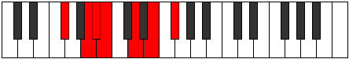
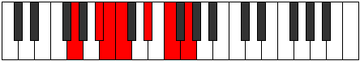

# Mode Epogimic

## Links

- [Documentation](index.md)
- [Scales Index](Scales.md)
- [Modes Index](Modes.md)
- [Chords Index](Chords.md)

## Parent Scale

[Dalimic](ScaleDalimic.md)

## Number

[1337](https://ianring.com/musictheory/scales/1337)

## Perfection

- 4 Perfect notes
- 2 Perfect notes

## Perfection Profile

[false true false true true true]

## Permutations

| Tonic | Notes | Signature | Illustration | Audio |
|-------|-------|-----------|--------------|-------|
| [C](ModeCNaturalEpogimic.md) | **C**, D#, **E**, F, G#, A#, **C** | C |  | [midi](ModeCNaturalEpogimic.mid) [ogg](ModeCNaturalEpogimic.ogg) |
| [C#](ModeCSharpEpogimic.md) | **C#**, D##, **E#**, F#, G##, A##, **C#** | C |  | [midi](ModeCSharpEpogimic.mid) [ogg](ModeCSharpEpogimic.ogg) |
| [Db](ModeDFlatEpogimic.md) | **Db**, E, **F**, Gb, A, B, **Db** | C |  | [midi](ModeDFlatEpogimic.mid) [ogg](ModeDFlatEpogimic.ogg) |
| [D](ModeDNaturalEpogimic.md) | **D**, E#, **F#**, G, A#, B#, **D** | C |  | [midi](ModeDNaturalEpogimic.mid) [ogg](ModeDNaturalEpogimic.ogg) |
| [D#](ModeDSharpEpogimic.md) | **D#**, E##, **F##**, G#, A##, B##, **D#** | C |  | [midi](ModeDSharpEpogimic.mid) [ogg](ModeDSharpEpogimic.ogg) |
| [Eb](ModeEFlatEpogimic.md) | **Eb**, F#, **G**, Ab, B, C#, **Eb** | C |  | [midi](ModeEFlatEpogimic.mid) [ogg](ModeEFlatEpogimic.ogg) |
| [E](ModeENaturalEpogimic.md) | **E**, F##, **G#**, A, B#, C##, **E** | C |  | [midi](ModeENaturalEpogimic.mid) [ogg](ModeENaturalEpogimic.ogg) |
| [F](ModeFNaturalEpogimic.md) | **F**, G#, **A**, Bb, C#, D#, **F** | C |  | [midi](ModeFNaturalEpogimic.mid) [ogg](ModeFNaturalEpogimic.ogg) |
| [F#](ModeFSharpEpogimic.md) | **F#**, G##, **A#**, B, C##, D##, **F#** | C |  | [midi](ModeFSharpEpogimic.mid) [ogg](ModeFSharpEpogimic.ogg) |
| [Gb](ModeGFlatEpogimic.md) | **Gb**, A, **Bb**, Cb, D, E, **Gb** | C |  | [midi](ModeGFlatEpogimic.mid) [ogg](ModeGFlatEpogimic.ogg) |
| [G](ModeGNaturalEpogimic.md) | **G**, A#, **B**, C, D#, E#, **G** | C |  | [midi](ModeGNaturalEpogimic.mid) [ogg](ModeGNaturalEpogimic.ogg) |
| [G#](ModeGSharpEpogimic.md) | **G#**, A##, **B#**, C#, D##, E##, **G#** | C |  | [midi](ModeGSharpEpogimic.mid) [ogg](ModeGSharpEpogimic.ogg) |
| [Ab](ModeAFlatEpogimic.md) | **Ab**, B, **C**, Db, E, F#, **Ab** | C |  | [midi](ModeAFlatEpogimic.mid) [ogg](ModeAFlatEpogimic.ogg) |
| [A](ModeANaturalEpogimic.md) | **A**, B#, **C#**, D, E#, F##, **A** | C |  | [midi](ModeANaturalEpogimic.mid) [ogg](ModeANaturalEpogimic.ogg) |
| [A#](ModeASharpEpogimic.md) | **A#**, B##, **C##**, D#, E##, F###, **A#** | C |  | [midi](ModeASharpEpogimic.mid) [ogg](ModeASharpEpogimic.ogg) |
| [Bb](ModeBFlatEpogimic.md) | **Bb**, C#, **D**, Eb, F#, G#, **Bb** | C |  | [midi](ModeBFlatEpogimic.mid) [ogg](ModeBFlatEpogimic.ogg) |
| [B](ModeBNaturalEpogimic.md) | **B**, C##, **D#**, E, F##, G##, **B** | C |  | [midi](ModeBNaturalEpogimic.mid) [ogg](ModeBNaturalEpogimic.ogg) |
