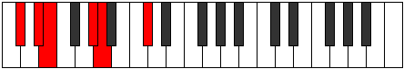
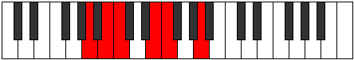

# Mode Epogitonic

## Links

- [Documentation](README.md)
- [Scales Index](Scales.md)
- [Modes Index](Modes.md)
- [Chords Index](Chords.md)

## Parent Scale

[Zolitonic](ScaleZolitonic.md)

## Number

[397](https://ianring.com/musictheory/scales/397)

## Interval Pattern

2, 1, 4, 1, 4

## Chord Pattern

## Perfection

- 3 Perfect notes
- 2 Perfect notes

## Perfection Profile

[true false false true true]

## Permutations

| Tonic | Notes | Signature | Illustration | Audio |
|-------|-------|-----------|--------------|-------|
| [C](ModeCNaturalEpogitonic.md) | C, **D**, **D#**, G, G#, C | C |  | [midi](https://github.com/edipermadi/music/blob/main/docs/ModeCNaturalEpogitonic.mid?raw=true) |
| [C#](ModeCSharpEpogitonic.md) | C#, **D#**, **E**, G#, A, C# | C |  | [midi](https://github.com/edipermadi/music/blob/main/docs/ModeCSharpEpogitonic.mid?raw=true) |
| [Db](ModeDFlatEpogitonic.md) | Db, **Eb**, **E**, Ab, A, Db | C |  | [midi](https://github.com/edipermadi/music/blob/main/docs/ModeDFlatEpogitonic.mid?raw=true) |
| [D](ModeDNaturalEpogitonic.md) | D, **E**, **F**, A, A#, D | C |  | [midi](https://github.com/edipermadi/music/blob/main/docs/ModeDNaturalEpogitonic.mid?raw=true) |
| [D#](ModeDSharpEpogitonic.md) | D#, **F**, **F#**, A#, B, D# | C |  | [midi](https://github.com/edipermadi/music/blob/main/docs/ModeDSharpEpogitonic.mid?raw=true) |
| [Eb](ModeEFlatEpogitonic.md) | Eb, **F**, **Gb**, Bb, B, Eb | C |  | [midi](https://github.com/edipermadi/music/blob/main/docs/ModeEFlatEpogitonic.mid?raw=true) |
| [E](ModeENaturalEpogitonic.md) | E, **F#**, **G**, B, C, E | C |  | [midi](https://github.com/edipermadi/music/blob/main/docs/ModeENaturalEpogitonic.mid?raw=true) |
| [F](ModeFNaturalEpogitonic.md) | F, **G**, **G#**, C, C#, F | C |  | [midi](https://github.com/edipermadi/music/blob/main/docs/ModeFNaturalEpogitonic.mid?raw=true) |
| [F#](ModeFSharpEpogitonic.md) | F#, **G#**, **A**, C#, D, F# | C |  | [midi](https://github.com/edipermadi/music/blob/main/docs/ModeFSharpEpogitonic.mid?raw=true) |
| [Gb](ModeGFlatEpogitonic.md) | Gb, **Ab**, **A**, Db, D, Gb | C |  | [midi](https://github.com/edipermadi/music/blob/main/docs/ModeGFlatEpogitonic.mid?raw=true) |
| [G](ModeGNaturalEpogitonic.md) | G, **A**, **A#**, D, D#, G | C |  | [midi](https://github.com/edipermadi/music/blob/main/docs/ModeGNaturalEpogitonic.mid?raw=true) |
| [G#](ModeGSharpEpogitonic.md) | G#, **A#**, **B**, D#, E, G# | C |  | [midi](https://github.com/edipermadi/music/blob/main/docs/ModeGSharpEpogitonic.mid?raw=true) |
| [Ab](ModeAFlatEpogitonic.md) | Ab, **Bb**, **B**, Eb, E, Ab | C |  | [midi](https://github.com/edipermadi/music/blob/main/docs/ModeAFlatEpogitonic.mid?raw=true) |
| [A](ModeANaturalEpogitonic.md) | A, **B**, **C**, E, F, A | C |  | [midi](https://github.com/edipermadi/music/blob/main/docs/ModeANaturalEpogitonic.mid?raw=true) |
| [A#](ModeASharpEpogitonic.md) | A#, **C**, **C#**, F, F#, A# | C |  | [midi](https://github.com/edipermadi/music/blob/main/docs/ModeASharpEpogitonic.mid?raw=true) |
| [Bb](ModeBFlatEpogitonic.md) | Bb, **C**, **Db**, F, Gb, Bb | C |  | [midi](https://github.com/edipermadi/music/blob/main/docs/ModeBFlatEpogitonic.mid?raw=true) |
| [B](ModeBNaturalEpogitonic.md) | B, **C#**, **D**, F#, G, B | C |  | [midi](https://github.com/edipermadi/music/blob/main/docs/ModeBNaturalEpogitonic.mid?raw=true) |
