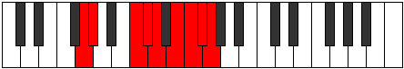
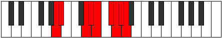

# Mode Epogyllic

## Links

- [Documentation](index.md)
- [Scales Index](Scales.md)
- [Modes Index](Modes.md)
- [Chords Index](Chords.md)

## Parent Scale

[Thagyllic](ScaleThagyllic.md)

## Number

[3811](https://ianring.com/musictheory/scales/3811)

## Perfection

- 5 Perfect notes
- 3 Perfect notes

## Perfection Profile

[true false true true false false true true]

## Permutations

| Tonic | Notes | Signature | Illustration | Audio |
|-------|-------|-----------|--------------|-------|
| [C](ModeCNaturalEpogyllic.md) | C, **C#**, F, F#, **G**, **A**, A#, B, C | C |  | [midi](ModeCNaturalEpogyllic.mid) [ogg](ModeCNaturalEpogyllic.ogg) |
| [C#](ModeCSharpEpogyllic.md) | C#, **D**, F#, G, **G#**, **A#**, B, C, C# | C |  | [midi](ModeCSharpEpogyllic.mid) [ogg](ModeCSharpEpogyllic.ogg) |
| [Db](ModeDFlatEpogyllic.md) | Db, **D**, Gb, G, **Ab**, **Bb**, B, C, Db | C |  | [midi](ModeDFlatEpogyllic.mid) [ogg](ModeDFlatEpogyllic.ogg) |
| [D](ModeDNaturalEpogyllic.md) | D, **D#**, G, G#, **A**, **B**, C, C#, D | C |  | [midi](ModeDNaturalEpogyllic.mid) [ogg](ModeDNaturalEpogyllic.ogg) |
| [D#](ModeDSharpEpogyllic.md) | D#, **E**, G#, A, **A#**, **C**, C#, D, D# | C |  | [midi](ModeDSharpEpogyllic.mid) [ogg](ModeDSharpEpogyllic.ogg) |
| [Eb](ModeEFlatEpogyllic.md) | Eb, **E**, Ab, A, **Bb**, **C**, Db, D, Eb | C |  | [midi](ModeEFlatEpogyllic.mid) [ogg](ModeEFlatEpogyllic.ogg) |
| [E](ModeENaturalEpogyllic.md) | E, **F**, A, A#, **B**, **C#**, D, D#, E | C |  | [midi](ModeENaturalEpogyllic.mid) [ogg](ModeENaturalEpogyllic.ogg) |
| [F](ModeFNaturalEpogyllic.md) | F, **F#**, A#, B, **C**, **D**, D#, E, F | C |  | [midi](ModeFNaturalEpogyllic.mid) [ogg](ModeFNaturalEpogyllic.ogg) |
| [F#](ModeFSharpEpogyllic.md) | F#, **G**, B, C, **C#**, **D#**, E, F, F# | C |  | [midi](ModeFSharpEpogyllic.mid) [ogg](ModeFSharpEpogyllic.ogg) |
| [Gb](ModeGFlatEpogyllic.md) | Gb, **G**, B, C, **Db**, **Eb**, E, F, Gb | C |  | [midi](ModeGFlatEpogyllic.mid) [ogg](ModeGFlatEpogyllic.ogg) |
| [G](ModeGNaturalEpogyllic.md) | G, **G#**, C, C#, **D**, **E**, F, F#, G | C |  | [midi](ModeGNaturalEpogyllic.mid) [ogg](ModeGNaturalEpogyllic.ogg) |
| [G#](ModeGSharpEpogyllic.md) | G#, **A**, C#, D, **D#**, **F**, F#, G, G# | C |  | [midi](ModeGSharpEpogyllic.mid) [ogg](ModeGSharpEpogyllic.ogg) |
| [Ab](ModeAFlatEpogyllic.md) | Ab, **A**, Db, D, **Eb**, **F**, Gb, G, Ab | C |  | [midi](ModeAFlatEpogyllic.mid) [ogg](ModeAFlatEpogyllic.ogg) |
| [A](ModeANaturalEpogyllic.md) | A, **A#**, D, D#, **E**, **F#**, G, G#, A | C |  | [midi](ModeANaturalEpogyllic.mid) [ogg](ModeANaturalEpogyllic.ogg) |
| [A#](ModeASharpEpogyllic.md) | A#, **B**, D#, E, **F**, **G**, G#, A, A# | C |  | [midi](ModeASharpEpogyllic.mid) [ogg](ModeASharpEpogyllic.ogg) |
| [Bb](ModeBFlatEpogyllic.md) | Bb, **B**, Eb, E, **F**, **G**, Ab, A, Bb | C |  | [midi](ModeBFlatEpogyllic.mid) [ogg](ModeBFlatEpogyllic.ogg) |
| [B](ModeBNaturalEpogyllic.md) | B, **C**, E, F, **F#**, **G#**, A, A#, B | C |  | [midi](ModeBNaturalEpogyllic.mid) [ogg](ModeBNaturalEpogyllic.ogg) |
