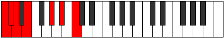
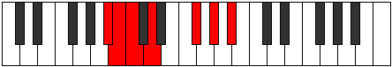

# Mode Epolimic

## Links

- [Documentation](index.md)
- [Scales Index](Scales.md)
- [Modes Index](Modes.md)
- [Chords Index](Chords.md)

## Parent Scale

[Dathimic](ScaleDathimic.md)

## Number

[1303](https://ianring.com/musictheory/scales/1303)

## Perfection

- 1 Perfect notes
- 5 Perfect notes

## Perfection Profile

[false true false false false false]

## Permutations

| Tonic | Notes | Signature | Illustration | Audio |
|-------|-------|-----------|--------------|-------|
| [C](ModeCNaturalEpolimic.md) | **C**, Db, **Ebb**, **Fb**, **G#**, **A#**, **C** | C |  | [midi](ModeCNaturalEpolimic.mid) [ogg](ModeCNaturalEpolimic.ogg) |
| [C#](ModeCSharpEpolimic.md) | **C#**, D, **Eb**, **F**, **G##**, **A##**, **C#** | C |  | [midi](ModeCSharpEpolimic.mid) [ogg](ModeCSharpEpolimic.ogg) |
| [Db](ModeDFlatEpolimic.md) | **Db**, Ebb, **Fbb**, **Gbb**, **A**, **B**, **Db** | C |  | [midi](ModeDFlatEpolimic.mid) [ogg](ModeDFlatEpolimic.ogg) |
| [D](ModeDNaturalEpolimic.md) | **D**, Eb, **Fb**, **Gb**, **A#**, **B#**, **D** | C |  | [midi](ModeDNaturalEpolimic.mid) [ogg](ModeDNaturalEpolimic.ogg) |
| [D#](ModeDSharpEpolimic.md) | **D#**, E, **F**, **G**, **A##**, **B##**, **D#** | C |  | [midi](ModeDSharpEpolimic.mid) [ogg](ModeDSharpEpolimic.ogg) |
| [Eb](ModeEFlatEpolimic.md) | **Eb**, Fb, **Gbb**, **Abb**, **B**, **C#**, **Eb** | C |  | [midi](ModeEFlatEpolimic.mid) [ogg](ModeEFlatEpolimic.ogg) |
| [E](ModeENaturalEpolimic.md) | **E**, F, **Gb**, **Ab**, **B#**, **C##**, **E** | C |  | [midi](ModeENaturalEpolimic.mid) [ogg](ModeENaturalEpolimic.ogg) |
| [F](ModeFNaturalEpolimic.md) | **F**, Gb, **Abb**, **Bbb**, **C#**, **D#**, **F** | C |  | [midi](ModeFNaturalEpolimic.mid) [ogg](ModeFNaturalEpolimic.ogg) |
| [F#](ModeFSharpEpolimic.md) | **F#**, G, **Ab**, **Bb**, **C##**, **D##**, **F#** | C |  | [midi](ModeFSharpEpolimic.mid) [ogg](ModeFSharpEpolimic.ogg) |
| [Gb](ModeGFlatEpolimic.md) | **Gb**, Abb, **Bbbb**, **Cbb**, **D**, **E**, **Gb** | C |  | [midi](ModeGFlatEpolimic.mid) [ogg](ModeGFlatEpolimic.ogg) |
| [G](ModeGNaturalEpolimic.md) | **G**, Ab, **Bbb**, **Cb**, **D#**, **E#**, **G** | C |  | [midi](ModeGNaturalEpolimic.mid) [ogg](ModeGNaturalEpolimic.ogg) |
| [G#](ModeGSharpEpolimic.md) | **G#**, A, **Bb**, **C**, **D##**, **E##**, **G#** | C |  | [midi](ModeGSharpEpolimic.mid) [ogg](ModeGSharpEpolimic.ogg) |
| [Ab](ModeAFlatEpolimic.md) | **Ab**, Bbb, **Cbb**, **Dbb**, **E**, **F#**, **Ab** | C |  | [midi](ModeAFlatEpolimic.mid) [ogg](ModeAFlatEpolimic.ogg) |
| [A](ModeANaturalEpolimic.md) | **A**, Bb, **Cb**, **Db**, **E#**, **F##**, **A** | C |  | [midi](ModeANaturalEpolimic.mid) [ogg](ModeANaturalEpolimic.ogg) |
| [A#](ModeASharpEpolimic.md) | **A#**, B, **C**, **D**, **E##**, **F###**, **A#** | C |  | [midi](ModeASharpEpolimic.mid) [ogg](ModeASharpEpolimic.ogg) |
| [Bb](ModeBFlatEpolimic.md) | **Bb**, Cb, **Dbb**, **Ebb**, **F#**, **G#**, **Bb** | C |  | [midi](ModeBFlatEpolimic.mid) [ogg](ModeBFlatEpolimic.ogg) |
| [B](ModeBNaturalEpolimic.md) | **B**, C, **Db**, **Eb**, **F##**, **G##**, **B** | C |  | [midi](ModeBNaturalEpolimic.mid) [ogg](ModeBNaturalEpolimic.ogg) |
