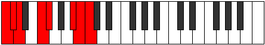

# Mode Eponian

## Links

- [Documentation](README.md)
- [Scales Index](Scales.md)
- [Modes Index](Modes.md)
- [Chords Index](Chords.md)

## Parent Scale

[Thycrian](ScaleThycrian.md)

## Number

[3175](https://ianring.com/musictheory/scales/3175)

## Transposition

1, 1, 3, 1, 4, 1, 1

## Chord Pattern

i⁰b3, vii⁰b3

## Perfection

- 4 Perfect notes
- 3 Perfect notes

## Perfection Profile

[false false false true true true true]

## Permutations

| Tonic | Notes | Signature | Illustration | Audio |
|-------|-------|-----------|--------------|-------|
| [C](ModeCNaturalEponian.md) | **C**, **Db**, **Ebb**, F, Gb, A#, B, **C** | C |  | [midi](https://github.com/edipermadi/music/blob/main/docs/ModeCNaturalEponian.mid?raw=true) |
| [C#](ModeCSharpEponian.md) | **C#**, **D**, **Eb**, F#, G, A##, B#, **C#** | C |  | [midi](https://github.com/edipermadi/music/blob/main/docs/ModeCSharpEponian.mid?raw=true) |
| [Db](ModeDFlatEponian.md) | **Db**, **Ebb**, **Fbb**, Gb, Abb, B, C, **Db** | C |  | [midi](https://github.com/edipermadi/music/blob/main/docs/ModeDFlatEponian.mid?raw=true) |
| [D](ModeDNaturalEponian.md) | **D**, **Eb**, **Fb**, G, Ab, B#, C#, **D** | C |  | [midi](https://github.com/edipermadi/music/blob/main/docs/ModeDNaturalEponian.mid?raw=true) |
| [D#](ModeDSharpEponian.md) | **D#**, **E**, **F**, G#, A, B##, C##, **D#** | C |  | [midi](https://github.com/edipermadi/music/blob/main/docs/ModeDSharpEponian.mid?raw=true) |
| [Eb](ModeEFlatEponian.md) | **Eb**, **Fb**, **Gbb**, Ab, Bbb, C#, D, **Eb** | C |  | [midi](https://github.com/edipermadi/music/blob/main/docs/ModeEFlatEponian.mid?raw=true) |
| [E](ModeENaturalEponian.md) | **E**, **F**, **Gb**, A, Bb, C##, D#, **E** | C |  | [midi](https://github.com/edipermadi/music/blob/main/docs/ModeENaturalEponian.mid?raw=true) |
| [F](ModeFNaturalEponian.md) | **F**, **Gb**, **Abb**, Bb, Cb, D#, E, **F** | C |  | [midi](https://github.com/edipermadi/music/blob/main/docs/ModeFNaturalEponian.mid?raw=true) |
| [F#](ModeFSharpEponian.md) | **F#**, **G**, **Ab**, B, C, D##, E#, **F#** | C |  | [midi](https://github.com/edipermadi/music/blob/main/docs/ModeFSharpEponian.mid?raw=true) |
| [Gb](ModeGFlatEponian.md) | **Gb**, **Abb**, **Bbbb**, Cb, Dbb, E, F, **Gb** | C |  | [midi](https://github.com/edipermadi/music/blob/main/docs/ModeGFlatEponian.mid?raw=true) |
| [G](ModeGNaturalEponian.md) | **G**, **Ab**, **Bbb**, C, Db, E#, F#, **G** | C |  | [midi](https://github.com/edipermadi/music/blob/main/docs/ModeGNaturalEponian.mid?raw=true) |
| [G#](ModeGSharpEponian.md) | **G#**, **A**, **Bb**, C#, D, E##, F##, **G#** | C |  | [midi](https://github.com/edipermadi/music/blob/main/docs/ModeGSharpEponian.mid?raw=true) |
| [Ab](ModeAFlatEponian.md) | **Ab**, **Bbb**, **Cbb**, Db, Ebb, F#, G, **Ab** | C |  | [midi](https://github.com/edipermadi/music/blob/main/docs/ModeAFlatEponian.mid?raw=true) |
| [A](ModeANaturalEponian.md) | **A**, **Bb**, **Cb**, D, Eb, F##, G#, **A** | C |  | [midi](https://github.com/edipermadi/music/blob/main/docs/ModeANaturalEponian.mid?raw=true) |
| [A#](ModeASharpEponian.md) | **A#**, **B**, **C**, D#, E, F###, G##, **A#** | C |  | [midi](https://github.com/edipermadi/music/blob/main/docs/ModeASharpEponian.mid?raw=true) |
| [Bb](ModeBFlatEponian.md) | **Bb**, **Cb**, **Dbb**, Eb, Fb, G#, A, **Bb** | C |  | [midi](https://github.com/edipermadi/music/blob/main/docs/ModeBFlatEponian.mid?raw=true) |
| [B](ModeBNaturalEponian.md) | **B**, **C**, **Db**, E, F, G##, A#, **B** | C |  | [midi](https://github.com/edipermadi/music/blob/main/docs/ModeBNaturalEponian.mid?raw=true) |
