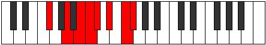
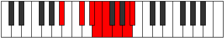

# Mode Eporian

## Links

- [Documentation](index.md)
- [Scales Index](Scales.md)
- [Modes Index](Modes.md)
- [Chords Index](Chords.md)

## Parent Scale

[Eporian](ScaleEporian.md)

## Number

[2793](https://ianring.com/musictheory/scales/2793)

## Perfection

- 3 Perfect notes
- 4 Perfect notes

## Perfection Profile

[true false true false false false true]

## Permutations

| Tonic | Notes | Signature | Illustration | Audio |
|-------|-------|-----------|--------------|-------|
| [C](ModeCNaturalEporian.md) | C, **D#**, E#, **F#**, **G**, **A**, B, C | C |  | [midi](ModeCNaturalEporian.mid) [ogg](ModeCNaturalEporian.ogg) |
| [C#](ModeCSharpEporian.md) | C#, **D##**, E##, **F##**, **G#**, **A#**, B#, C# | C |  | [midi](ModeCSharpEporian.mid) [ogg](ModeCSharpEporian.ogg) |
| [Db](ModeDFlatEporian.md) | Db, **E**, F#, **G**, **Ab**, **Bb**, C, Db | C |  | [midi](ModeDFlatEporian.mid) [ogg](ModeDFlatEporian.ogg) |
| [D](ModeDNaturalEporian.md) | D, **E#**, F##, **G#**, **A**, **B**, C#, D | C |  | [midi](ModeDNaturalEporian.mid) [ogg](ModeDNaturalEporian.ogg) |
| [D#](ModeDSharpEporian.md) | D#, **E##**, F###, **G##**, **A#**, **B#**, C##, D# | C |  | [midi](ModeDSharpEporian.mid) [ogg](ModeDSharpEporian.ogg) |
| [Eb](ModeEFlatEporian.md) | Eb, **F#**, G#, **A**, **Bb**, **C**, D, Eb | C |  | [midi](ModeEFlatEporian.mid) [ogg](ModeEFlatEporian.ogg) |
| [E](ModeENaturalEporian.md) | E, **F##**, G##, **A#**, **B**, **C#**, D#, E | C |  | [midi](ModeENaturalEporian.mid) [ogg](ModeENaturalEporian.ogg) |
| [F](ModeFNaturalEporian.md) | F, **G#**, A#, **B**, **C**, **D**, E, F | C |  | [midi](ModeFNaturalEporian.mid) [ogg](ModeFNaturalEporian.ogg) |
| [F#](ModeFSharpEporian.md) | F#, **G##**, A##, **B#**, **C#**, **D#**, E#, F# | C |  | [midi](ModeFSharpEporian.mid) [ogg](ModeFSharpEporian.ogg) |
| [Gb](ModeGFlatEporian.md) | Gb, **A**, B, **C**, **Db**, **Eb**, F, Gb | C |  | [midi](ModeGFlatEporian.mid) [ogg](ModeGFlatEporian.ogg) |
| [G](ModeGNaturalEporian.md) | G, **A#**, B#, **C#**, **D**, **E**, F#, G | C |  | [midi](ModeGNaturalEporian.mid) [ogg](ModeGNaturalEporian.ogg) |
| [G#](ModeGSharpEporian.md) | G#, **A##**, B##, **C##**, **D#**, **E#**, F##, G# | C |  | [midi](ModeGSharpEporian.mid) [ogg](ModeGSharpEporian.ogg) |
| [Ab](ModeAFlatEporian.md) | Ab, **B**, C#, **D**, **Eb**, **F**, G, Ab | C |  | [midi](ModeAFlatEporian.mid) [ogg](ModeAFlatEporian.ogg) |
| [A](ModeANaturalEporian.md) | A, **B#**, C##, **D#**, **E**, **F#**, G#, A | C |  | [midi](ModeANaturalEporian.mid) [ogg](ModeANaturalEporian.ogg) |
| [A#](ModeASharpEporian.md) | A#, **B##**, C###, **D##**, **E#**, **F##**, G##, A# | C |  | [midi](ModeASharpEporian.mid) [ogg](ModeASharpEporian.ogg) |
| [Bb](ModeBFlatEporian.md) | Bb, **C#**, D#, **E**, **F**, **G**, A, Bb | C |  | [midi](ModeBFlatEporian.mid) [ogg](ModeBFlatEporian.ogg) |
| [B](ModeBNaturalEporian.md) | B, **C##**, D##, **E#**, **F#**, **G#**, A#, B | C |  | [midi](ModeBNaturalEporian.mid) [ogg](ModeBNaturalEporian.ogg) |
