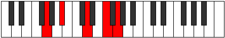
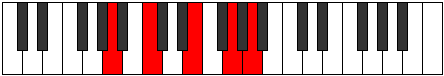

# Mode Eporic

## Links

- [Documentation](README.md)
- [Scales Index](Scales.md)
- [Modes Index](Modes.md)
- [Chords Index](Chords.md)

## Parent Scale

[Epathic](ScaleEpathic.md)

## Number

[1161](https://ianring.com/musictheory/scales/1161)

## Luminosity

4

## Transposition

3, 4, 3, 2

## Chord Pattern

## Perfection

- 2 Perfect notes
- 2 Perfect notes

## Perfection Profile

true, true, false, false

## Permutations

| Tonic | Notes | Signature | Illustration | Audio |
|-------|-------|-----------|--------------|-------|
| [C](ModeCNaturalEporic.md) | C, D#, **G**, **A#**, C | C |  | [midi](https://github.com/edipermadi/music/blob/main/docs/ModeCNaturalEporic.mid?raw=true) |
| [C#](ModeCSharpEporic.md) | C#, E, **G#**, **B**, C# | C |  | [midi](https://github.com/edipermadi/music/blob/main/docs/ModeCSharpEporic.mid?raw=true) |
| [Db](ModeDFlatEporic.md) | Db, E, **Ab**, **B**, Db | C |  | [midi](https://github.com/edipermadi/music/blob/main/docs/ModeDFlatEporic.mid?raw=true) |
| [D](ModeDNaturalEporic.md) | D, F, **A**, **C**, D | C |  | [midi](https://github.com/edipermadi/music/blob/main/docs/ModeDNaturalEporic.mid?raw=true) |
| [D#](ModeDSharpEporic.md) | D#, F#, **A#**, **C#**, D# | C |  | [midi](https://github.com/edipermadi/music/blob/main/docs/ModeDSharpEporic.mid?raw=true) |
| [Eb](ModeEFlatEporic.md) | Eb, Gb, **Bb**, **Db**, Eb | C |  | [midi](https://github.com/edipermadi/music/blob/main/docs/ModeEFlatEporic.mid?raw=true) |
| [E](ModeENaturalEporic.md) | E, G, **B**, **D**, E | C |  | [midi](https://github.com/edipermadi/music/blob/main/docs/ModeENaturalEporic.mid?raw=true) |
| [F](ModeFNaturalEporic.md) | F, G#, **C**, **D#**, F | C |  | [midi](https://github.com/edipermadi/music/blob/main/docs/ModeFNaturalEporic.mid?raw=true) |
| [F#](ModeFSharpEporic.md) | F#, A, **C#**, **E**, F# | C |  | [midi](https://github.com/edipermadi/music/blob/main/docs/ModeFSharpEporic.mid?raw=true) |
| [Gb](ModeGFlatEporic.md) | Gb, A, **Db**, **E**, Gb | C |  | [midi](https://github.com/edipermadi/music/blob/main/docs/ModeGFlatEporic.mid?raw=true) |
| [G](ModeGNaturalEporic.md) | G, A#, **D**, **F**, G | C |  | [midi](https://github.com/edipermadi/music/blob/main/docs/ModeGNaturalEporic.mid?raw=true) |
| [G#](ModeGSharpEporic.md) | G#, B, **D#**, **F#**, G# | C |  | [midi](https://github.com/edipermadi/music/blob/main/docs/ModeGSharpEporic.mid?raw=true) |
| [Ab](ModeAFlatEporic.md) | Ab, B, **Eb**, **Gb**, Ab | C |  | [midi](https://github.com/edipermadi/music/blob/main/docs/ModeAFlatEporic.mid?raw=true) |
| [A](ModeANaturalEporic.md) | A, C, **E**, **G**, A | C |  | [midi](https://github.com/edipermadi/music/blob/main/docs/ModeANaturalEporic.mid?raw=true) |
| [A#](ModeASharpEporic.md) | A#, C#, **F**, **G#**, A# | C |  | [midi](https://github.com/edipermadi/music/blob/main/docs/ModeASharpEporic.mid?raw=true) |
| [Bb](ModeBFlatEporic.md) | Bb, Db, **F**, **Ab**, Bb | C |  | [midi](https://github.com/edipermadi/music/blob/main/docs/ModeBFlatEporic.mid?raw=true) |
| [B](ModeBNaturalEporic.md) | B, D, **F#**, **A**, B | C |  | [midi](https://github.com/edipermadi/music/blob/main/docs/ModeBNaturalEporic.mid?raw=true) |
