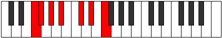

# Mode Eporimic

## Links

- [Documentation](README.md)
- [Scales Index](Scales.md)
- [Modes Index](Modes.md)
- [Chords Index](Chords.md)

## Parent Scale

[Epathimic](ScaleEpathimic.md)

## Number

[1323](https://ianring.com/musictheory/scales/1323)

## Transposition

1, 2, 2, 3, 2, 2

## Chord Pattern

V, vi

## Perfection

- 5 Perfect notes
- 1 Perfect notes

## Perfection Profile

false, true, true, true, true, true

## Permutations

| Tonic | Notes | Signature | Illustration | Audio |
|-------|-------|-----------|--------------|-------|
| [C](ModeCNaturalEporimic.md) | **C**, Db, Eb, F, G#, A#, **C** | C |  | [midi](https://github.com/edipermadi/music/blob/main/docs/ModeCNaturalEporimic.mid?raw=true) |
| [C#](ModeCSharpEporimic.md) | **C#**, D, E, F#, G##, A##, **C#** | C |  | [midi](https://github.com/edipermadi/music/blob/main/docs/ModeCSharpEporimic.mid?raw=true) |
| [Db](ModeDFlatEporimic.md) | **Db**, Ebb, Fb, Gb, A, B, **Db** | C |  | [midi](https://github.com/edipermadi/music/blob/main/docs/ModeDFlatEporimic.mid?raw=true) |
| [D](ModeDNaturalEporimic.md) | **D**, Eb, F, G, A#, B#, **D** | C |  | [midi](https://github.com/edipermadi/music/blob/main/docs/ModeDNaturalEporimic.mid?raw=true) |
| [D#](ModeDSharpEporimic.md) | **D#**, E, F#, G#, A##, B##, **D#** | C |  | [midi](https://github.com/edipermadi/music/blob/main/docs/ModeDSharpEporimic.mid?raw=true) |
| [Eb](ModeEFlatEporimic.md) | **Eb**, Fb, Gb, Ab, B, C#, **Eb** | C |  | [midi](https://github.com/edipermadi/music/blob/main/docs/ModeEFlatEporimic.mid?raw=true) |
| [E](ModeENaturalEporimic.md) | **E**, F, G, A, B#, C##, **E** | C |  | [midi](https://github.com/edipermadi/music/blob/main/docs/ModeENaturalEporimic.mid?raw=true) |
| [F](ModeFNaturalEporimic.md) | **F**, Gb, Ab, Bb, C#, D#, **F** | C |  | [midi](https://github.com/edipermadi/music/blob/main/docs/ModeFNaturalEporimic.mid?raw=true) |
| [F#](ModeFSharpEporimic.md) | **F#**, G, A, B, C##, D##, **F#** | C |  | [midi](https://github.com/edipermadi/music/blob/main/docs/ModeFSharpEporimic.mid?raw=true) |
| [Gb](ModeGFlatEporimic.md) | **Gb**, Abb, Bbb, Cb, D, E, **Gb** | C |  | [midi](https://github.com/edipermadi/music/blob/main/docs/ModeGFlatEporimic.mid?raw=true) |
| [G](ModeGNaturalEporimic.md) | **G**, Ab, Bb, C, D#, E#, **G** | C |  | [midi](https://github.com/edipermadi/music/blob/main/docs/ModeGNaturalEporimic.mid?raw=true) |
| [G#](ModeGSharpEporimic.md) | **G#**, A, B, C#, D##, E##, **G#** | C |  | [midi](https://github.com/edipermadi/music/blob/main/docs/ModeGSharpEporimic.mid?raw=true) |
| [Ab](ModeAFlatEporimic.md) | **Ab**, Bbb, Cb, Db, E, F#, **Ab** | C |  | [midi](https://github.com/edipermadi/music/blob/main/docs/ModeAFlatEporimic.mid?raw=true) |
| [A](ModeANaturalEporimic.md) | **A**, Bb, C, D, E#, F##, **A** | C |  | [midi](https://github.com/edipermadi/music/blob/main/docs/ModeANaturalEporimic.mid?raw=true) |
| [A#](ModeASharpEporimic.md) | **A#**, B, C#, D#, E##, F###, **A#** | C |  | [midi](https://github.com/edipermadi/music/blob/main/docs/ModeASharpEporimic.mid?raw=true) |
| [Bb](ModeBFlatEporimic.md) | **Bb**, Cb, Db, Eb, F#, G#, **Bb** | C |  | [midi](https://github.com/edipermadi/music/blob/main/docs/ModeBFlatEporimic.mid?raw=true) |
| [B](ModeBNaturalEporimic.md) | **B**, C, D, E, F##, G##, **B** | C |  | [midi](https://github.com/edipermadi/music/blob/main/docs/ModeBNaturalEporimic.mid?raw=true) |
