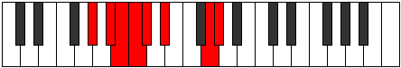

# Mode Epothian

## Links

- [Documentation](README.md)
- [Scales Index](Scales.md)
- [Modes Index](Modes.md)
- [Chords Index](Chords.md)

## Parent Scale

[Zorian](ScaleZorian.md)

## Number

[2237](https://ianring.com/musictheory/scales/2237)

## Luminosity

-1

## Transposition

2, 1, 1, 1, 2, 4, 1

## Chord Pattern

## Perfection

- 4 Perfect notes
- 3 Perfect notes

## Perfection Profile

true, false, false, true, true, true, false

## Permutations

| Tonic | Notes | Signature | Illustration | Audio |
|-------|-------|-----------|--------------|-------|
| [C](ModeCNaturalEpothian.md) | C, **D**, **Eb**, Fb, Gbb, Abb, **B**, C | C |  | [midi](https://github.com/edipermadi/music/blob/main/docs/ModeCNaturalEpothian.mid?raw=true) |
| [C#](ModeCSharpEpothian.md) | C#, **D#**, **E**, F, Gb, Ab, **B#**, C# | C |  | [midi](https://github.com/edipermadi/music/blob/main/docs/ModeCSharpEpothian.mid?raw=true) |
| [Db](ModeDFlatEpothian.md) | Db, **Eb**, **Fb**, Gbb, Abbb, Bbbb, **C**, Db | C |  | [midi](https://github.com/edipermadi/music/blob/main/docs/ModeDFlatEpothian.mid?raw=true) |
| [D](ModeDNaturalEpothian.md) | D, **E**, **F**, Gb, Abb, Bbb, **C#**, D | C |  | [midi](https://github.com/edipermadi/music/blob/main/docs/ModeDNaturalEpothian.mid?raw=true) |
| [D#](ModeDSharpEpothian.md) | D#, **E#**, **F#**, G, Ab, Bb, **C##**, D# | C |  | [midi](https://github.com/edipermadi/music/blob/main/docs/ModeDSharpEpothian.mid?raw=true) |
| [Eb](ModeEFlatEpothian.md) | Eb, **F**, **Gb**, Abb, Bbbb, Cbb, **D**, Eb | C |  | [midi](https://github.com/edipermadi/music/blob/main/docs/ModeEFlatEpothian.mid?raw=true) |
| [E](ModeENaturalEpothian.md) | E, **F#**, **G**, Ab, Bbb, Cb, **D#**, E | C |  | [midi](https://github.com/edipermadi/music/blob/main/docs/ModeENaturalEpothian.mid?raw=true) |
| [F](ModeFNaturalEpothian.md) | F, **G**, **Ab**, Bbb, Cbb, Dbb, **E**, F | C |  | [midi](https://github.com/edipermadi/music/blob/main/docs/ModeFNaturalEpothian.mid?raw=true) |
| [F#](ModeFSharpEpothian.md) | F#, **G#**, **A**, Bb, Cb, Db, **E#**, F# | C |  | [midi](https://github.com/edipermadi/music/blob/main/docs/ModeFSharpEpothian.mid?raw=true) |
| [Gb](ModeGFlatEpothian.md) | Gb, **Ab**, **Bbb**, Cbb, Dbbb, Ebbb, **F**, Gb | C |  | [midi](https://github.com/edipermadi/music/blob/main/docs/ModeGFlatEpothian.mid?raw=true) |
| [G](ModeGNaturalEpothian.md) | G, **A**, **Bb**, Cb, Dbb, Ebb, **F#**, G | C |  | [midi](https://github.com/edipermadi/music/blob/main/docs/ModeGNaturalEpothian.mid?raw=true) |
| [G#](ModeGSharpEpothian.md) | G#, **A#**, **B**, C, Db, Eb, **F##**, G# | C |  | [midi](https://github.com/edipermadi/music/blob/main/docs/ModeGSharpEpothian.mid?raw=true) |
| [Ab](ModeAFlatEpothian.md) | Ab, **Bb**, **Cb**, Dbb, Ebbb, Fbb, **G**, Ab | C |  | [midi](https://github.com/edipermadi/music/blob/main/docs/ModeAFlatEpothian.mid?raw=true) |
| [A](ModeANaturalEpothian.md) | A, **B**, **C**, Db, Ebb, Fb, **G#**, A | C |  | [midi](https://github.com/edipermadi/music/blob/main/docs/ModeANaturalEpothian.mid?raw=true) |
| [A#](ModeASharpEpothian.md) | A#, **B#**, **C#**, D, Eb, F, **G##**, A# | C |  | [midi](https://github.com/edipermadi/music/blob/main/docs/ModeASharpEpothian.mid?raw=true) |
| [Bb](ModeBFlatEpothian.md) | Bb, **C**, **Db**, Ebb, Fbb, Gbb, **A**, Bb | C |  | [midi](https://github.com/edipermadi/music/blob/main/docs/ModeBFlatEpothian.mid?raw=true) |
| [B](ModeBNaturalEpothian.md) | B, **C#**, **D**, Eb, Fb, Gb, **A#**, B | C |  | [midi](https://github.com/edipermadi/music/blob/main/docs/ModeBNaturalEpothian.mid?raw=true) |
