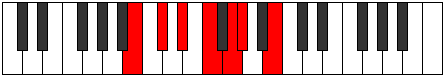

# Mode Epothimic

## Links

- [Documentation](index.md)
- [Scales Index](Scales.md)
- [Modes Index](Modes.md)
- [Chords Index](Chords.md)

## Parent Scale

[Aeragimic](ScaleAeragimic.md)

## Number

[853](https://ianring.com/musictheory/scales/853)

## Perfection

- 2 Perfect notes
- 4 Perfect notes

## Perfection Profile

[false true false false false true]

## Permutations

| Tonic | Notes | Signature | Illustration | Audio |
|-------|-------|-----------|--------------|-------|
| [C](ModeCNaturalEpothimic.md) | **C**, D, **E**, **F#**, **G#**, A, **C** | C |  | [midi](ModeCNaturalEpothimic.mid) [ogg](ModeCNaturalEpothimic.ogg) |
| [C#](ModeCSharpEpothimic.md) | **C#**, D#, **E#**, **F##**, **G##**, A#, **C#** | C |  | [midi](ModeCSharpEpothimic.mid) [ogg](ModeCSharpEpothimic.ogg) |
| [Db](ModeDFlatEpothimic.md) | **Db**, Eb, **F**, **G**, **A**, Bb, **Db** | C |  | [midi](ModeDFlatEpothimic.mid) [ogg](ModeDFlatEpothimic.ogg) |
| [D](ModeDNaturalEpothimic.md) | **D**, E, **F#**, **G#**, **A#**, B, **D** | C |  | [midi](ModeDNaturalEpothimic.mid) [ogg](ModeDNaturalEpothimic.ogg) |
| [D#](ModeDSharpEpothimic.md) | **D#**, E#, **F##**, **G##**, **A##**, B#, **D#** | C |  | [midi](ModeDSharpEpothimic.mid) [ogg](ModeDSharpEpothimic.ogg) |
| [Eb](ModeEFlatEpothimic.md) | **Eb**, F, **G**, **A**, **B**, C, **Eb** | C |  | [midi](ModeEFlatEpothimic.mid) [ogg](ModeEFlatEpothimic.ogg) |
| [E](ModeENaturalEpothimic.md) | **E**, F#, **G#**, **A#**, **B#**, C#, **E** | C |  | [midi](ModeENaturalEpothimic.mid) [ogg](ModeENaturalEpothimic.ogg) |
| [F](ModeFNaturalEpothimic.md) | **F**, G, **A**, **B**, **C#**, D, **F** | C |  | [midi](ModeFNaturalEpothimic.mid) [ogg](ModeFNaturalEpothimic.ogg) |
| [F#](ModeFSharpEpothimic.md) | **F#**, G#, **A#**, **B#**, **C##**, D#, **F#** | C |  | [midi](ModeFSharpEpothimic.mid) [ogg](ModeFSharpEpothimic.ogg) |
| [Gb](ModeGFlatEpothimic.md) | **Gb**, Ab, **Bb**, **C**, **D**, Eb, **Gb** | C |  | [midi](ModeGFlatEpothimic.mid) [ogg](ModeGFlatEpothimic.ogg) |
| [G](ModeGNaturalEpothimic.md) | **G**, A, **B**, **C#**, **D#**, E, **G** | C |  | [midi](ModeGNaturalEpothimic.mid) [ogg](ModeGNaturalEpothimic.ogg) |
| [G#](ModeGSharpEpothimic.md) | **G#**, A#, **B#**, **C##**, **D##**, E#, **G#** | C |  | [midi](ModeGSharpEpothimic.mid) [ogg](ModeGSharpEpothimic.ogg) |
| [Ab](ModeAFlatEpothimic.md) | **Ab**, Bb, **C**, **D**, **E**, F, **Ab** | C |  | [midi](ModeAFlatEpothimic.mid) [ogg](ModeAFlatEpothimic.ogg) |
| [A](ModeANaturalEpothimic.md) | **A**, B, **C#**, **D#**, **E#**, F#, **A** | C |  | [midi](ModeANaturalEpothimic.mid) [ogg](ModeANaturalEpothimic.ogg) |
| [A#](ModeASharpEpothimic.md) | **A#**, B#, **C##**, **D##**, **E##**, F##, **A#** | C |  | [midi](ModeASharpEpothimic.mid) [ogg](ModeASharpEpothimic.ogg) |
| [Bb](ModeBFlatEpothimic.md) | **Bb**, C, **D**, **E**, **F#**, G, **Bb** | C |  | [midi](ModeBFlatEpothimic.mid) [ogg](ModeBFlatEpothimic.ogg) |
| [B](ModeBNaturalEpothimic.md) | **B**, C#, **D#**, **E#**, **F##**, G#, **B** | C |  | [midi](ModeBNaturalEpothimic.mid) [ogg](ModeBNaturalEpothimic.ogg) |
