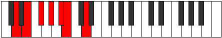

# Mode Epothimic

## Links

- [Documentation](index.md)
- [Scales Index](Scales.md)
- [Modes Index](Modes.md)
- [Chords Index](Chords.md)

## Parent Scale

[Aeragimic](ScaleAeragimic.md)

## Number

[853](https://ianring.com/musictheory/scales/853)

## Interval Pattern

2, 2, 2, 2, 1, 3

## Chord Pattern

I⁺, II, III⁺, iv⁰, V⁺, vi

## Perfection

- 2 Perfect notes
- 4 Perfect notes

## Perfection Profile

[false true false false false true]

## Permutations

| Tonic | Notes | Signature | Illustration | Audio |
|-------|-------|-----------|--------------|-------|
| [C](ModeCNaturalEpothimic.md) | **C**, D, **E**, **F#**, **G#**, A, **C** | C |  | [midi](https://github.com/edipermadi/music/blob/main/docs/ModeCNaturalEpothimic.mid?raw=true) |
| [C#](ModeCSharpEpothimic.md) | **C#**, D#, **E#**, **F##**, **G##**, A#, **C#** | C |  | [midi](https://github.com/edipermadi/music/blob/main/docs/ModeCSharpEpothimic.mid?raw=true) |
| [Db](ModeDFlatEpothimic.md) | **Db**, Eb, **F**, **G**, **A**, Bb, **Db** | C |  | [midi](https://github.com/edipermadi/music/blob/main/docs/ModeDFlatEpothimic.mid?raw=true) |
| [D](ModeDNaturalEpothimic.md) | **D**, E, **F#**, **G#**, **A#**, B, **D** | C |  | [midi](https://github.com/edipermadi/music/blob/main/docs/ModeDNaturalEpothimic.mid?raw=true) |
| [D#](ModeDSharpEpothimic.md) | **D#**, E#, **F##**, **G##**, **A##**, B#, **D#** | C |  | [midi](https://github.com/edipermadi/music/blob/main/docs/ModeDSharpEpothimic.mid?raw=true) |
| [Eb](ModeEFlatEpothimic.md) | **Eb**, F, **G**, **A**, **B**, C, **Eb** | C |  | [midi](https://github.com/edipermadi/music/blob/main/docs/ModeEFlatEpothimic.mid?raw=true) |
| [E](ModeENaturalEpothimic.md) | **E**, F#, **G#**, **A#**, **B#**, C#, **E** | C |  | [midi](https://github.com/edipermadi/music/blob/main/docs/ModeENaturalEpothimic.mid?raw=true) |
| [F](ModeFNaturalEpothimic.md) | **F**, G, **A**, **B**, **C#**, D, **F** | C |  | [midi](https://github.com/edipermadi/music/blob/main/docs/ModeFNaturalEpothimic.mid?raw=true) |
| [F#](ModeFSharpEpothimic.md) | **F#**, G#, **A#**, **B#**, **C##**, D#, **F#** | C |  | [midi](https://github.com/edipermadi/music/blob/main/docs/ModeFSharpEpothimic.mid?raw=true) |
| [Gb](ModeGFlatEpothimic.md) | **Gb**, Ab, **Bb**, **C**, **D**, Eb, **Gb** | C |  | [midi](https://github.com/edipermadi/music/blob/main/docs/ModeGFlatEpothimic.mid?raw=true) |
| [G](ModeGNaturalEpothimic.md) | **G**, A, **B**, **C#**, **D#**, E, **G** | C |  | [midi](https://github.com/edipermadi/music/blob/main/docs/ModeGNaturalEpothimic.mid?raw=true) |
| [G#](ModeGSharpEpothimic.md) | **G#**, A#, **B#**, **C##**, **D##**, E#, **G#** | C |  | [midi](https://github.com/edipermadi/music/blob/main/docs/ModeGSharpEpothimic.mid?raw=true) |
| [Ab](ModeAFlatEpothimic.md) | **Ab**, Bb, **C**, **D**, **E**, F, **Ab** | C |  | [midi](https://github.com/edipermadi/music/blob/main/docs/ModeAFlatEpothimic.mid?raw=true) |
| [A](ModeANaturalEpothimic.md) | **A**, B, **C#**, **D#**, **E#**, F#, **A** | C |  | [midi](https://github.com/edipermadi/music/blob/main/docs/ModeANaturalEpothimic.mid?raw=true) |
| [A#](ModeASharpEpothimic.md) | **A#**, B#, **C##**, **D##**, **E##**, F##, **A#** | C |  | [midi](https://github.com/edipermadi/music/blob/main/docs/ModeASharpEpothimic.mid?raw=true) |
| [Bb](ModeBFlatEpothimic.md) | **Bb**, C, **D**, **E**, **F#**, G, **Bb** | C |  | [midi](https://github.com/edipermadi/music/blob/main/docs/ModeBFlatEpothimic.mid?raw=true) |
| [B](ModeBNaturalEpothimic.md) | **B**, C#, **D#**, **E#**, **F##**, G#, **B** | C |  | [midi](https://github.com/edipermadi/music/blob/main/docs/ModeBNaturalEpothimic.mid?raw=true) |
