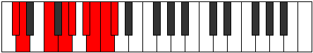
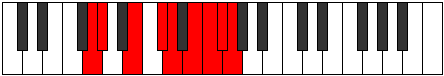

# Mode Epothyllic

## Links

- [Documentation](index.md)
- [Scales Index](Scales.md)
- [Modes Index](Modes.md)
- [Chords Index](Chords.md)

## Parent Scale

[Lydyllic](ScaleLydyllic.md)

## Number

[3795](https://ianring.com/musictheory/scales/3795)

## Interval Pattern

1, 3, 2, 1, 2, 1, 1, 1

## Chord Pattern

I, ii⁰, iii⁰, iii, iv⁰, iv, IV, v⁰, vi, VI, vii⁰

## Perfection

- 5 Perfect notes
- 3 Perfect notes

## Perfection Profile

[true false true true false true false true]

## Permutations

| Tonic | Notes | Signature | Illustration | Audio |
|-------|-------|-----------|--------------|-------|
| [C](ModeCNaturalEpothyllic.md) | C, **C#**, E, F#, **G**, A, **A#**, B, C | C |  | [midi](https://github.com/edipermadi/music/blob/main/docs/ModeCNaturalEpothyllic.mid?raw=true) |
| [C#](ModeCSharpEpothyllic.md) | C#, **D**, F, G, **G#**, A#, **B**, C, C# | C |  | [midi](https://github.com/edipermadi/music/blob/main/docs/ModeCSharpEpothyllic.mid?raw=true) |
| [Db](ModeDFlatEpothyllic.md) | Db, **D**, F, G, **Ab**, Bb, **B**, C, Db | C |  | [midi](https://github.com/edipermadi/music/blob/main/docs/ModeDFlatEpothyllic.mid?raw=true) |
| [D](ModeDNaturalEpothyllic.md) | D, **D#**, F#, G#, **A**, B, **C**, C#, D | C |  | [midi](https://github.com/edipermadi/music/blob/main/docs/ModeDNaturalEpothyllic.mid?raw=true) |
| [D#](ModeDSharpEpothyllic.md) | D#, **E**, G, A, **A#**, C, **C#**, D, D# | C |  | [midi](https://github.com/edipermadi/music/blob/main/docs/ModeDSharpEpothyllic.mid?raw=true) |
| [Eb](ModeEFlatEpothyllic.md) | Eb, **E**, G, A, **Bb**, C, **Db**, D, Eb | C |  | [midi](https://github.com/edipermadi/music/blob/main/docs/ModeEFlatEpothyllic.mid?raw=true) |
| [E](ModeENaturalEpothyllic.md) | E, **F**, G#, A#, **B**, C#, **D**, D#, E | C |  | [midi](https://github.com/edipermadi/music/blob/main/docs/ModeENaturalEpothyllic.mid?raw=true) |
| [F](ModeFNaturalEpothyllic.md) | F, **F#**, A, B, **C**, D, **D#**, E, F | C |  | [midi](https://github.com/edipermadi/music/blob/main/docs/ModeFNaturalEpothyllic.mid?raw=true) |
| [F#](ModeFSharpEpothyllic.md) | F#, **G**, A#, C, **C#**, D#, **E**, F, F# | C |  | [midi](https://github.com/edipermadi/music/blob/main/docs/ModeFSharpEpothyllic.mid?raw=true) |
| [Gb](ModeGFlatEpothyllic.md) | Gb, **G**, Bb, C, **Db**, Eb, **E**, F, Gb | C |  | [midi](https://github.com/edipermadi/music/blob/main/docs/ModeGFlatEpothyllic.mid?raw=true) |
| [G](ModeGNaturalEpothyllic.md) | G, **G#**, B, C#, **D**, E, **F**, F#, G | C |  | [midi](https://github.com/edipermadi/music/blob/main/docs/ModeGNaturalEpothyllic.mid?raw=true) |
| [G#](ModeGSharpEpothyllic.md) | G#, **A**, C, D, **D#**, F, **F#**, G, G# | C |  | [midi](https://github.com/edipermadi/music/blob/main/docs/ModeGSharpEpothyllic.mid?raw=true) |
| [Ab](ModeAFlatEpothyllic.md) | Ab, **A**, C, D, **Eb**, F, **Gb**, G, Ab | C |  | [midi](https://github.com/edipermadi/music/blob/main/docs/ModeAFlatEpothyllic.mid?raw=true) |
| [A](ModeANaturalEpothyllic.md) | A, **A#**, C#, D#, **E**, F#, **G**, G#, A | C |  | [midi](https://github.com/edipermadi/music/blob/main/docs/ModeANaturalEpothyllic.mid?raw=true) |
| [A#](ModeASharpEpothyllic.md) | A#, **B**, D, E, **F**, G, **G#**, A, A# | C |  | [midi](https://github.com/edipermadi/music/blob/main/docs/ModeASharpEpothyllic.mid?raw=true) |
| [Bb](ModeBFlatEpothyllic.md) | Bb, **B**, D, E, **F**, G, **Ab**, A, Bb | C |  | [midi](https://github.com/edipermadi/music/blob/main/docs/ModeBFlatEpothyllic.mid?raw=true) |
| [B](ModeBNaturalEpothyllic.md) | B, **C**, D#, F, **F#**, G#, **A**, A#, B | C |  | [midi](https://github.com/edipermadi/music/blob/main/docs/ModeBNaturalEpothyllic.mid?raw=true) |
