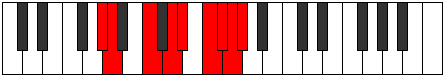

# Mode Epothyllic

## Links

- [Documentation](index.md)
- [Scales Index](Scales.md)
- [Modes Index](Modes.md)
- [Chords Index](Chords.md)

## Parent Scale

[Lydyllic](ScaleLydyllic.md)

## Number

[3795](https://ianring.com/musictheory/scales/3795)

## Perfection

- 5 Perfect notes
- 3 Perfect notes

## Perfection Profile

[true false true true false true false true]

## Permutations

| Tonic | Notes | Signature | Illustration | Audio |
|-------|-------|-----------|--------------|-------|
| [C](ModeCNaturalEpothyllic.md) | C, **C#**, E, F#, **G**, A, **A#**, B, C | C |  | [midi](ModeCNaturalEpothyllic.mid) [ogg](ModeCNaturalEpothyllic.ogg) |
| [C#](ModeCSharpEpothyllic.md) | C#, **D**, F, G, **G#**, A#, **B**, C, C# | C |  | [midi](ModeCSharpEpothyllic.mid) [ogg](ModeCSharpEpothyllic.ogg) |
| [Db](ModeDFlatEpothyllic.md) | Db, **D**, F, G, **Ab**, Bb, **B**, C, Db | C |  | [midi](ModeDFlatEpothyllic.mid) [ogg](ModeDFlatEpothyllic.ogg) |
| [D](ModeDNaturalEpothyllic.md) | D, **D#**, F#, G#, **A**, B, **C**, C#, D | C |  | [midi](ModeDNaturalEpothyllic.mid) [ogg](ModeDNaturalEpothyllic.ogg) |
| [D#](ModeDSharpEpothyllic.md) | D#, **E**, G, A, **A#**, C, **C#**, D, D# | C |  | [midi](ModeDSharpEpothyllic.mid) [ogg](ModeDSharpEpothyllic.ogg) |
| [Eb](ModeEFlatEpothyllic.md) | Eb, **E**, G, A, **Bb**, C, **Db**, D, Eb | C |  | [midi](ModeEFlatEpothyllic.mid) [ogg](ModeEFlatEpothyllic.ogg) |
| [E](ModeENaturalEpothyllic.md) | E, **F**, G#, A#, **B**, C#, **D**, D#, E | C |  | [midi](ModeENaturalEpothyllic.mid) [ogg](ModeENaturalEpothyllic.ogg) |
| [F](ModeFNaturalEpothyllic.md) | F, **F#**, A, B, **C**, D, **D#**, E, F | C |  | [midi](ModeFNaturalEpothyllic.mid) [ogg](ModeFNaturalEpothyllic.ogg) |
| [F#](ModeFSharpEpothyllic.md) | F#, **G**, A#, C, **C#**, D#, **E**, F, F# | C |  | [midi](ModeFSharpEpothyllic.mid) [ogg](ModeFSharpEpothyllic.ogg) |
| [Gb](ModeGFlatEpothyllic.md) | Gb, **G**, Bb, C, **Db**, Eb, **E**, F, Gb | C |  | [midi](ModeGFlatEpothyllic.mid) [ogg](ModeGFlatEpothyllic.ogg) |
| [G](ModeGNaturalEpothyllic.md) | G, **G#**, B, C#, **D**, E, **F**, F#, G | C |  | [midi](ModeGNaturalEpothyllic.mid) [ogg](ModeGNaturalEpothyllic.ogg) |
| [G#](ModeGSharpEpothyllic.md) | G#, **A**, C, D, **D#**, F, **F#**, G, G# | C |  | [midi](ModeGSharpEpothyllic.mid) [ogg](ModeGSharpEpothyllic.ogg) |
| [Ab](ModeAFlatEpothyllic.md) | Ab, **A**, C, D, **Eb**, F, **Gb**, G, Ab | C |  | [midi](ModeAFlatEpothyllic.mid) [ogg](ModeAFlatEpothyllic.ogg) |
| [A](ModeANaturalEpothyllic.md) | A, **A#**, C#, D#, **E**, F#, **G**, G#, A | C |  | [midi](ModeANaturalEpothyllic.mid) [ogg](ModeANaturalEpothyllic.ogg) |
| [A#](ModeASharpEpothyllic.md) | A#, **B**, D, E, **F**, G, **G#**, A, A# | C |  | [midi](ModeASharpEpothyllic.mid) [ogg](ModeASharpEpothyllic.ogg) |
| [Bb](ModeBFlatEpothyllic.md) | Bb, **B**, D, E, **F**, G, **Ab**, A, Bb | C |  | [midi](ModeBFlatEpothyllic.mid) [ogg](ModeBFlatEpothyllic.ogg) |
| [B](ModeBNaturalEpothyllic.md) | B, **C**, D#, F, **F#**, G#, **A**, A#, B | C |  | [midi](ModeBNaturalEpothyllic.mid) [ogg](ModeBNaturalEpothyllic.ogg) |
