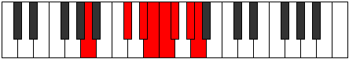

# Mode Epycrian

## Links

- [Documentation](README.md)
- [Scales Index](Scales.md)
- [Modes Index](Modes.md)
- [Chords Index](Chords.md)

## Parent Scale

[Epycrian](ScaleEpycrian.md)

## Number

[3025](https://ianring.com/musictheory/scales/3025)

## Interval Pattern

4, 2, 1, 1, 1, 2, 1

## Chord Pattern

## Perfection

- 4 Perfect notes
- 3 Perfect notes

## Perfection Profile

[true true false false false true true]

## Permutations

| Tonic | Notes | Signature | Illustration | Audio |
|-------|-------|-----------|--------------|-------|
| [C](ModeCNaturalEpycrian.md) | C, D##, **E##**, **F##**, **G#**, A, B, C | C |  | [midi](https://github.com/edipermadi/music/blob/main/docs/ModeCNaturalEpycrian.mid?raw=true) |
| [C#](ModeCSharpEpycrian.md) | C#, D###, **E###**, **F###**, **G##**, A#, B#, C# | C |  | [midi](https://github.com/edipermadi/music/blob/main/docs/ModeCSharpEpycrian.mid?raw=true) |
| [Db](ModeDFlatEpycrian.md) | Db, E#, **F##**, **G#**, **A**, Bb, C, Db | C |  | [midi](https://github.com/edipermadi/music/blob/main/docs/ModeDFlatEpycrian.mid?raw=true) |
| [D](ModeDNaturalEpycrian.md) | D, E##, **F###**, **G##**, **A#**, B, C#, D | C |  | [midi](https://github.com/edipermadi/music/blob/main/docs/ModeDNaturalEpycrian.mid?raw=true) |
| [D#](ModeDSharpEpycrian.md) | D#, E###, **Cbbb**, **Cbb**, **Dbbb**, Dbb, Ebb, D# | C |  | [midi](https://github.com/edipermadi/music/blob/main/docs/ModeDSharpEpycrian.mid?raw=true) |
| [Eb](ModeEFlatEpycrian.md) | Eb, F##, **G##**, **A#**, **B**, C, D, Eb | C |  | [midi](https://github.com/edipermadi/music/blob/main/docs/ModeEFlatEpycrian.mid?raw=true) |
| [E](ModeENaturalEpycrian.md) | E, F###, **G###**, **A##**, **B#**, C#, D#, E | C |  | [midi](https://github.com/edipermadi/music/blob/main/docs/ModeENaturalEpycrian.mid?raw=true) |
| [F](ModeFNaturalEpycrian.md) | F, G##, **A##**, **B#**, **C#**, D, E, F | C |  | [midi](https://github.com/edipermadi/music/blob/main/docs/ModeFNaturalEpycrian.mid?raw=true) |
| [F#](ModeFSharpEpycrian.md) | F#, G###, **A###**, **B##**, **C##**, D#, E#, F# | C |  | [midi](https://github.com/edipermadi/music/blob/main/docs/ModeFSharpEpycrian.mid?raw=true) |
| [Gb](ModeGFlatEpycrian.md) | Gb, A#, **B#**, **C#**, **D**, Eb, F, Gb | C |  | [midi](https://github.com/edipermadi/music/blob/main/docs/ModeGFlatEpycrian.mid?raw=true) |
| [G](ModeGNaturalEpycrian.md) | G, A##, **B##**, **C##**, **D#**, E, F#, G | C |  | [midi](https://github.com/edipermadi/music/blob/main/docs/ModeGNaturalEpycrian.mid?raw=true) |
| [G#](ModeGSharpEpycrian.md) | G#, A###, **B###**, **C###**, **D##**, E#, F##, G# | C |  | [midi](https://github.com/edipermadi/music/blob/main/docs/ModeGSharpEpycrian.mid?raw=true) |
| [Ab](ModeAFlatEpycrian.md) | Ab, B#, **C##**, **D#**, **E**, F, G, Ab | C |  | [midi](https://github.com/edipermadi/music/blob/main/docs/ModeAFlatEpycrian.mid?raw=true) |
| [A](ModeANaturalEpycrian.md) | A, B##, **C###**, **D##**, **E#**, F#, G#, A | C |  | [midi](https://github.com/edipermadi/music/blob/main/docs/ModeANaturalEpycrian.mid?raw=true) |
| [A#](ModeASharpEpycrian.md) | A#, B###, **D##**, **E#**, **F#**, G, A, A# | C |  | [midi](https://github.com/edipermadi/music/blob/main/docs/ModeASharpEpycrian.mid?raw=true) |
| [Bb](ModeBFlatEpycrian.md) | Bb, C##, **D##**, **E#**, **F#**, G, A, Bb | C |  | [midi](https://github.com/edipermadi/music/blob/main/docs/ModeBFlatEpycrian.mid?raw=true) |
| [B](ModeBNaturalEpycrian.md) | B, C###, **D###**, **E##**, **F##**, G#, A#, B | C |  | [midi](https://github.com/edipermadi/music/blob/main/docs/ModeBNaturalEpycrian.mid?raw=true) |
