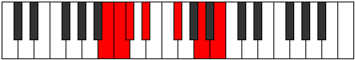

# Mode Epycrimic

## Links

- [Documentation](README.md)
- [Scales Index](Scales.md)
- [Modes Index](Modes.md)
- [Chords Index](Chords.md)

## Parent Scale

[Thagimic](ScaleThagimic.md)

## Number

[1175](https://ianring.com/musictheory/scales/1175)

## Transposition

1, 1, 2, 3, 3, 2

## Chord Pattern

vi⁰

## Perfection

- 2 Perfect notes
- 4 Perfect notes

## Perfection Profile

true, false, false, false, true, false

## Permutations

| Tonic | Notes | Signature | Illustration | Audio |
|-------|-------|-----------|--------------|-------|
| [C](ModeCNaturalEpycrimic.md) | C, **Db**, **Ebb**, **Fb**, G, **A#**, C | C |  | [midi](https://github.com/edipermadi/music/blob/main/docs/ModeCNaturalEpycrimic.mid?raw=true) |
| [C#](ModeCSharpEpycrimic.md) | C#, **D**, **Eb**, **F**, G#, **A##**, C# | C |  | [midi](https://github.com/edipermadi/music/blob/main/docs/ModeCSharpEpycrimic.mid?raw=true) |
| [Db](ModeDFlatEpycrimic.md) | Db, **Ebb**, **Fbb**, **Gbb**, Ab, **B**, Db | C |  | [midi](https://github.com/edipermadi/music/blob/main/docs/ModeDFlatEpycrimic.mid?raw=true) |
| [D](ModeDNaturalEpycrimic.md) | D, **Eb**, **Fb**, **Gb**, A, **B#**, D | C |  | [midi](https://github.com/edipermadi/music/blob/main/docs/ModeDNaturalEpycrimic.mid?raw=true) |
| [D#](ModeDSharpEpycrimic.md) | D#, **E**, **F**, **G**, A#, **B##**, D# | C |  | [midi](https://github.com/edipermadi/music/blob/main/docs/ModeDSharpEpycrimic.mid?raw=true) |
| [Eb](ModeEFlatEpycrimic.md) | Eb, **Fb**, **Gbb**, **Abb**, Bb, **C#**, Eb | C |  | [midi](https://github.com/edipermadi/music/blob/main/docs/ModeEFlatEpycrimic.mid?raw=true) |
| [E](ModeENaturalEpycrimic.md) | E, **F**, **Gb**, **Ab**, B, **C##**, E | C |  | [midi](https://github.com/edipermadi/music/blob/main/docs/ModeENaturalEpycrimic.mid?raw=true) |
| [F](ModeFNaturalEpycrimic.md) | F, **Gb**, **Abb**, **Bbb**, C, **D#**, F | C |  | [midi](https://github.com/edipermadi/music/blob/main/docs/ModeFNaturalEpycrimic.mid?raw=true) |
| [F#](ModeFSharpEpycrimic.md) | F#, **G**, **Ab**, **Bb**, C#, **D##**, F# | C |  | [midi](https://github.com/edipermadi/music/blob/main/docs/ModeFSharpEpycrimic.mid?raw=true) |
| [Gb](ModeGFlatEpycrimic.md) | Gb, **Abb**, **Bbbb**, **Cbb**, Db, **E**, Gb | C |  | [midi](https://github.com/edipermadi/music/blob/main/docs/ModeGFlatEpycrimic.mid?raw=true) |
| [G](ModeGNaturalEpycrimic.md) | G, **Ab**, **Bbb**, **Cb**, D, **E#**, G | C |  | [midi](https://github.com/edipermadi/music/blob/main/docs/ModeGNaturalEpycrimic.mid?raw=true) |
| [G#](ModeGSharpEpycrimic.md) | G#, **A**, **Bb**, **C**, D#, **E##**, G# | C |  | [midi](https://github.com/edipermadi/music/blob/main/docs/ModeGSharpEpycrimic.mid?raw=true) |
| [Ab](ModeAFlatEpycrimic.md) | Ab, **Bbb**, **Cbb**, **Dbb**, Eb, **F#**, Ab | C |  | [midi](https://github.com/edipermadi/music/blob/main/docs/ModeAFlatEpycrimic.mid?raw=true) |
| [A](ModeANaturalEpycrimic.md) | A, **Bb**, **Cb**, **Db**, E, **F##**, A | C |  | [midi](https://github.com/edipermadi/music/blob/main/docs/ModeANaturalEpycrimic.mid?raw=true) |
| [A#](ModeASharpEpycrimic.md) | A#, **B**, **C**, **D**, E#, **F###**, A# | C |  | [midi](https://github.com/edipermadi/music/blob/main/docs/ModeASharpEpycrimic.mid?raw=true) |
| [Bb](ModeBFlatEpycrimic.md) | Bb, **Cb**, **Dbb**, **Ebb**, F, **G#**, Bb | C |  | [midi](https://github.com/edipermadi/music/blob/main/docs/ModeBFlatEpycrimic.mid?raw=true) |
| [B](ModeBNaturalEpycrimic.md) | B, **C**, **Db**, **Eb**, F#, **G##**, B | C |  | [midi](https://github.com/edipermadi/music/blob/main/docs/ModeBNaturalEpycrimic.mid?raw=true) |
