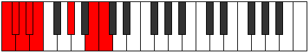
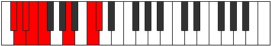
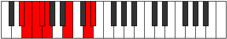
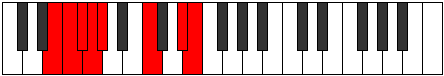
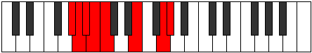
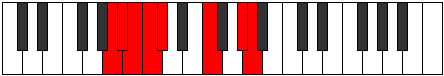
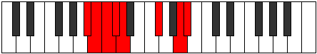
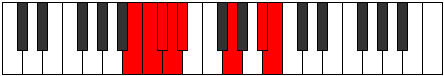

# Mode Epydian

## Links

- [Documentation](index.md)
- [Scales Index](Scales.md)
- [Modes Index](Modes.md)
- [Chords Index](Chords.md)

## Parent Scale

[Thadian](ScaleThadian.md)

## Number

[2335](https://ianring.com/musictheory/scales/2335)

## Interval Pattern

1, 1, 1, 1, 4, 3, 1

## Chord Pattern

## Perfection

- 3 Perfect notes
- 4 Perfect notes

## Perfection Profile

[false true false false true true false]

## Permutations

| Tonic | Notes | Signature | Illustration | Audio |
|-------|-------|-----------|--------------|-------|
| [C](ModeCNaturalEpydian.md) | **C**, Db, **Ebb**, **Fbb**, Gbbb, Ab, **B**, **C** | C |  | [midi](https://github.com/edipermadi/music/blob/main/docs/ModeCNaturalEpydian.mid?raw=true) |
| [C#](ModeCSharpEpydian.md) | **C#**, D, **Eb**, **Fb**, Gbb, A, **B#**, **C#** | C |  | [midi](https://github.com/edipermadi/music/blob/main/docs/ModeCSharpEpydian.mid?raw=true) |
| [Db](ModeDFlatEpydian.md) | **Db**, Ebb, **Fbb**, **Gbbb**, D###, Cbbb, **Dbb**, **Db** | C |  | [midi](https://github.com/edipermadi/music/blob/main/docs/ModeDFlatEpydian.mid?raw=true) |
| [D](ModeDNaturalEpydian.md) | **D**, Eb, **Fb**, **Gbb**, Abbb, Bb, **C#**, **D** | C |  | [midi](https://github.com/edipermadi/music/blob/main/docs/ModeDNaturalEpydian.mid?raw=true) |
| [D#](ModeDSharpEpydian.md) | **D#**, E, **F**, **Gb**, Abb, B, **C##**, **D#** | C |  | [midi](https://github.com/edipermadi/music/blob/main/docs/ModeDSharpEpydian.mid?raw=true) |
| [Eb](ModeEFlatEpydian.md) | **Eb**, Fb, **Gbb**, **Abbb**, E###, Cb, **D**, **Eb** | C |  | [midi](https://github.com/edipermadi/music/blob/main/docs/ModeEFlatEpydian.mid?raw=true) |
| [E](ModeENaturalEpydian.md) | **E**, F, **Gb**, **Abb**, Bbbb, C, **D#**, **E** | C |  | [midi](https://github.com/edipermadi/music/blob/main/docs/ModeENaturalEpydian.mid?raw=true) |
| [F](ModeFNaturalEpydian.md) | **F**, Gb, **Abb**, **Bbbb**, Cbbb, Db, **E**, **F** | C |  | [midi](https://github.com/edipermadi/music/blob/main/docs/ModeFNaturalEpydian.mid?raw=true) |
| [F#](ModeFSharpEpydian.md) | **F#**, G, **Ab**, **Bbb**, Cbb, D, **E#**, **F#** | C |  | [midi](https://github.com/edipermadi/music/blob/main/docs/ModeFSharpEpydian.mid?raw=true) |
| [Gb](ModeGFlatEpydian.md) | **Gb**, Abb, **Bbbb**, **Cbbb**, Cbb, D, **E#**, **Gb** | C |  | [midi](https://github.com/edipermadi/music/blob/main/docs/ModeGFlatEpydian.mid?raw=true) |
| [G](ModeGNaturalEpydian.md) | **G**, Ab, **Bbb**, **Cbb**, Dbbb, Eb, **F#**, **G** | C |  | [midi](https://github.com/edipermadi/music/blob/main/docs/ModeGNaturalEpydian.mid?raw=true) |
| [G#](ModeGSharpEpydian.md) | **G#**, A, **Bb**, **Cb**, Dbb, E, **F##**, **G#** | C |  | [midi](https://github.com/edipermadi/music/blob/main/docs/ModeGSharpEpydian.mid?raw=true) |
| [Ab](ModeAFlatEpydian.md) | **Ab**, Bbb, **Cbb**, **Dbbb**, Dbb, E, **F##**, **Ab** | C |  | [midi](https://github.com/edipermadi/music/blob/main/docs/ModeAFlatEpydian.mid?raw=true) |
| [A](ModeANaturalEpydian.md) | **A**, Bb, **Cb**, **Dbb**, Ebbb, F, **G#**, **A** | C |  | [midi](https://github.com/edipermadi/music/blob/main/docs/ModeANaturalEpydian.mid?raw=true) |
| [A#](ModeASharpEpydian.md) | **A#**, B, **C**, **Db**, Ebb, F#, **G##**, **A#** | C |  | [midi](https://github.com/edipermadi/music/blob/main/docs/ModeASharpEpydian.mid?raw=true) |
| [Bb](ModeBFlatEpydian.md) | **Bb**, Cb, **Dbb**, **Ebbb**, Fbbb, Gb, **A**, **Bb** | C |  | [midi](https://github.com/edipermadi/music/blob/main/docs/ModeBFlatEpydian.mid?raw=true) |
| [B](ModeBNaturalEpydian.md) | **B**, C, **Db**, **Ebb**, Fbb, G, **A#**, **B** | C |  | [midi](https://github.com/edipermadi/music/blob/main/docs/ModeBNaturalEpydian.mid?raw=true) |
