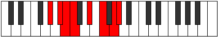

# Mode Epygian

## Links

- [Documentation](index.md)
- [Scales Index](Scales.md)
- [Modes Index](Modes.md)
- [Chords Index](Chords.md)

## Parent Scale

[Phrolian](ScalePhrolian.md)

## Number

[2717](https://ianring.com/musictheory/scales/2717)

## Perfection

- 5 Perfect notes
- 2 Perfect notes

## Interval Pattern

2, 1, 1, 3, 2, 2, 1

## Perfection Profile

[true true false true true true false]

## Permutations

| Tonic | Notes | Signature | Illustration | Audio |
|-------|-------|-----------|--------------|-------|
| [C](ModeCNaturalEpygian.md) | C, D, **Eb**, Fb, G, A, **B**, C | C |  | [midi](https://github.com/edipermadi/music/blob/main/docs/ModeCNaturalEpygian.mid?raw=true) |
| [C#](ModeCSharpEpygian.md) | C#, D#, **E**, F, G#, A#, **B#**, C# | C |  | [midi](https://github.com/edipermadi/music/blob/main/docs/ModeCSharpEpygian.mid?raw=true) |
| [Db](ModeDFlatEpygian.md) | Db, Eb, **Fb**, Gbb, Ab, Bb, **C**, Db | C |  | [midi](https://github.com/edipermadi/music/blob/main/docs/ModeDFlatEpygian.mid?raw=true) |
| [D](ModeDNaturalEpygian.md) | D, E, **F**, Gb, A, B, **C#**, D | C |  | [midi](https://github.com/edipermadi/music/blob/main/docs/ModeDNaturalEpygian.mid?raw=true) |
| [D#](ModeDSharpEpygian.md) | D#, E#, **F#**, G, A#, B#, **C##**, D# | C |  | [midi](https://github.com/edipermadi/music/blob/main/docs/ModeDSharpEpygian.mid?raw=true) |
| [Eb](ModeEFlatEpygian.md) | Eb, F, **Gb**, Abb, Bb, C, **D**, Eb | C |  | [midi](https://github.com/edipermadi/music/blob/main/docs/ModeEFlatEpygian.mid?raw=true) |
| [E](ModeENaturalEpygian.md) | E, F#, **G**, Ab, B, C#, **D#**, E | C |  | [midi](https://github.com/edipermadi/music/blob/main/docs/ModeENaturalEpygian.mid?raw=true) |
| [F](ModeFNaturalEpygian.md) | F, G, **Ab**, Bbb, C, D, **E**, F | C |  | [midi](https://github.com/edipermadi/music/blob/main/docs/ModeFNaturalEpygian.mid?raw=true) |
| [F#](ModeFSharpEpygian.md) | F#, G#, **A**, Bb, C#, D#, **E#**, F# | C |  | [midi](https://github.com/edipermadi/music/blob/main/docs/ModeFSharpEpygian.mid?raw=true) |
| [Gb](ModeGFlatEpygian.md) | Gb, Ab, **Bbb**, Cbb, Db, Eb, **F**, Gb | C |  | [midi](https://github.com/edipermadi/music/blob/main/docs/ModeGFlatEpygian.mid?raw=true) |
| [G](ModeGNaturalEpygian.md) | G, A, **Bb**, Cb, D, E, **F#**, G | C |  | [midi](https://github.com/edipermadi/music/blob/main/docs/ModeGNaturalEpygian.mid?raw=true) |
| [G#](ModeGSharpEpygian.md) | G#, A#, **B**, C, D#, E#, **F##**, G# | C |  | [midi](https://github.com/edipermadi/music/blob/main/docs/ModeGSharpEpygian.mid?raw=true) |
| [Ab](ModeAFlatEpygian.md) | Ab, Bb, **Cb**, Dbb, Eb, F, **G**, Ab | C |  | [midi](https://github.com/edipermadi/music/blob/main/docs/ModeAFlatEpygian.mid?raw=true) |
| [A](ModeANaturalEpygian.md) | A, B, **C**, Db, E, F#, **G#**, A | C |  | [midi](https://github.com/edipermadi/music/blob/main/docs/ModeANaturalEpygian.mid?raw=true) |
| [A#](ModeASharpEpygian.md) | A#, B#, **C#**, D, E#, F##, **G##**, A# | C |  | [midi](https://github.com/edipermadi/music/blob/main/docs/ModeASharpEpygian.mid?raw=true) |
| [Bb](ModeBFlatEpygian.md) | Bb, C, **Db**, Ebb, F, G, **A**, Bb | C |  | [midi](https://github.com/edipermadi/music/blob/main/docs/ModeBFlatEpygian.mid?raw=true) |
| [B](ModeBNaturalEpygian.md) | B, C#, **D**, Eb, F#, G#, **A#**, B | C |  | [midi](https://github.com/edipermadi/music/blob/main/docs/ModeBNaturalEpygian.mid?raw=true) |
