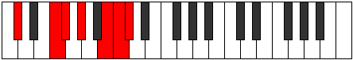
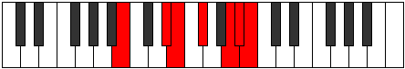

# Mode Epygimic

## Links

- [Documentation](index.md)
- [Scales Index](Scales.md)
- [Modes Index](Modes.md)
- [Chords Index](Chords.md)

## Parent Scale

[Epygimic](ScaleEpygimic.md)

## Number

[3249](https://ianring.com/musictheory/scales/3249)

## Perfection

- 4 Perfect notes
- 2 Perfect notes

## Perfection Profile

[true true true false true false]

## Permutations

| Tonic | Notes | Signature | Illustration | Audio |
|-------|-------|-----------|--------------|-------|
| [C](ModeCNaturalEpygimic.md) | C, D##, E#, **F##**, G###, **A##**, C | C |  | [midi](ModeCNaturalEpygimic.mid) [ogg](ModeCNaturalEpygimic.ogg) |
| [C#](ModeCSharpEpygimic.md) | C#, D###, E##, **F###**, Cb, **Dbb**, C# | C |  | [midi](ModeCSharpEpygimic.mid) [ogg](ModeCSharpEpygimic.ogg) |
| [Db](ModeDFlatEpygimic.md) | Db, E#, F#, **G#**, A##, **B#**, Db | C |  | [midi](ModeDFlatEpygimic.mid) [ogg](ModeDFlatEpygimic.ogg) |
| [D](ModeDNaturalEpygimic.md) | D, E##, F##, **G##**, A###, **B##**, D | C |  | [midi](ModeDNaturalEpygimic.mid) [ogg](ModeDNaturalEpygimic.ogg) |
| [D#](ModeDSharpEpygimic.md) | D#, E###, F###, **G###**, Db, **Ebb**, D# | C |  | [midi](ModeDSharpEpygimic.mid) [ogg](ModeDSharpEpygimic.ogg) |
| [Eb](ModeEFlatEpygimic.md) | Eb, F##, G#, **A#**, B##, **C##**, Eb | C |  | [midi](ModeEFlatEpygimic.mid) [ogg](ModeEFlatEpygimic.ogg) |
| [E](ModeENaturalEpygimic.md) | E, F###, G##, **A##**, B###, **C###**, E | C |  | [midi](ModeENaturalEpygimic.mid) [ogg](ModeENaturalEpygimic.ogg) |
| [F](ModeFNaturalEpygimic.md) | F, G##, A#, **B#**, C###, **D##**, F | C |  | [midi](ModeFNaturalEpygimic.mid) [ogg](ModeFNaturalEpygimic.ogg) |
| [F#](ModeFSharpEpygimic.md) | F#, G###, A##, **B##**, D##, **E#**, F# | C |  | [midi](ModeFSharpEpygimic.mid) [ogg](ModeFSharpEpygimic.ogg) |
| [Gb](ModeGFlatEpygimic.md) | Gb, A#, B, **C#**, D##, **E#**, Gb | C |  | [midi](ModeGFlatEpygimic.mid) [ogg](ModeGFlatEpygimic.ogg) |
| [G](ModeGNaturalEpygimic.md) | G, A##, B#, **C##**, D###, **E##**, G | C |  | [midi](ModeGNaturalEpygimic.mid) [ogg](ModeGNaturalEpygimic.ogg) |
| [G#](ModeGSharpEpygimic.md) | G#, A###, B##, **C###**, E##, **F##**, G# | C |  | [midi](ModeGSharpEpygimic.mid) [ogg](ModeGSharpEpygimic.ogg) |
| [Ab](ModeAFlatEpygimic.md) | Ab, B#, C#, **D#**, E##, **F##**, Ab | C |  | [midi](ModeAFlatEpygimic.mid) [ogg](ModeAFlatEpygimic.ogg) |
| [A](ModeANaturalEpygimic.md) | A, B##, C##, **D##**, E###, **F###**, A | C |  | [midi](ModeANaturalEpygimic.mid) [ogg](ModeANaturalEpygimic.ogg) |
| [A#](ModeASharpEpygimic.md) | A#, B###, C###, **D###**, F###, **G##**, A# | C |  | [midi](ModeASharpEpygimic.mid) [ogg](ModeASharpEpygimic.ogg) |
| [Bb](ModeBFlatEpygimic.md) | Bb, C##, D#, **E#**, F###, **G##**, Bb | C |  | [midi](ModeBFlatEpygimic.mid) [ogg](ModeBFlatEpygimic.ogg) |
| [B](ModeBNaturalEpygimic.md) | B, C###, D##, **E##**, Cbbb, **Cbb**, B | C |  | [midi](ModeBNaturalEpygimic.mid) [ogg](ModeBNaturalEpygimic.ogg) |
