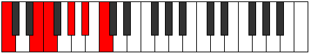
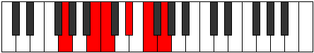

# Mode Epygitonic

## Links

- [Documentation](index.md)
- [Scales Index](Scales.md)
- [Modes Index](Modes.md)
- [Chords Index](Chords.md)

## Parent Scale

[Epygitonic](ScaleEpygitonic.md)

## Number

[1329](https://ianring.com/musictheory/scales/1329)

## Interval Pattern

4, 1, 3, 2, 2

## Chord Pattern

I⁺, II⁺, iii, IV⁺

## Perfection

- 2 Perfect notes
- 3 Perfect notes

## Perfection Profile

[false false true false true]

## Permutations

| Tonic | Notes | Signature | Illustration | Audio |
|-------|-------|-----------|--------------|-------|
| [C](ModeCNaturalEpygitonic.md) | **C**, **E**, F, **G#**, A#, **C** | C |  | [midi](https://github.com/edipermadi/music/blob/main/docs/ModeCNaturalEpygitonic.mid?raw=true) |
| [C#](ModeCSharpEpygitonic.md) | **C#**, **F**, F#, **A**, B, **C#** | C |  | [midi](https://github.com/edipermadi/music/blob/main/docs/ModeCSharpEpygitonic.mid?raw=true) |
| [Db](ModeDFlatEpygitonic.md) | **Db**, **F**, Gb, **A**, B, **Db** | C |  | [midi](https://github.com/edipermadi/music/blob/main/docs/ModeDFlatEpygitonic.mid?raw=true) |
| [D](ModeDNaturalEpygitonic.md) | **D**, **F#**, G, **A#**, C, **D** | C |  | [midi](https://github.com/edipermadi/music/blob/main/docs/ModeDNaturalEpygitonic.mid?raw=true) |
| [D#](ModeDSharpEpygitonic.md) | **D#**, **G**, G#, **B**, C#, **D#** | C |  | [midi](https://github.com/edipermadi/music/blob/main/docs/ModeDSharpEpygitonic.mid?raw=true) |
| [Eb](ModeEFlatEpygitonic.md) | **Eb**, **G**, Ab, **B**, Db, **Eb** | C |  | [midi](https://github.com/edipermadi/music/blob/main/docs/ModeEFlatEpygitonic.mid?raw=true) |
| [E](ModeENaturalEpygitonic.md) | **E**, **G#**, A, **C**, D, **E** | C |  | [midi](https://github.com/edipermadi/music/blob/main/docs/ModeENaturalEpygitonic.mid?raw=true) |
| [F](ModeFNaturalEpygitonic.md) | **F**, **A**, A#, **C#**, D#, **F** | C |  | [midi](https://github.com/edipermadi/music/blob/main/docs/ModeFNaturalEpygitonic.mid?raw=true) |
| [F#](ModeFSharpEpygitonic.md) | **F#**, **A#**, B, **D**, E, **F#** | C |  | [midi](https://github.com/edipermadi/music/blob/main/docs/ModeFSharpEpygitonic.mid?raw=true) |
| [Gb](ModeGFlatEpygitonic.md) | **Gb**, **Bb**, B, **D**, E, **Gb** | C |  | [midi](https://github.com/edipermadi/music/blob/main/docs/ModeGFlatEpygitonic.mid?raw=true) |
| [G](ModeGNaturalEpygitonic.md) | **G**, **B**, C, **D#**, F, **G** | C |  | [midi](https://github.com/edipermadi/music/blob/main/docs/ModeGNaturalEpygitonic.mid?raw=true) |
| [G#](ModeGSharpEpygitonic.md) | **G#**, **C**, C#, **E**, F#, **G#** | C |  | [midi](https://github.com/edipermadi/music/blob/main/docs/ModeGSharpEpygitonic.mid?raw=true) |
| [Ab](ModeAFlatEpygitonic.md) | **Ab**, **C**, Db, **E**, Gb, **Ab** | C |  | [midi](https://github.com/edipermadi/music/blob/main/docs/ModeAFlatEpygitonic.mid?raw=true) |
| [A](ModeANaturalEpygitonic.md) | **A**, **C#**, D, **F**, G, **A** | C |  | [midi](https://github.com/edipermadi/music/blob/main/docs/ModeANaturalEpygitonic.mid?raw=true) |
| [A#](ModeASharpEpygitonic.md) | **A#**, **D**, D#, **F#**, G#, **A#** | C |  | [midi](https://github.com/edipermadi/music/blob/main/docs/ModeASharpEpygitonic.mid?raw=true) |
| [Bb](ModeBFlatEpygitonic.md) | **Bb**, **D**, Eb, **Gb**, Ab, **Bb** | C |  | [midi](https://github.com/edipermadi/music/blob/main/docs/ModeBFlatEpygitonic.mid?raw=true) |
| [B](ModeBNaturalEpygitonic.md) | **B**, **D#**, E, **G**, A, **B** | C |  | [midi](https://github.com/edipermadi/music/blob/main/docs/ModeBNaturalEpygitonic.mid?raw=true) |
