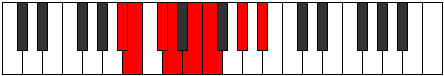

# Mode Epylian

## Links

- [Documentation](index.md)
- [Scales Index](Scales.md)
- [Modes Index](Modes.md)
- [Chords Index](Chords.md)

## Parent Scale

[Pogian](ScalePogian.md)

## Number

[1243](https://ianring.com/musictheory/scales/1243)

## Interval Pattern

1, 2, 1, 2, 1, 3, 2

## Chord Pattern

i⁰, ii⁰, iii, V, vii⁰

## Perfection

- 3 Perfect notes
- 4 Perfect notes

## Perfection Profile

[true false true false true false false]

## Permutations

| Tonic | Notes | Signature | Illustration | Audio |
|-------|-------|-----------|--------------|-------|
| [C](ModeCNaturalEpylian.md) | C, **Db**, Eb, **Fb**, Gb, **Abb**, **Bb**, C | C |  | [midi](https://github.com/edipermadi/music/blob/main/docs/ModeCNaturalEpylian.mid?raw=true) |
| [C#](ModeCSharpEpylian.md) | C#, **D**, E, **F**, G, **Ab**, **B**, C# | C |  | [midi](https://github.com/edipermadi/music/blob/main/docs/ModeCSharpEpylian.mid?raw=true) |
| [Db](ModeDFlatEpylian.md) | Db, **Ebb**, Fb, **Gbb**, Abb, **Bbbb**, **Cb**, Db | C |  | [midi](https://github.com/edipermadi/music/blob/main/docs/ModeDFlatEpylian.mid?raw=true) |
| [D](ModeDNaturalEpylian.md) | D, **Eb**, F, **Gb**, Ab, **Bbb**, **C**, D | C |  | [midi](https://github.com/edipermadi/music/blob/main/docs/ModeDNaturalEpylian.mid?raw=true) |
| [D#](ModeDSharpEpylian.md) | D#, **E**, F#, **G**, A, **Bb**, **C#**, D# | C |  | [midi](https://github.com/edipermadi/music/blob/main/docs/ModeDSharpEpylian.mid?raw=true) |
| [Eb](ModeEFlatEpylian.md) | Eb, **Fb**, Gb, **Abb**, Bbb, **Cbb**, **Db**, Eb | C |  | [midi](https://github.com/edipermadi/music/blob/main/docs/ModeEFlatEpylian.mid?raw=true) |
| [E](ModeENaturalEpylian.md) | E, **F**, G, **Ab**, Bb, **Cb**, **D**, E | C |  | [midi](https://github.com/edipermadi/music/blob/main/docs/ModeENaturalEpylian.mid?raw=true) |
| [F](ModeFNaturalEpylian.md) | F, **Gb**, Ab, **Bbb**, Cb, **Dbb**, **Eb**, F | C |  | [midi](https://github.com/edipermadi/music/blob/main/docs/ModeFNaturalEpylian.mid?raw=true) |
| [F#](ModeFSharpEpylian.md) | F#, **G**, A, **Bb**, C, **Db**, **E**, F# | C |  | [midi](https://github.com/edipermadi/music/blob/main/docs/ModeFSharpEpylian.mid?raw=true) |
| [Gb](ModeGFlatEpylian.md) | Gb, **Abb**, Bbb, **Cbb**, Dbb, **Ebbb**, **Fb**, Gb | C |  | [midi](https://github.com/edipermadi/music/blob/main/docs/ModeGFlatEpylian.mid?raw=true) |
| [G](ModeGNaturalEpylian.md) | G, **Ab**, Bb, **Cb**, Db, **Ebb**, **F**, G | C |  | [midi](https://github.com/edipermadi/music/blob/main/docs/ModeGNaturalEpylian.mid?raw=true) |
| [G#](ModeGSharpEpylian.md) | G#, **A**, B, **C**, D, **Eb**, **F#**, G# | C |  | [midi](https://github.com/edipermadi/music/blob/main/docs/ModeGSharpEpylian.mid?raw=true) |
| [Ab](ModeAFlatEpylian.md) | Ab, **Bbb**, Cb, **Dbb**, Ebb, **Fbb**, **Gb**, Ab | C |  | [midi](https://github.com/edipermadi/music/blob/main/docs/ModeAFlatEpylian.mid?raw=true) |
| [A](ModeANaturalEpylian.md) | A, **Bb**, C, **Db**, Eb, **Fb**, **G**, A | C |  | [midi](https://github.com/edipermadi/music/blob/main/docs/ModeANaturalEpylian.mid?raw=true) |
| [A#](ModeASharpEpylian.md) | A#, **B**, C#, **D**, E, **F**, **G#**, A# | C |  | [midi](https://github.com/edipermadi/music/blob/main/docs/ModeASharpEpylian.mid?raw=true) |
| [Bb](ModeBFlatEpylian.md) | Bb, **Cb**, Db, **Ebb**, Fb, **Gbb**, **Ab**, Bb | C |  | [midi](https://github.com/edipermadi/music/blob/main/docs/ModeBFlatEpylian.mid?raw=true) |
| [B](ModeBNaturalEpylian.md) | B, **C**, D, **Eb**, F, **Gb**, **A**, B | C |  | [midi](https://github.com/edipermadi/music/blob/main/docs/ModeBNaturalEpylian.mid?raw=true) |
