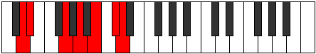

# Mode Epylimic

## Links

- [Documentation](index.md)
- [Scales Index](Scales.md)
- [Modes Index](Modes.md)
- [Chords Index](Chords.md)

## Parent Scale

[Katanimic](ScaleKatanimic.md)

## Number

[2723](https://ianring.com/musictheory/scales/2723)

## Perfection

- 2 Perfect notes
- 4 Perfect notes

## Perfection Profile

[true false true false false false]

## Permutations

| Tonic | Notes | Signature | Illustration | Audio |
|-------|-------|-----------|--------------|-------|
| [C](ModeCNaturalEpylimic.md) | C, **Db**, E#, **F##**, **G##**, **A##**, C | C |  | [midi](https://github.com/edipermadi/music/blob/main/docs/ModeCNaturalEpylimic.mid?raw=true) |
| [C#](ModeCSharpEpylimic.md) | C#, **D**, E##, **F###**, **G###**, **A###**, C# | C |  | [midi](https://github.com/edipermadi/music/blob/main/docs/ModeCSharpEpylimic.mid?raw=true) |
| [Db](ModeDFlatEpylimic.md) | Db, **Ebb**, F#, **G#**, **A#**, **B#**, Db | C |  | [midi](https://github.com/edipermadi/music/blob/main/docs/ModeDFlatEpylimic.mid?raw=true) |
| [D](ModeDNaturalEpylimic.md) | D, **Eb**, F##, **G##**, **A##**, **B##**, D | C |  | [midi](https://github.com/edipermadi/music/blob/main/docs/ModeDNaturalEpylimic.mid?raw=true) |
| [D#](ModeDSharpEpylimic.md) | D#, **E**, F###, **G###**, **A###**, **B###**, D# | C |  | [midi](https://github.com/edipermadi/music/blob/main/docs/ModeDSharpEpylimic.mid?raw=true) |
| [Eb](ModeEFlatEpylimic.md) | Eb, **Fb**, G#, **A#**, **B#**, **C##**, Eb | C |  | [midi](https://github.com/edipermadi/music/blob/main/docs/ModeEFlatEpylimic.mid?raw=true) |
| [E](ModeENaturalEpylimic.md) | E, **F**, G##, **A##**, **B##**, **C###**, E | C |  | [midi](https://github.com/edipermadi/music/blob/main/docs/ModeENaturalEpylimic.mid?raw=true) |
| [F](ModeFNaturalEpylimic.md) | F, **Gb**, A#, **B#**, **C##**, **D##**, F | C |  | [midi](https://github.com/edipermadi/music/blob/main/docs/ModeFNaturalEpylimic.mid?raw=true) |
| [F#](ModeFSharpEpylimic.md) | F#, **G**, A##, **B##**, **C###**, **D###**, F# | C |  | [midi](https://github.com/edipermadi/music/blob/main/docs/ModeFSharpEpylimic.mid?raw=true) |
| [Gb](ModeGFlatEpylimic.md) | Gb, **Abb**, B, **C#**, **D#**, **E#**, Gb | C |  | [midi](https://github.com/edipermadi/music/blob/main/docs/ModeGFlatEpylimic.mid?raw=true) |
| [G](ModeGNaturalEpylimic.md) | G, **Ab**, B#, **C##**, **D##**, **E##**, G | C |  | [midi](https://github.com/edipermadi/music/blob/main/docs/ModeGNaturalEpylimic.mid?raw=true) |
| [G#](ModeGSharpEpylimic.md) | G#, **A**, B##, **C###**, **D###**, **E###**, G# | C |  | [midi](https://github.com/edipermadi/music/blob/main/docs/ModeGSharpEpylimic.mid?raw=true) |
| [Ab](ModeAFlatEpylimic.md) | Ab, **Bbb**, C#, **D#**, **E#**, **F##**, Ab | C |  | [midi](https://github.com/edipermadi/music/blob/main/docs/ModeAFlatEpylimic.mid?raw=true) |
| [A](ModeANaturalEpylimic.md) | A, **Bb**, C##, **D##**, **E##**, **F###**, A | C |  | [midi](https://github.com/edipermadi/music/blob/main/docs/ModeANaturalEpylimic.mid?raw=true) |
| [A#](ModeASharpEpylimic.md) | A#, **B**, C###, **D###**, **E###**, **Cbbb**, A# | C |  | [midi](https://github.com/edipermadi/music/blob/main/docs/ModeASharpEpylimic.mid?raw=true) |
| [Bb](ModeBFlatEpylimic.md) | Bb, **Cb**, D#, **E#**, **F##**, **G##**, Bb | C |  | [midi](https://github.com/edipermadi/music/blob/main/docs/ModeBFlatEpylimic.mid?raw=true) |
| [B](ModeBNaturalEpylimic.md) | B, **C**, D##, **E##**, **F###**, **G###**, B | C |  | [midi](https://github.com/edipermadi/music/blob/main/docs/ModeBNaturalEpylimic.mid?raw=true) |
