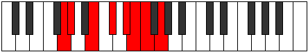

# Mode Epyphian

## Links

- [Documentation](index.md)
- [Scales Index](Scales.md)
- [Modes Index](Modes.md)
- [Chords Index](Chords.md)

## Parent Scale

[Epacrian](ScaleEpacrian.md)

## Number

[1875](https://ianring.com/musictheory/scales/1875)

## Perfection

- 3 Perfect notes
- 4 Perfect notes

## Perfection Profile

[false true false true false true false]

## Permutations

| Tonic | Notes | Signature | Illustration | Audio |
|-------|-------|-----------|--------------|-------|
| [C](ModeCNaturalEpyphian.md) | **C**, Db, **E**, F#, **G#**, A, **Bb**, **C** | C |  | [midi](https://github.com/edipermadi/music/blob/main/docs/ModeCNaturalEpyphian.mid?raw=true) |
| [C#](ModeCSharpEpyphian.md) | **C#**, D, **E#**, F##, **G##**, A#, **B**, **C#** | C |  | [midi](https://github.com/edipermadi/music/blob/main/docs/ModeCSharpEpyphian.mid?raw=true) |
| [Db](ModeDFlatEpyphian.md) | **Db**, Ebb, **F**, G, **A**, Bb, **Cb**, **Db** | C |  | [midi](https://github.com/edipermadi/music/blob/main/docs/ModeDFlatEpyphian.mid?raw=true) |
| [D](ModeDNaturalEpyphian.md) | **D**, Eb, **F#**, G#, **A#**, B, **C**, **D** | C |  | [midi](https://github.com/edipermadi/music/blob/main/docs/ModeDNaturalEpyphian.mid?raw=true) |
| [D#](ModeDSharpEpyphian.md) | **D#**, E, **F##**, G##, **A##**, B#, **C#**, **D#** | C |  | [midi](https://github.com/edipermadi/music/blob/main/docs/ModeDSharpEpyphian.mid?raw=true) |
| [Eb](ModeEFlatEpyphian.md) | **Eb**, Fb, **G**, A, **B**, C, **Db**, **Eb** | C |  | [midi](https://github.com/edipermadi/music/blob/main/docs/ModeEFlatEpyphian.mid?raw=true) |
| [E](ModeENaturalEpyphian.md) | **E**, F, **G#**, A#, **B#**, C#, **D**, **E** | C |  | [midi](https://github.com/edipermadi/music/blob/main/docs/ModeENaturalEpyphian.mid?raw=true) |
| [F](ModeFNaturalEpyphian.md) | **F**, Gb, **A**, B, **C#**, D, **Eb**, **F** | C |  | [midi](https://github.com/edipermadi/music/blob/main/docs/ModeFNaturalEpyphian.mid?raw=true) |
| [F#](ModeFSharpEpyphian.md) | **F#**, G, **A#**, B#, **C##**, D#, **E**, **F#** | C |  | [midi](https://github.com/edipermadi/music/blob/main/docs/ModeFSharpEpyphian.mid?raw=true) |
| [Gb](ModeGFlatEpyphian.md) | **Gb**, Abb, **Bb**, C, **D**, Eb, **Fb**, **Gb** | C |  | [midi](https://github.com/edipermadi/music/blob/main/docs/ModeGFlatEpyphian.mid?raw=true) |
| [G](ModeGNaturalEpyphian.md) | **G**, Ab, **B**, C#, **D#**, E, **F**, **G** | C |  | [midi](https://github.com/edipermadi/music/blob/main/docs/ModeGNaturalEpyphian.mid?raw=true) |
| [G#](ModeGSharpEpyphian.md) | **G#**, A, **B#**, C##, **D##**, E#, **F#**, **G#** | C |  | [midi](https://github.com/edipermadi/music/blob/main/docs/ModeGSharpEpyphian.mid?raw=true) |
| [Ab](ModeAFlatEpyphian.md) | **Ab**, Bbb, **C**, D, **E**, F, **Gb**, **Ab** | C |  | [midi](https://github.com/edipermadi/music/blob/main/docs/ModeAFlatEpyphian.mid?raw=true) |
| [A](ModeANaturalEpyphian.md) | **A**, Bb, **C#**, D#, **E#**, F#, **G**, **A** | C |  | [midi](https://github.com/edipermadi/music/blob/main/docs/ModeANaturalEpyphian.mid?raw=true) |
| [A#](ModeASharpEpyphian.md) | **A#**, B, **C##**, D##, **E##**, F##, **G#**, **A#** | C |  | [midi](https://github.com/edipermadi/music/blob/main/docs/ModeASharpEpyphian.mid?raw=true) |
| [Bb](ModeBFlatEpyphian.md) | **Bb**, Cb, **D**, E, **F#**, G, **Ab**, **Bb** | C |  | [midi](https://github.com/edipermadi/music/blob/main/docs/ModeBFlatEpyphian.mid?raw=true) |
| [B](ModeBNaturalEpyphian.md) | **B**, C, **D#**, E#, **F##**, G#, **A**, **B** | C |  | [midi](https://github.com/edipermadi/music/blob/main/docs/ModeBNaturalEpyphian.mid?raw=true) |
