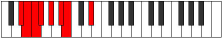

# Mode Epyrian

## Links

- [Documentation](README.md)
- [Scales Index](Scales.md)
- [Modes Index](Modes.md)
- [Chords Index](Chords.md)

## Parent Scale

[Zogian](ScaleZogian.md)

## Number

[431](https://ianring.com/musictheory/scales/431)

## Interval Pattern

1, 1, 1, 2, 2, 1, 4

## Chord Pattern

ii⁰b3, iii⁰

## Perfection

- 5 Perfect notes
- 2 Perfect notes

## Perfection Profile

[true true false false true true true]

## Permutations

| Tonic | Notes | Signature | Illustration | Audio |
|-------|-------|-----------|--------------|-------|
| [C](ModeCNaturalEpyrian.md) | C, Db, **Ebb**, **Fbb**, Gbb, Abb, Bbbb, C | C |  | [midi](https://github.com/edipermadi/music/blob/main/docs/ModeCNaturalEpyrian.mid?raw=true) |
| [C#](ModeCSharpEpyrian.md) | C#, D, **Eb**, **Fb**, Gb, Ab, Bbb, C# | C |  | [midi](https://github.com/edipermadi/music/blob/main/docs/ModeCSharpEpyrian.mid?raw=true) |
| [Db](ModeDFlatEpyrian.md) | Db, Ebb, **Fbb**, **Gbbb**, Abbb, Bbbb, Cbbb, Db | C |  | [midi](https://github.com/edipermadi/music/blob/main/docs/ModeDFlatEpyrian.mid?raw=true) |
| [D](ModeDNaturalEpyrian.md) | D, Eb, **Fb**, **Gbb**, Abb, Bbb, Cbb, D | C |  | [midi](https://github.com/edipermadi/music/blob/main/docs/ModeDNaturalEpyrian.mid?raw=true) |
| [D#](ModeDSharpEpyrian.md) | D#, E, **F**, **Gb**, Ab, Bb, Cb, D# | C |  | [midi](https://github.com/edipermadi/music/blob/main/docs/ModeDSharpEpyrian.mid?raw=true) |
| [Eb](ModeEFlatEpyrian.md) | Eb, Fb, **Gbb**, **Abbb**, Bbbb, Cbb, Dbbb, Eb | C |  | [midi](https://github.com/edipermadi/music/blob/main/docs/ModeEFlatEpyrian.mid?raw=true) |
| [E](ModeENaturalEpyrian.md) | E, F, **Gb**, **Abb**, Bbb, Cb, Dbb, E | C |  | [midi](https://github.com/edipermadi/music/blob/main/docs/ModeENaturalEpyrian.mid?raw=true) |
| [F](ModeFNaturalEpyrian.md) | F, Gb, **Abb**, **Bbbb**, Cbb, Dbb, Ebbb, F | C |  | [midi](https://github.com/edipermadi/music/blob/main/docs/ModeFNaturalEpyrian.mid?raw=true) |
| [F#](ModeFSharpEpyrian.md) | F#, G, **Ab**, **Bbb**, Cb, Db, Ebb, F# | C |  | [midi](https://github.com/edipermadi/music/blob/main/docs/ModeFSharpEpyrian.mid?raw=true) |
| [Gb](ModeGFlatEpyrian.md) | Gb, Abb, **Bbbb**, **Cbbb**, Dbbb, Ebbb, Fbbb, Gb | C |  | [midi](https://github.com/edipermadi/music/blob/main/docs/ModeGFlatEpyrian.mid?raw=true) |
| [G](ModeGNaturalEpyrian.md) | G, Ab, **Bbb**, **Cbb**, Dbb, Ebb, Fbb, G | C |  | [midi](https://github.com/edipermadi/music/blob/main/docs/ModeGNaturalEpyrian.mid?raw=true) |
| [G#](ModeGSharpEpyrian.md) | G#, A, **Bb**, **Cb**, Db, Eb, Fb, G# | C |  | [midi](https://github.com/edipermadi/music/blob/main/docs/ModeGSharpEpyrian.mid?raw=true) |
| [Ab](ModeAFlatEpyrian.md) | Ab, Bbb, **Cbb**, **Dbbb**, Ebbb, Fbb, Gbbb, Ab | C |  | [midi](https://github.com/edipermadi/music/blob/main/docs/ModeAFlatEpyrian.mid?raw=true) |
| [A](ModeANaturalEpyrian.md) | A, Bb, **Cb**, **Dbb**, Ebb, Fb, Gbb, A | C |  | [midi](https://github.com/edipermadi/music/blob/main/docs/ModeANaturalEpyrian.mid?raw=true) |
| [A#](ModeASharpEpyrian.md) | A#, B, **C**, **Db**, Eb, F, Gb, A# | C |  | [midi](https://github.com/edipermadi/music/blob/main/docs/ModeASharpEpyrian.mid?raw=true) |
| [Bb](ModeBFlatEpyrian.md) | Bb, Cb, **Dbb**, **Ebbb**, Fbb, Gbb, Abbb, Bb | C |  | [midi](https://github.com/edipermadi/music/blob/main/docs/ModeBFlatEpyrian.mid?raw=true) |
| [B](ModeBNaturalEpyrian.md) | B, C, **Db**, **Ebb**, Fb, Gb, Abb, B | C |  | [midi](https://github.com/edipermadi/music/blob/main/docs/ModeBNaturalEpyrian.mid?raw=true) |
