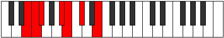

# Mode Epyrimic

## Links

- [Documentation](index.md)
- [Scales Index](Scales.md)
- [Modes Index](Modes.md)
- [Chords Index](Chords.md)

## Parent Scale

[Epygimic](ScaleEpygimic.md)

## Number

[711](https://ianring.com/musictheory/scales/711)

## Perfection

- 4 Perfect notes
- 2 Perfect notes

## Perfection Profile

[true false true true true false]

## Permutations

| Tonic | Notes | Signature | Illustration | Audio |
|-------|-------|-----------|--------------|-------|
| [C](ModeCNaturalEpyrimic.md) | C, **Db**, Ebb, F#, G, **A**, C | C |  | [midi](ModeCNaturalEpyrimic.mid) [ogg](ModeCNaturalEpyrimic.ogg) |
| [C#](ModeCSharpEpyrimic.md) | C#, **D**, Eb, F##, G#, **A#**, C# | C |  | [midi](ModeCSharpEpyrimic.mid) [ogg](ModeCSharpEpyrimic.ogg) |
| [Db](ModeDFlatEpyrimic.md) | Db, **Ebb**, Fbb, G, Ab, **Bb**, Db | C |  | [midi](ModeDFlatEpyrimic.mid) [ogg](ModeDFlatEpyrimic.ogg) |
| [D](ModeDNaturalEpyrimic.md) | D, **Eb**, Fb, G#, A, **B**, D | C |  | [midi](ModeDNaturalEpyrimic.mid) [ogg](ModeDNaturalEpyrimic.ogg) |
| [D#](ModeDSharpEpyrimic.md) | D#, **E**, F, G##, A#, **B#**, D# | C |  | [midi](ModeDSharpEpyrimic.mid) [ogg](ModeDSharpEpyrimic.ogg) |
| [Eb](ModeEFlatEpyrimic.md) | Eb, **Fb**, Gbb, A, Bb, **C**, Eb | C |  | [midi](ModeEFlatEpyrimic.mid) [ogg](ModeEFlatEpyrimic.ogg) |
| [E](ModeENaturalEpyrimic.md) | E, **F**, Gb, A#, B, **C#**, E | C |  | [midi](ModeENaturalEpyrimic.mid) [ogg](ModeENaturalEpyrimic.ogg) |
| [F](ModeFNaturalEpyrimic.md) | F, **Gb**, Abb, B, C, **D**, F | C |  | [midi](ModeFNaturalEpyrimic.mid) [ogg](ModeFNaturalEpyrimic.ogg) |
| [F#](ModeFSharpEpyrimic.md) | F#, **G**, Ab, B#, C#, **D#**, F# | C |  | [midi](ModeFSharpEpyrimic.mid) [ogg](ModeFSharpEpyrimic.ogg) |
| [Gb](ModeGFlatEpyrimic.md) | Gb, **Abb**, Bbbb, C, Db, **Eb**, Gb | C |  | [midi](ModeGFlatEpyrimic.mid) [ogg](ModeGFlatEpyrimic.ogg) |
| [G](ModeGNaturalEpyrimic.md) | G, **Ab**, Bbb, C#, D, **E**, G | C |  | [midi](ModeGNaturalEpyrimic.mid) [ogg](ModeGNaturalEpyrimic.ogg) |
| [G#](ModeGSharpEpyrimic.md) | G#, **A**, Bb, C##, D#, **E#**, G# | C |  | [midi](ModeGSharpEpyrimic.mid) [ogg](ModeGSharpEpyrimic.ogg) |
| [Ab](ModeAFlatEpyrimic.md) | Ab, **Bbb**, Cbb, D, Eb, **F**, Ab | C |  | [midi](ModeAFlatEpyrimic.mid) [ogg](ModeAFlatEpyrimic.ogg) |
| [A](ModeANaturalEpyrimic.md) | A, **Bb**, Cb, D#, E, **F#**, A | C |  | [midi](ModeANaturalEpyrimic.mid) [ogg](ModeANaturalEpyrimic.ogg) |
| [A#](ModeASharpEpyrimic.md) | A#, **B**, C, D##, E#, **F##**, A# | C |  | [midi](ModeASharpEpyrimic.mid) [ogg](ModeASharpEpyrimic.ogg) |
| [Bb](ModeBFlatEpyrimic.md) | Bb, **Cb**, Dbb, E, F, **G**, Bb | C |  | [midi](ModeBFlatEpyrimic.mid) [ogg](ModeBFlatEpyrimic.ogg) |
| [B](ModeBNaturalEpyrimic.md) | B, **C**, Db, E#, F#, **G#**, B | C |  | [midi](ModeBNaturalEpyrimic.mid) [ogg](ModeBNaturalEpyrimic.ogg) |
