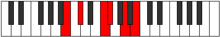

# Mode Epyritonic

## Links

- [Documentation](README.md)
- [Scales Index](Scales.md)
- [Modes Index](Modes.md)
- [Chords Index](Chords.md)

## Parent Scale

[Epygitonic](ScaleEpygitonic.md)

## Number

[1221](https://ianring.com/musictheory/scales/1221)

## Transposition

2, 4, 1, 3, 2

## Chord Pattern

III⁺

## Perfection

- 2 Perfect notes
- 3 Perfect notes

## Perfection Profile

true, false, false, true, false

## Permutations

| Tonic | Notes | Signature | Illustration | Audio |
|-------|-------|-----------|--------------|-------|
| [C](ModeCNaturalEpyritonic.md) | C, **D**, **F#**, G, **A#**, C | C |  | [midi](https://github.com/edipermadi/music/blob/main/docs/ModeCNaturalEpyritonic.mid?raw=true) |
| [C#](ModeCSharpEpyritonic.md) | C#, **D#**, **G**, G#, **B**, C# | C |  | [midi](https://github.com/edipermadi/music/blob/main/docs/ModeCSharpEpyritonic.mid?raw=true) |
| [Db](ModeDFlatEpyritonic.md) | Db, **Eb**, **G**, Ab, **B**, Db | C |  | [midi](https://github.com/edipermadi/music/blob/main/docs/ModeDFlatEpyritonic.mid?raw=true) |
| [D](ModeDNaturalEpyritonic.md) | D, **E**, **G#**, A, **C**, D | C |  | [midi](https://github.com/edipermadi/music/blob/main/docs/ModeDNaturalEpyritonic.mid?raw=true) |
| [D#](ModeDSharpEpyritonic.md) | D#, **F**, **A**, A#, **C#**, D# | C |  | [midi](https://github.com/edipermadi/music/blob/main/docs/ModeDSharpEpyritonic.mid?raw=true) |
| [Eb](ModeEFlatEpyritonic.md) | Eb, **F**, **A**, Bb, **Db**, Eb | C |  | [midi](https://github.com/edipermadi/music/blob/main/docs/ModeEFlatEpyritonic.mid?raw=true) |
| [E](ModeENaturalEpyritonic.md) | E, **F#**, **A#**, B, **D**, E | C |  | [midi](https://github.com/edipermadi/music/blob/main/docs/ModeENaturalEpyritonic.mid?raw=true) |
| [F](ModeFNaturalEpyritonic.md) | F, **G**, **B**, C, **D#**, F | C |  | [midi](https://github.com/edipermadi/music/blob/main/docs/ModeFNaturalEpyritonic.mid?raw=true) |
| [F#](ModeFSharpEpyritonic.md) | F#, **G#**, **C**, C#, **E**, F# | C |  | [midi](https://github.com/edipermadi/music/blob/main/docs/ModeFSharpEpyritonic.mid?raw=true) |
| [Gb](ModeGFlatEpyritonic.md) | Gb, **Ab**, **C**, Db, **E**, Gb | C |  | [midi](https://github.com/edipermadi/music/blob/main/docs/ModeGFlatEpyritonic.mid?raw=true) |
| [G](ModeGNaturalEpyritonic.md) | G, **A**, **C#**, D, **F**, G | C |  | [midi](https://github.com/edipermadi/music/blob/main/docs/ModeGNaturalEpyritonic.mid?raw=true) |
| [G#](ModeGSharpEpyritonic.md) | G#, **A#**, **D**, D#, **F#**, G# | C |  | [midi](https://github.com/edipermadi/music/blob/main/docs/ModeGSharpEpyritonic.mid?raw=true) |
| [Ab](ModeAFlatEpyritonic.md) | Ab, **Bb**, **D**, Eb, **Gb**, Ab | C |  | [midi](https://github.com/edipermadi/music/blob/main/docs/ModeAFlatEpyritonic.mid?raw=true) |
| [A](ModeANaturalEpyritonic.md) | A, **B**, **D#**, E, **G**, A | C |  | [midi](https://github.com/edipermadi/music/blob/main/docs/ModeANaturalEpyritonic.mid?raw=true) |
| [A#](ModeASharpEpyritonic.md) | A#, **C**, **E**, F, **G#**, A# | C |  | [midi](https://github.com/edipermadi/music/blob/main/docs/ModeASharpEpyritonic.mid?raw=true) |
| [Bb](ModeBFlatEpyritonic.md) | Bb, **C**, **E**, F, **Ab**, Bb | C |  | [midi](https://github.com/edipermadi/music/blob/main/docs/ModeBFlatEpyritonic.mid?raw=true) |
| [B](ModeBNaturalEpyritonic.md) | B, **C#**, **F**, F#, **A**, B | C |  | [midi](https://github.com/edipermadi/music/blob/main/docs/ModeBNaturalEpyritonic.mid?raw=true) |
