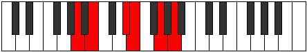

# Mode Epyritonic

## Links

- [Documentation](index.md)
- [Scales Index](Scales.md)
- [Modes Index](Modes.md)
- [Chords Index](Chords.md)

## Parent Scale

[Epygitonic](ScaleEpygitonic.md)

## Number

[1221](https://ianring.com/musictheory/scales/1221)

## Perfection

- 2 Perfect notes
- 3 Perfect notes

## Perfection Profile

[true false false true false]

## Permutations

| Tonic | Notes | Signature | Illustration | Audio |
|-------|-------|-----------|--------------|-------|
| [C](ModeCNaturalEpyritonic.md) | C, **D**, **F#**, G, **A#**, C | C |  | [midi](ModeCNaturalEpyritonic.mid) [ogg](ModeCNaturalEpyritonic.ogg) |
| [C#](ModeCSharpEpyritonic.md) | C#, **D#**, **G**, G#, **B**, C# | C |  | [midi](ModeCSharpEpyritonic.mid) [ogg](ModeCSharpEpyritonic.ogg) |
| [Db](ModeDFlatEpyritonic.md) | Db, **Eb**, **G**, Ab, **B**, Db | C |  | [midi](ModeDFlatEpyritonic.mid) [ogg](ModeDFlatEpyritonic.ogg) |
| [D](ModeDNaturalEpyritonic.md) | D, **E**, **G#**, A, **C**, D | C |  | [midi](ModeDNaturalEpyritonic.mid) [ogg](ModeDNaturalEpyritonic.ogg) |
| [D#](ModeDSharpEpyritonic.md) | D#, **F**, **A**, A#, **C#**, D# | C |  | [midi](ModeDSharpEpyritonic.mid) [ogg](ModeDSharpEpyritonic.ogg) |
| [Eb](ModeEFlatEpyritonic.md) | Eb, **F**, **A**, Bb, **Db**, Eb | C |  | [midi](ModeEFlatEpyritonic.mid) [ogg](ModeEFlatEpyritonic.ogg) |
| [E](ModeENaturalEpyritonic.md) | E, **F#**, **A#**, B, **D**, E | C |  | [midi](ModeENaturalEpyritonic.mid) [ogg](ModeENaturalEpyritonic.ogg) |
| [F](ModeFNaturalEpyritonic.md) | F, **G**, **B**, C, **D#**, F | C |  | [midi](ModeFNaturalEpyritonic.mid) [ogg](ModeFNaturalEpyritonic.ogg) |
| [F#](ModeFSharpEpyritonic.md) | F#, **G#**, **C**, C#, **E**, F# | C |  | [midi](ModeFSharpEpyritonic.mid) [ogg](ModeFSharpEpyritonic.ogg) |
| [Gb](ModeGFlatEpyritonic.md) | Gb, **Ab**, **C**, Db, **E**, Gb | C |  | [midi](ModeGFlatEpyritonic.mid) [ogg](ModeGFlatEpyritonic.ogg) |
| [G](ModeGNaturalEpyritonic.md) | G, **A**, **C#**, D, **F**, G | C |  | [midi](ModeGNaturalEpyritonic.mid) [ogg](ModeGNaturalEpyritonic.ogg) |
| [G#](ModeGSharpEpyritonic.md) | G#, **A#**, **D**, D#, **F#**, G# | C |  | [midi](ModeGSharpEpyritonic.mid) [ogg](ModeGSharpEpyritonic.ogg) |
| [Ab](ModeAFlatEpyritonic.md) | Ab, **Bb**, **D**, Eb, **Gb**, Ab | C |  | [midi](ModeAFlatEpyritonic.mid) [ogg](ModeAFlatEpyritonic.ogg) |
| [A](ModeANaturalEpyritonic.md) | A, **B**, **D#**, E, **G**, A | C |  | [midi](ModeANaturalEpyritonic.mid) [ogg](ModeANaturalEpyritonic.ogg) |
| [A#](ModeASharpEpyritonic.md) | A#, **C**, **E**, F, **G#**, A# | C |  | [midi](ModeASharpEpyritonic.mid) [ogg](ModeASharpEpyritonic.ogg) |
| [Bb](ModeBFlatEpyritonic.md) | Bb, **C**, **E**, F, **Ab**, Bb | C |  | [midi](ModeBFlatEpyritonic.mid) [ogg](ModeBFlatEpyritonic.ogg) |
| [B](ModeBNaturalEpyritonic.md) | B, **C#**, **F**, F#, **A**, B | C |  | [midi](ModeBNaturalEpyritonic.mid) [ogg](ModeBNaturalEpyritonic.ogg) |
