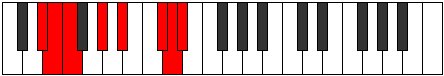

# Mode Epythian

## Links

- [Documentation](index.md)
- [Scales Index](Scales.md)
- [Modes Index](Modes.md)
- [Chords Index](Chords.md)

## Parent Scale

[Morian](ScaleMorian.md)

## Number

[3239](https://ianring.com/musictheory/scales/3239)

## Perfection

- 4 Perfect notes
- 3 Perfect notes

## Perfection Profile

[true false false true true true false]

## Permutations

| Tonic | Notes | Signature | Illustration | Audio |
|-------|-------|-----------|--------------|-------|
| [C](ModeCNaturalEpythian.md) | C, **Db**, **Ebb**, F, G, A#, **B**, C | C |  | [midi](ModeCNaturalEpythian.mid) [ogg](ModeCNaturalEpythian.ogg) |
| [C#](ModeCSharpEpythian.md) | C#, **D**, **Eb**, F#, G#, A##, **B#**, C# | C |  | [midi](ModeCSharpEpythian.mid) [ogg](ModeCSharpEpythian.ogg) |
| [Db](ModeDFlatEpythian.md) | Db, **Ebb**, **Fbb**, Gb, Ab, B, **C**, Db | C |  | [midi](ModeDFlatEpythian.mid) [ogg](ModeDFlatEpythian.ogg) |
| [D](ModeDNaturalEpythian.md) | D, **Eb**, **Fb**, G, A, B#, **C#**, D | C |  | [midi](ModeDNaturalEpythian.mid) [ogg](ModeDNaturalEpythian.ogg) |
| [D#](ModeDSharpEpythian.md) | D#, **E**, **F**, G#, A#, B##, **C##**, D# | C |  | [midi](ModeDSharpEpythian.mid) [ogg](ModeDSharpEpythian.ogg) |
| [Eb](ModeEFlatEpythian.md) | Eb, **Fb**, **Gbb**, Ab, Bb, C#, **D**, Eb | C |  | [midi](ModeEFlatEpythian.mid) [ogg](ModeEFlatEpythian.ogg) |
| [E](ModeENaturalEpythian.md) | E, **F**, **Gb**, A, B, C##, **D#**, E | C |  | [midi](ModeENaturalEpythian.mid) [ogg](ModeENaturalEpythian.ogg) |
| [F](ModeFNaturalEpythian.md) | F, **Gb**, **Abb**, Bb, C, D#, **E**, F | C |  | [midi](ModeFNaturalEpythian.mid) [ogg](ModeFNaturalEpythian.ogg) |
| [F#](ModeFSharpEpythian.md) | F#, **G**, **Ab**, B, C#, D##, **E#**, F# | C |  | [midi](ModeFSharpEpythian.mid) [ogg](ModeFSharpEpythian.ogg) |
| [Gb](ModeGFlatEpythian.md) | Gb, **Abb**, **Bbbb**, Cb, Db, E, **F**, Gb | C |  | [midi](ModeGFlatEpythian.mid) [ogg](ModeGFlatEpythian.ogg) |
| [G](ModeGNaturalEpythian.md) | G, **Ab**, **Bbb**, C, D, E#, **F#**, G | C |  | [midi](ModeGNaturalEpythian.mid) [ogg](ModeGNaturalEpythian.ogg) |
| [G#](ModeGSharpEpythian.md) | G#, **A**, **Bb**, C#, D#, E##, **F##**, G# | C |  | [midi](ModeGSharpEpythian.mid) [ogg](ModeGSharpEpythian.ogg) |
| [Ab](ModeAFlatEpythian.md) | Ab, **Bbb**, **Cbb**, Db, Eb, F#, **G**, Ab | C |  | [midi](ModeAFlatEpythian.mid) [ogg](ModeAFlatEpythian.ogg) |
| [A](ModeANaturalEpythian.md) | A, **Bb**, **Cb**, D, E, F##, **G#**, A | C |  | [midi](ModeANaturalEpythian.mid) [ogg](ModeANaturalEpythian.ogg) |
| [A#](ModeASharpEpythian.md) | A#, **B**, **C**, D#, E#, F###, **G##**, A# | C |  | [midi](ModeASharpEpythian.mid) [ogg](ModeASharpEpythian.ogg) |
| [Bb](ModeBFlatEpythian.md) | Bb, **Cb**, **Dbb**, Eb, F, G#, **A**, Bb | C |  | [midi](ModeBFlatEpythian.mid) [ogg](ModeBFlatEpythian.ogg) |
| [B](ModeBNaturalEpythian.md) | B, **C**, **Db**, E, F#, G##, **A#**, B | C |  | [midi](ModeBNaturalEpythian.mid) [ogg](ModeBNaturalEpythian.ogg) |
