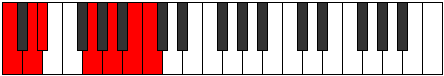
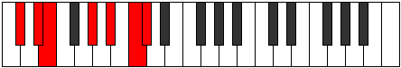

# Mode Epythimic

## Links

- [Documentation](README.md)
- [Scales Index](Scales.md)
- [Modes Index](Modes.md)
- [Chords Index](Chords.md)

## Parent Scale

[Rycrimic](ScaleRycrimic.md)

## Number

[2701](https://ianring.com/musictheory/scales/2701)

## Transposition

2, 1, 4, 2, 2, 1

## Chord Pattern

IV, v⁰

## Perfection

- 3 Perfect notes
- 3 Perfect notes

## Perfection Profile

[true true false true false false]

## Permutations

| Tonic | Notes | Signature | Illustration | Audio |
|-------|-------|-----------|--------------|-------|
| [C](ModeCNaturalEpythimic.md) | C, D, **Eb**, F##, **G##**, **A##**, C | C |  | [midi](https://github.com/edipermadi/music/blob/main/docs/ModeCNaturalEpythimic.mid?raw=true) |
| [C#](ModeCSharpEpythimic.md) | C#, D#, **E**, F###, **G###**, **A###**, C# | C |  | [midi](https://github.com/edipermadi/music/blob/main/docs/ModeCSharpEpythimic.mid?raw=true) |
| [Db](ModeDFlatEpythimic.md) | Db, Eb, **Fb**, G#, **A#**, **B#**, Db | C |  | [midi](https://github.com/edipermadi/music/blob/main/docs/ModeDFlatEpythimic.mid?raw=true) |
| [D](ModeDNaturalEpythimic.md) | D, E, **F**, G##, **A##**, **B##**, D | C |  | [midi](https://github.com/edipermadi/music/blob/main/docs/ModeDNaturalEpythimic.mid?raw=true) |
| [D#](ModeDSharpEpythimic.md) | D#, E#, **F#**, G###, **A###**, **B###**, D# | C |  | [midi](https://github.com/edipermadi/music/blob/main/docs/ModeDSharpEpythimic.mid?raw=true) |
| [Eb](ModeEFlatEpythimic.md) | Eb, F, **Gb**, A#, **B#**, **C##**, Eb | C |  | [midi](https://github.com/edipermadi/music/blob/main/docs/ModeEFlatEpythimic.mid?raw=true) |
| [E](ModeENaturalEpythimic.md) | E, F#, **G**, A##, **B##**, **C###**, E | C |  | [midi](https://github.com/edipermadi/music/blob/main/docs/ModeENaturalEpythimic.mid?raw=true) |
| [F](ModeFNaturalEpythimic.md) | F, G, **Ab**, B#, **C##**, **D##**, F | C |  | [midi](https://github.com/edipermadi/music/blob/main/docs/ModeFNaturalEpythimic.mid?raw=true) |
| [F#](ModeFSharpEpythimic.md) | F#, G#, **A**, B##, **C###**, **D###**, F# | C |  | [midi](https://github.com/edipermadi/music/blob/main/docs/ModeFSharpEpythimic.mid?raw=true) |
| [Gb](ModeGFlatEpythimic.md) | Gb, Ab, **Bbb**, C#, **D#**, **E#**, Gb | C |  | [midi](https://github.com/edipermadi/music/blob/main/docs/ModeGFlatEpythimic.mid?raw=true) |
| [G](ModeGNaturalEpythimic.md) | G, A, **Bb**, C##, **D##**, **E##**, G | C |  | [midi](https://github.com/edipermadi/music/blob/main/docs/ModeGNaturalEpythimic.mid?raw=true) |
| [G#](ModeGSharpEpythimic.md) | G#, A#, **B**, C###, **D###**, **E###**, G# | C |  | [midi](https://github.com/edipermadi/music/blob/main/docs/ModeGSharpEpythimic.mid?raw=true) |
| [Ab](ModeAFlatEpythimic.md) | Ab, Bb, **Cb**, D#, **E#**, **F##**, Ab | C |  | [midi](https://github.com/edipermadi/music/blob/main/docs/ModeAFlatEpythimic.mid?raw=true) |
| [A](ModeANaturalEpythimic.md) | A, B, **C**, D##, **E##**, **F###**, A | C |  | [midi](https://github.com/edipermadi/music/blob/main/docs/ModeANaturalEpythimic.mid?raw=true) |
| [A#](ModeASharpEpythimic.md) | A#, B#, **C#**, D###, **E###**, **Cbbb**, A# | C |  | [midi](https://github.com/edipermadi/music/blob/main/docs/ModeASharpEpythimic.mid?raw=true) |
| [Bb](ModeBFlatEpythimic.md) | Bb, C, **Db**, E#, **F##**, **G##**, Bb | C |  | [midi](https://github.com/edipermadi/music/blob/main/docs/ModeBFlatEpythimic.mid?raw=true) |
| [B](ModeBNaturalEpythimic.md) | B, C#, **D**, E##, **F###**, **G###**, B | C |  | [midi](https://github.com/edipermadi/music/blob/main/docs/ModeBNaturalEpythimic.mid?raw=true) |
