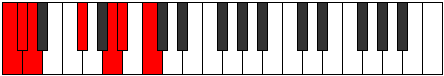
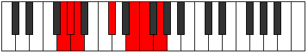

# Mode Epytimic

## Links

- [Documentation](index.md)
- [Scales Index](Scales.md)
- [Modes Index](Modes.md)
- [Chords Index](Chords.md)

## Parent Scale

[Lathimic](ScaleLathimic.md)

## Number

[1607](https://ianring.com/musictheory/scales/1607)

## Perfection

- 2 Perfect notes
- 4 Perfect notes

## Perfection Profile

[false false true true false false]

## Permutations

| Tonic | Notes | Signature | Illustration | Audio |
|-------|-------|-----------|--------------|-------|
| [C](ModeCNaturalEpytimic.md) | **C**, **Db**, Ebb, F#, **G##**, **A#**, **C** | C |  | [midi](ModeCNaturalEpytimic.mid) [ogg](ModeCNaturalEpytimic.ogg) |
| [C#](ModeCSharpEpytimic.md) | **C#**, **D**, Eb, F##, **G###**, **A##**, **C#** | C |  | [midi](ModeCSharpEpytimic.mid) [ogg](ModeCSharpEpytimic.ogg) |
| [Db](ModeDFlatEpytimic.md) | **Db**, **Ebb**, Fbb, G, **A#**, **B**, **Db** | C |  | [midi](ModeDFlatEpytimic.mid) [ogg](ModeDFlatEpytimic.ogg) |
| [D](ModeDNaturalEpytimic.md) | **D**, **Eb**, Fb, G#, **A##**, **B#**, **D** | C |  | [midi](ModeDNaturalEpytimic.mid) [ogg](ModeDNaturalEpytimic.ogg) |
| [D#](ModeDSharpEpytimic.md) | **D#**, **E**, F, G##, **A###**, **B##**, **D#** | C |  | [midi](ModeDSharpEpytimic.mid) [ogg](ModeDSharpEpytimic.ogg) |
| [Eb](ModeEFlatEpytimic.md) | **Eb**, **Fb**, Gbb, A, **B#**, **C#**, **Eb** | C |  | [midi](ModeEFlatEpytimic.mid) [ogg](ModeEFlatEpytimic.ogg) |
| [E](ModeENaturalEpytimic.md) | **E**, **F**, Gb, A#, **B##**, **C##**, **E** | C |  | [midi](ModeENaturalEpytimic.mid) [ogg](ModeENaturalEpytimic.ogg) |
| [F](ModeFNaturalEpytimic.md) | **F**, **Gb**, Abb, B, **C##**, **D#**, **F** | C |  | [midi](ModeFNaturalEpytimic.mid) [ogg](ModeFNaturalEpytimic.ogg) |
| [F#](ModeFSharpEpytimic.md) | **F#**, **G**, Ab, B#, **C###**, **D##**, **F#** | C |  | [midi](ModeFSharpEpytimic.mid) [ogg](ModeFSharpEpytimic.ogg) |
| [Gb](ModeGFlatEpytimic.md) | **Gb**, **Abb**, Bbbb, C, **D#**, **E**, **Gb** | C |  | [midi](ModeGFlatEpytimic.mid) [ogg](ModeGFlatEpytimic.ogg) |
| [G](ModeGNaturalEpytimic.md) | **G**, **Ab**, Bbb, C#, **D##**, **E#**, **G** | C |  | [midi](ModeGNaturalEpytimic.mid) [ogg](ModeGNaturalEpytimic.ogg) |
| [G#](ModeGSharpEpytimic.md) | **G#**, **A**, Bb, C##, **D###**, **E##**, **G#** | C |  | [midi](ModeGSharpEpytimic.mid) [ogg](ModeGSharpEpytimic.ogg) |
| [Ab](ModeAFlatEpytimic.md) | **Ab**, **Bbb**, Cbb, D, **E#**, **F#**, **Ab** | C |  | [midi](ModeAFlatEpytimic.mid) [ogg](ModeAFlatEpytimic.ogg) |
| [A](ModeANaturalEpytimic.md) | **A**, **Bb**, Cb, D#, **E##**, **F##**, **A** | C |  | [midi](ModeANaturalEpytimic.mid) [ogg](ModeANaturalEpytimic.ogg) |
| [A#](ModeASharpEpytimic.md) | **A#**, **B**, C, D##, **E###**, **F###**, **A#** | C |  | [midi](ModeASharpEpytimic.mid) [ogg](ModeASharpEpytimic.ogg) |
| [Bb](ModeBFlatEpytimic.md) | **Bb**, **Cb**, Dbb, E, **F##**, **G#**, **Bb** | C |  | [midi](ModeBFlatEpytimic.mid) [ogg](ModeBFlatEpytimic.ogg) |
| [B](ModeBNaturalEpytimic.md) | **B**, **C**, Db, E#, **F###**, **G##**, **B** | C |  | [midi](ModeBNaturalEpytimic.mid) [ogg](ModeBNaturalEpytimic.ogg) |
