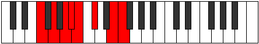
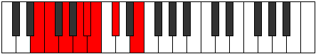
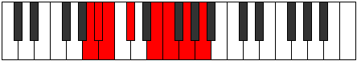
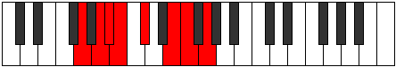
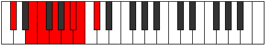
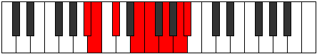
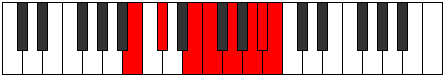

# Mode FNaturalMalian

## Links

- [Documentation](index.md)
- [Scales Index](Scales.md)
- [Modes Index](Modes.md)
- [Chords Index](Chords.md)

## Scale

[Korian](ScaleKorian.md)

## Mode

[FNaturalMalian](ModeFNaturalMalian.md)

## Tonic

F

## Signature

[CNaturalMajor]

## Perfection

 - 3 Perfect Notes

 - 4 Imperfect Notes

## Notes

- F (Imperfect)
- G (Imperfect)
- A
- Bb
- Cb (Imperfect)
- Db (Imperfect)
- E
- F (Imperfect)

## Illustration

## Relative Modes

| Number | Mode | Tonic | Notes | Illustration |
|--------|------|-------|-------|--------------|
| [747](https://ianring.com/musictheory/scales/747) | [Lynian](ModeLynian.md) | E | E, F, G, A, Bb, Cb, Db, E |  |
| [1431](https://ianring.com/musictheory/scales/1431) | [Phragian](ModePhragian.md) | A | A, Bb, Cb, Db, E, F, G, A |  |
| [1629](https://ianring.com/musictheory/scales/1629) | [Synian](ModeSynian.md) | G | G, A, Bb, Cb, Db, E, F, G |  |
| [1881](https://ianring.com/musictheory/scales/1881) | [Korian](ModeKorian.md) | C# | C#, D##, E#, F##, G##, A#, B, C# |  |
| [1881](https://ianring.com/musictheory/scales/1881) | [Korian](ModeKorian.md) | Db | Db, E, F, G, A, Bb, Cb, Db |  |
| [2421](https://ianring.com/musictheory/scales/2421) | [Malian](ModeMalian.md) | F | F, G, A, Bb, Cb, Db, E, F |  |
| [2763](https://ianring.com/musictheory/scales/2763) | [Manian](ModeManian.md) | A# | A#, B, C#, D##, E#, F##, G##, A# |  |
| [2763](https://ianring.com/musictheory/scales/2763) | [Manian](ModeManian.md) | Bb | Bb, Cb, Db, E, F, G, A, Bb |  |
| [3429](https://ianring.com/musictheory/scales/3429) | [Marian](ModeMarian.md) | B | B, C#, D##, E#, F##, G##, A#, B |  |

## Chords

### F

| Number | Root | Name | Notes | Illustration | Audio |
|--------|------|------|-------|--------------|-------|

### G

| Number | Root | Name | Notes | Illustration | Audio |
|--------|------|------|-------|--------------|-------|

### A

| Number | Root | Name | Notes | Illustration | Audio |
|--------|------|------|-------|--------------|-------|

### Bb

| Number | Root | Name | Notes | Illustration | Audio |
|--------|------|------|-------|--------------|-------|

### Cb

| Number | Root | Name | Notes | Illustration | Audio |
|--------|------|------|-------|--------------|-------|

### Db

| Number | Root | Name | Notes | Illustration | Audio |
|--------|------|------|-------|--------------|-------|

### E

| Number | Root | Name | Notes | Illustration | Audio |
|--------|------|------|-------|--------------|-------|

