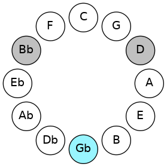
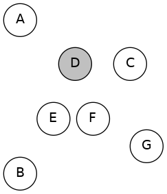
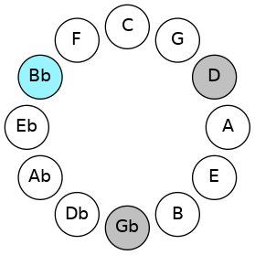
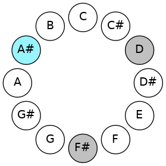
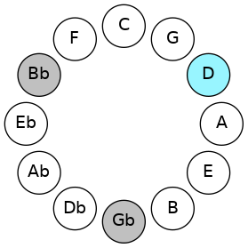
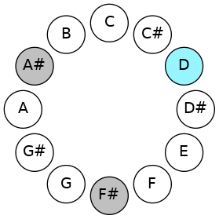

# Mode FSharpMinoric

## Links

- [Documentation](README.md)
- [Scales Index](Scales.md)
- [Modes Index](Modes.md)
- [Chords Index](Chords.md)

## Scale

[Minoric](ScaleMinoric.md)

## Mode

[FSharpMinoric](ModeFSharpMinoric.md)

## Tonic

F#

## Signature

[CNaturalMajor]

## Transposition

4, 4, 4

## Chord Pattern

I⁺, I⁺, II⁺, II⁺, III⁺

## Perfection

 - 0 Perfect Notes

 - 3 Imperfect Notes

## Notes

- F# (Imperfect)
- A# (Imperfect)
- D (Imperfect)
- F# (Imperfect)

## Illustration

## Diagram

| Circle of Fifth | Chromatic Circle |
|-----------------|------------------|
|  |  |
## Relative Modes

| Number | Mode | Tonic | Notes | Illustration |
|--------|------|-------|-------|--------------|
| [273](https://ianring.com/musictheory/scales/273) | [Minoric](ModeMinoric.md) | F# | F#, A#, D, F# |  |
| [273](https://ianring.com/musictheory/scales/273) | [Minoric](ModeMinoric.md) | Gb | Gb, Bb, D, Gb |  |
| [273](https://ianring.com/musictheory/scales/273) | [Minoric](ModeMinoric.md) | A# | A#, D, F#, A# |  |
| [273](https://ianring.com/musictheory/scales/273) | [Minoric](ModeMinoric.md) | Bb | Bb, D, Gb, Bb |  |
| [273](https://ianring.com/musictheory/scales/273) | [Minoric](ModeMinoric.md) | D | D, F#, A#, D |  |
## Relative Brightness

| Number | Mode | Tonic | Notes | Circle Of Fifth | Chromatic Circle |
|--------|------|-------|-------|-----------------|------------------|
| [273](https://ianring.com/musictheory/scales/273) | [Minoric](ModeMinoric.md) | F# | F#, A#, D, F# |  |  
| [273](https://ianring.com/musictheory/scales/273) | [Minoric](ModeMinoric.md) | Gb | Gb, Bb, D, Gb |  |  
| [273](https://ianring.com/musictheory/scales/273) | [Minoric](ModeMinoric.md) | A# | A#, D, F#, A# |  |  
| [273](https://ianring.com/musictheory/scales/273) | [Minoric](ModeMinoric.md) | Bb | Bb, D, Gb, Bb |  |  
| [273](https://ianring.com/musictheory/scales/273) | [Minoric](ModeMinoric.md) | D | D, F#, A#, D |  |  

## Chords

### F#

| Number | Root | Name | Notes | Illustration | Audio |
|--------|------|------|-------|--------------|-------|
| 1092 | F# | [F#+](ChordFSharpAugmented.md) | F#, A#, C## |  | [midi](ChordFSharpAugmentedRootPosition.mid) |
| 1092 | F# | [F#+7](ChordFSharpAugmentedAugmentedSeventh.md) | F#, A#, C##, E## |  | [midi](ChordFSharpAugmentedAugmentedSeventhRootPosition.mid) |
| 1092 | F# | [Gb+](ChordGFlatAugmented.md) | Gb, Bb, D |  | [midi](ChordGFlatAugmentedRootPosition.mid) |
| 1092 | F# | [Gb+7](ChordGFlatAugmentedAugmentedSeventh.md) | Gb, Bb, D, F# |  | [midi](ChordGFlatAugmentedAugmentedSeventhRootPosition.mid) |

### A#

| Number | Root | Name | Notes | Illustration | Audio |
|--------|------|------|-------|--------------|-------|
| 1092 | A# | [A#+](ChordASharpAugmented.md) | A#, C##, E## |  | [midi](ChordASharpAugmentedRootPosition.mid) |
| 1092 | A# | [A#+7](ChordASharpAugmentedAugmentedSeventh.md) | A#, C##, E##, G### |  | [midi](ChordASharpAugmentedAugmentedSeventhRootPosition.mid) |
| 1092 | A# | [Bb+](ChordBFlatAugmented.md) | Bb, D, F# |  | [midi](ChordBFlatAugmentedRootPosition.mid) |
| 1092 | A# | [Bb+7](ChordBFlatAugmentedAugmentedSeventh.md) | Bb, D, F#, A# |  | [midi](ChordBFlatAugmentedAugmentedSeventhRootPosition.mid) |

### D

| Number | Root | Name | Notes | Illustration | Audio |
|--------|------|------|-------|--------------|-------|
| 1092 | D | [D+](ChordDNaturalAugmented.md) | D, F#, A# |  | [midi](ChordDNaturalAugmentedRootPosition.mid) |
| 1092 | D | [D+7](ChordDNaturalAugmentedAugmentedSeventh.md) | D, F#, A#, C## |  | [midi](ChordDNaturalAugmentedAugmentedSeventhRootPosition.mid) |

