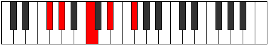

# Mode GSharpDaric

## Links

- [Documentation](index.md)
- [Scales Index](Scales.md)
- [Modes Index](Modes.md)
- [Chords Index](Chords.md)

## Scale

[Daric](ScaleDaric.md)

## Mode

[GSharpDaric](ModeGSharpDaric.md)

## Tonic

G#

## Signature

[CNaturalMajor]

## Perfection

 - 1 Perfect Notes

 - 3 Imperfect Notes

## Notes

- G#
- C (Imperfect)
- D# (Imperfect)
- F# (Imperfect)
- G#

## Illustration

## Relative Modes

| Number | Mode | Tonic | Notes | Illustration |
|--------|------|-------|-------|--------------|
| [1169](https://ianring.com/musictheory/scales/1169) | [Daric](ModeDaric.md) | G# | G#, C, D#, F#, G# |  |
| [329](https://ianring.com/musictheory/scales/329) | [Lonic](ModeLonic.md) | C | C, D#, F#, G#, C |  |
| [553](https://ianring.com/musictheory/scales/553) | [Phradic](ModePhradic.md) | D# | D#, F#, G#, C, D# |  |
| [581](https://ianring.com/musictheory/scales/581) | [Bolic](ModeBolic.md) | F# | F#, G#, C, D#, F# |  |

## Chords

### G#

| Number | Root | Name | Notes | Illustration | Audio |
|--------|------|------|-------|--------------|-------|

### C

| Number | Root | Name | Notes | Illustration | Audio |
|--------|------|------|-------|--------------|-------|
| 73 | C | [Co](ChordCNaturalDiminished.md) | C, Eb, Gb |  | [midi](ChordCNaturalDiminishedRootPosition.mid) |
| 265 | C | [Cm#5](ChordCNaturalMinorSharpFifth.md) | C, Eb, Ab |  | [midi](ChordCNaturalMinorSharpFifthRootPosition.mid) |

### D#

| Number | Root | Name | Notes | Illustration | Audio |
|--------|------|------|-------|--------------|-------|

### F#

| Number | Root | Name | Notes | Illustration | Audio |
|--------|------|------|-------|--------------|-------|

