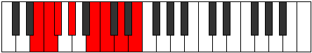

# Mode GSharpKorian

## Links

- [Documentation](index.md)
- [Scales Index](Scales.md)
- [Modes Index](Modes.md)
- [Chords Index](Chords.md)

## Scale

[Korian](ScaleKorian.md)

## Mode

[GSharpKorian](ModeGSharpKorian.md)

## Tonic

G#

## Signature

[CNaturalMajor]

## Perfection

 - 3 Perfect Notes

 - 4 Imperfect Notes

## Notes

- G# (Imperfect)
- A##
- B# (Imperfect)
- C## (Imperfect)
- D##
- E#
- F# (Imperfect)
- G# (Imperfect)

## Illustration

## Relative Modes

| Number | Mode | Tonic | Notes | Illustration |
|--------|------|-------|-------|--------------|
| [747](https://ianring.com/musictheory/scales/747) | [Lynian](ModeLynian.md) | B | B, C, D, E, F, Gb, Ab, B |  |
| [1431](https://ianring.com/musictheory/scales/1431) | [Phragian](ModePhragian.md) | E | E, F, Gb, Ab, B, C, D, E |  |
| [1629](https://ianring.com/musictheory/scales/1629) | [Synian](ModeSynian.md) | D | D, E, F, Gb, Ab, B, C, D |  |
| [1881](https://ianring.com/musictheory/scales/1881) | [Korian](ModeKorian.md) | G# | G#, A##, B#, C##, D##, E#, F#, G# |  |
| [1881](https://ianring.com/musictheory/scales/1881) | [Korian](ModeKorian.md) | Ab | Ab, B, C, D, E, F, Gb, Ab |  |
| [2421](https://ianring.com/musictheory/scales/2421) | [Malian](ModeMalian.md) | C | C, D, E, F, Gb, Ab, B, C |  |
| [2763](https://ianring.com/musictheory/scales/2763) | [Manian](ModeManian.md) | F | F, Gb, Ab, B, C, D, E, F |  |
| [3429](https://ianring.com/musictheory/scales/3429) | [Marian](ModeMarian.md) | F# | F#, G#, A##, B#, C##, D##, E#, F# |  |
| [3429](https://ianring.com/musictheory/scales/3429) | [Marian](ModeMarian.md) | Gb | Gb, Ab, B, C, D, E, F, Gb |  |

## Chords

### G#

| Number | Root | Name | Notes | Illustration | Audio |
|--------|------|------|-------|--------------|-------|

### A##

| Number | Root | Name | Notes | Illustration | Audio |
|--------|------|------|-------|--------------|-------|

### B#

| Number | Root | Name | Notes | Illustration | Audio |
|--------|------|------|-------|--------------|-------|

### C##

| Number | Root | Name | Notes | Illustration | Audio |
|--------|------|------|-------|--------------|-------|

### D##

| Number | Root | Name | Notes | Illustration | Audio |
|--------|------|------|-------|--------------|-------|

### E#

| Number | Root | Name | Notes | Illustration | Audio |
|--------|------|------|-------|--------------|-------|

### F#

| Number | Root | Name | Notes | Illustration | Audio |
|--------|------|------|-------|--------------|-------|

