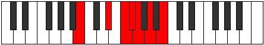

# Mode Gacrimic

## Links

- [Documentation](index.md)
- [Scales Index](Scales.md)
- [Modes Index](Modes.md)
- [Chords Index](Chords.md)

## Parent Scale

[Gacrimic](ScaleGacrimic.md)

## Number

[1489](https://ianring.com/musictheory/scales/1489)

## Perfection

- 1 Perfect notes
- 5 Perfect notes

## Perfection Profile

[true false false false false false]

## Permutations

| Tonic | Notes | Signature | Illustration | Audio |
|-------|-------|-----------|--------------|-------|
| [C](ModeCNaturalGacrimic.md) | C, **D##**, **E##**, **F##**, **G#**, **A#**, C | C |  | [midi](ModeCNaturalGacrimic.mid) [ogg](ModeCNaturalGacrimic.ogg) |
| [C#](ModeCSharpGacrimic.md) | C#, **D###**, **E###**, **F###**, **G##**, **A##**, C# | C |  | [midi](ModeCSharpGacrimic.mid) [ogg](ModeCSharpGacrimic.ogg) |
| [Db](ModeDFlatGacrimic.md) | Db, **E#**, **F##**, **G#**, **A**, **B**, Db | C |  | [midi](ModeDFlatGacrimic.mid) [ogg](ModeDFlatGacrimic.ogg) |
| [D](ModeDNaturalGacrimic.md) | D, **E##**, **F###**, **G##**, **A#**, **B#**, D | C |  | [midi](ModeDNaturalGacrimic.mid) [ogg](ModeDNaturalGacrimic.ogg) |
| [D#](ModeDSharpGacrimic.md) | D#, **E###**, **Cbbb**, **Cbb**, **Dbbb**, **Ebbb**, D# | C |  | [midi](ModeDSharpGacrimic.mid) [ogg](ModeDSharpGacrimic.ogg) |
| [Eb](ModeEFlatGacrimic.md) | Eb, **F##**, **G##**, **A#**, **B**, **C#**, Eb | C |  | [midi](ModeEFlatGacrimic.mid) [ogg](ModeEFlatGacrimic.ogg) |
| [E](ModeENaturalGacrimic.md) | E, **F###**, **G###**, **A##**, **B#**, **C##**, E | C |  | [midi](ModeENaturalGacrimic.mid) [ogg](ModeENaturalGacrimic.ogg) |
| [F](ModeFNaturalGacrimic.md) | F, **G##**, **A##**, **B#**, **C#**, **D#**, F | C |  | [midi](ModeFNaturalGacrimic.mid) [ogg](ModeFNaturalGacrimic.ogg) |
| [F#](ModeFSharpGacrimic.md) | F#, **G###**, **A###**, **B##**, **C##**, **D##**, F# | C |  | [midi](ModeFSharpGacrimic.mid) [ogg](ModeFSharpGacrimic.ogg) |
| [Gb](ModeGFlatGacrimic.md) | Gb, **A#**, **B#**, **C#**, **D**, **E**, Gb | C |  | [midi](ModeGFlatGacrimic.mid) [ogg](ModeGFlatGacrimic.ogg) |
| [G](ModeGNaturalGacrimic.md) | G, **A##**, **B##**, **C##**, **D#**, **E#**, G | C |  | [midi](ModeGNaturalGacrimic.mid) [ogg](ModeGNaturalGacrimic.ogg) |
| [G#](ModeGSharpGacrimic.md) | G#, **A###**, **B###**, **C###**, **D##**, **E##**, G# | C |  | [midi](ModeGSharpGacrimic.mid) [ogg](ModeGSharpGacrimic.ogg) |
| [Ab](ModeAFlatGacrimic.md) | Ab, **B#**, **C##**, **D#**, **E**, **F#**, Ab | C |  | [midi](ModeAFlatGacrimic.mid) [ogg](ModeAFlatGacrimic.ogg) |
| [A](ModeANaturalGacrimic.md) | A, **B##**, **C###**, **D##**, **E#**, **F##**, A | C |  | [midi](ModeANaturalGacrimic.mid) [ogg](ModeANaturalGacrimic.ogg) |
| [A#](ModeASharpGacrimic.md) | A#, **B###**, **D##**, **E#**, **F#**, **G#**, A# | C |  | [midi](ModeASharpGacrimic.mid) [ogg](ModeASharpGacrimic.ogg) |
| [Bb](ModeBFlatGacrimic.md) | Bb, **C##**, **D##**, **E#**, **F#**, **G#**, Bb | C |  | [midi](ModeBFlatGacrimic.mid) [ogg](ModeBFlatGacrimic.ogg) |
| [B](ModeBNaturalGacrimic.md) | B, **C###**, **D###**, **E##**, **F##**, **G##**, B | C |  | [midi](ModeBNaturalGacrimic.mid) [ogg](ModeBNaturalGacrimic.ogg) |
