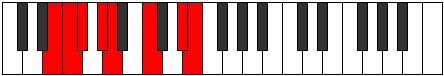

# Mode Gadian

## Links

- [Documentation](index.md)
- [Scales Index](Scales.md)
- [Modes Index](Modes.md)
- [Chords Index](Chords.md)

## Parent Scale

[Gacrian](ScaleGacrian.md)

## Number

[2359](https://ianring.com/musictheory/scales/2359)

## Perfection

- 3 Perfect notes
- 4 Perfect notes

## Perfection Profile

[false true false true true false false]

## Permutations

| Tonic | Notes | Signature | Illustration | Audio |
|-------|-------|-----------|--------------|-------|
| [C](ModeCNaturalGadian.md) | **C**, Db, **Ebb**, Fb, Gbb, **Ab**, **B**, **C** | C |  | [midi](ModeCNaturalGadian.mid) [ogg](ModeCNaturalGadian.ogg) |
| [C#](ModeCSharpGadian.md) | **C#**, D, **Eb**, F, Gb, **A**, **B#**, **C#** | C |  | [midi](ModeCSharpGadian.mid) [ogg](ModeCSharpGadian.ogg) |
| [Db](ModeDFlatGadian.md) | **Db**, Ebb, **Fbb**, Gbb, Abbb, **Bbb**, **C**, **Db** | C |  | [midi](ModeDFlatGadian.mid) [ogg](ModeDFlatGadian.ogg) |
| [D](ModeDNaturalGadian.md) | **D**, Eb, **Fb**, Gb, Abb, **Bb**, **C#**, **D** | C |  | [midi](ModeDNaturalGadian.mid) [ogg](ModeDNaturalGadian.ogg) |
| [D#](ModeDSharpGadian.md) | **D#**, E, **F**, G, Ab, **B**, **C##**, **D#** | C |  | [midi](ModeDSharpGadian.mid) [ogg](ModeDSharpGadian.ogg) |
| [Eb](ModeEFlatGadian.md) | **Eb**, Fb, **Gbb**, Abb, Bbbb, **Cb**, **D**, **Eb** | C |  | [midi](ModeEFlatGadian.mid) [ogg](ModeEFlatGadian.ogg) |
| [E](ModeENaturalGadian.md) | **E**, F, **Gb**, Ab, Bbb, **C**, **D#**, **E** | C |  | [midi](ModeENaturalGadian.mid) [ogg](ModeENaturalGadian.ogg) |
| [F](ModeFNaturalGadian.md) | **F**, Gb, **Abb**, Bbb, Cbb, **Db**, **E**, **F** | C |  | [midi](ModeFNaturalGadian.mid) [ogg](ModeFNaturalGadian.ogg) |
| [F#](ModeFSharpGadian.md) | **F#**, G, **Ab**, Bb, Cb, **D**, **E#**, **F#** | C |  | [midi](ModeFSharpGadian.mid) [ogg](ModeFSharpGadian.ogg) |
| [Gb](ModeGFlatGadian.md) | **Gb**, Abb, **Bbbb**, Cbb, Dbbb, **Ebb**, **F**, **Gb** | C |  | [midi](ModeGFlatGadian.mid) [ogg](ModeGFlatGadian.ogg) |
| [G](ModeGNaturalGadian.md) | **G**, Ab, **Bbb**, Cb, Dbb, **Eb**, **F#**, **G** | C |  | [midi](ModeGNaturalGadian.mid) [ogg](ModeGNaturalGadian.ogg) |
| [G#](ModeGSharpGadian.md) | **G#**, A, **Bb**, C, Db, **E**, **F##**, **G#** | C |  | [midi](ModeGSharpGadian.mid) [ogg](ModeGSharpGadian.ogg) |
| [Ab](ModeAFlatGadian.md) | **Ab**, Bbb, **Cbb**, Dbb, Ebbb, **Fb**, **G**, **Ab** | C |  | [midi](ModeAFlatGadian.mid) [ogg](ModeAFlatGadian.ogg) |
| [A](ModeANaturalGadian.md) | **A**, Bb, **Cb**, Db, Ebb, **F**, **G#**, **A** | C |  | [midi](ModeANaturalGadian.mid) [ogg](ModeANaturalGadian.ogg) |
| [A#](ModeASharpGadian.md) | **A#**, B, **C**, D, Eb, **F#**, **G##**, **A#** | C |  | [midi](ModeASharpGadian.mid) [ogg](ModeASharpGadian.ogg) |
| [Bb](ModeBFlatGadian.md) | **Bb**, Cb, **Dbb**, Ebb, Fbb, **Gb**, **A**, **Bb** | C |  | [midi](ModeBFlatGadian.mid) [ogg](ModeBFlatGadian.ogg) |
| [B](ModeBNaturalGadian.md) | **B**, C, **Db**, Eb, Fb, **G**, **A#**, **B** | C |  | [midi](ModeBNaturalGadian.mid) [ogg](ModeBNaturalGadian.ogg) |
