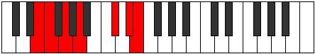

# Mode Gadimic

## Links

- [Documentation](index.md)
- [Scales Index](Scales.md)
- [Modes Index](Modes.md)
- [Chords Index](Chords.md)

## Parent Scale

[Gacrimic](ScaleGacrimic.md)

## Number

[2603](https://ianring.com/musictheory/scales/2603)

## Interval Pattern

1, 2, 2, 4, 2, 1

## Chord Pattern

II⁺, IV, IV⁺, v⁰, V⁺

## Perfection

- 1 Perfect notes
- 5 Perfect notes

## Perfection Profile

[false false false true false false]

## Permutations

| Tonic | Notes | Signature | Illustration | Audio |
|-------|-------|-----------|--------------|-------|
| [C](ModeCNaturalGadimic.md) | **C**, **Db**, **Eb**, F, **G##**, **A##**, **C** | C |  | [midi](https://github.com/edipermadi/music/blob/main/docs/ModeCNaturalGadimic.mid?raw=true) |
| [C#](ModeCSharpGadimic.md) | **C#**, **D**, **E**, F#, **G###**, **A###**, **C#** | C |  | [midi](https://github.com/edipermadi/music/blob/main/docs/ModeCSharpGadimic.mid?raw=true) |
| [Db](ModeDFlatGadimic.md) | **Db**, **Ebb**, **Fb**, Gb, **A#**, **B#**, **Db** | C |  | [midi](https://github.com/edipermadi/music/blob/main/docs/ModeDFlatGadimic.mid?raw=true) |
| [D](ModeDNaturalGadimic.md) | **D**, **Eb**, **F**, G, **A##**, **B##**, **D** | C |  | [midi](https://github.com/edipermadi/music/blob/main/docs/ModeDNaturalGadimic.mid?raw=true) |
| [D#](ModeDSharpGadimic.md) | **D#**, **E**, **F#**, G#, **A###**, **B###**, **D#** | C |  | [midi](https://github.com/edipermadi/music/blob/main/docs/ModeDSharpGadimic.mid?raw=true) |
| [Eb](ModeEFlatGadimic.md) | **Eb**, **Fb**, **Gb**, Ab, **B#**, **C##**, **Eb** | C |  | [midi](https://github.com/edipermadi/music/blob/main/docs/ModeEFlatGadimic.mid?raw=true) |
| [E](ModeENaturalGadimic.md) | **E**, **F**, **G**, A, **B##**, **C###**, **E** | C |  | [midi](https://github.com/edipermadi/music/blob/main/docs/ModeENaturalGadimic.mid?raw=true) |
| [F](ModeFNaturalGadimic.md) | **F**, **Gb**, **Ab**, Bb, **C##**, **D##**, **F** | C |  | [midi](https://github.com/edipermadi/music/blob/main/docs/ModeFNaturalGadimic.mid?raw=true) |
| [F#](ModeFSharpGadimic.md) | **F#**, **G**, **A**, B, **C###**, **D###**, **F#** | C |  | [midi](https://github.com/edipermadi/music/blob/main/docs/ModeFSharpGadimic.mid?raw=true) |
| [Gb](ModeGFlatGadimic.md) | **Gb**, **Abb**, **Bbb**, Cb, **D#**, **E#**, **Gb** | C |  | [midi](https://github.com/edipermadi/music/blob/main/docs/ModeGFlatGadimic.mid?raw=true) |
| [G](ModeGNaturalGadimic.md) | **G**, **Ab**, **Bb**, C, **D##**, **E##**, **G** | C |  | [midi](https://github.com/edipermadi/music/blob/main/docs/ModeGNaturalGadimic.mid?raw=true) |
| [G#](ModeGSharpGadimic.md) | **G#**, **A**, **B**, C#, **D###**, **E###**, **G#** | C |  | [midi](https://github.com/edipermadi/music/blob/main/docs/ModeGSharpGadimic.mid?raw=true) |
| [Ab](ModeAFlatGadimic.md) | **Ab**, **Bbb**, **Cb**, Db, **E#**, **F##**, **Ab** | C |  | [midi](https://github.com/edipermadi/music/blob/main/docs/ModeAFlatGadimic.mid?raw=true) |
| [A](ModeANaturalGadimic.md) | **A**, **Bb**, **C**, D, **E##**, **F###**, **A** | C |  | [midi](https://github.com/edipermadi/music/blob/main/docs/ModeANaturalGadimic.mid?raw=true) |
| [A#](ModeASharpGadimic.md) | **A#**, **B**, **C#**, D#, **E###**, **Cbbb**, **A#** | C |  | [midi](https://github.com/edipermadi/music/blob/main/docs/ModeASharpGadimic.mid?raw=true) |
| [Bb](ModeBFlatGadimic.md) | **Bb**, **Cb**, **Db**, Eb, **F##**, **G##**, **Bb** | C |  | [midi](https://github.com/edipermadi/music/blob/main/docs/ModeBFlatGadimic.mid?raw=true) |
| [B](ModeBNaturalGadimic.md) | **B**, **C**, **D**, E, **F###**, **G###**, **B** | C |  | [midi](https://github.com/edipermadi/music/blob/main/docs/ModeBNaturalGadimic.mid?raw=true) |
