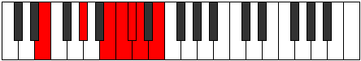

# Mode Galimic

## Links

- [Documentation](index.md)
- [Scales Index](Scales.md)
- [Modes Index](Modes.md)
- [Chords Index](Chords.md)

## Parent Scale

[Galimic](ScaleGalimic.md)

## Number

[1937](https://ianring.com/musictheory/scales/1937)

## Perfection

- 2 Perfect notes
- 4 Perfect notes

## Perfection Profile

[true false false false true false]

## Permutations

| Tonic | Notes | Signature | Illustration | Audio |
|-------|-------|-----------|--------------|-------|
| [C](ModeCNaturalGalimic.md) | C, **D##**, **E###**, **F###**, G##, **A#**, C | C |  | [midi](ModeCNaturalGalimic.mid) [ogg](ModeCNaturalGalimic.ogg) |
| [C#](ModeCSharpGalimic.md) | C#, **D###**, **F###**, **G##**, A#, **B**, C# | C |  | [midi](ModeCSharpGalimic.mid) [ogg](ModeCSharpGalimic.ogg) |
| [Db](ModeDFlatGalimic.md) | Db, **E#**, **F###**, **G##**, A#, **B**, Db | C |  | [midi](ModeDFlatGalimic.mid) [ogg](ModeDFlatGalimic.ogg) |
| [D](ModeDNaturalGalimic.md) | D, **E##**, **Cbbb**, **Cbb**, Dbbb, **Dbb**, D | C |  | [midi](ModeDNaturalGalimic.mid) [ogg](ModeDNaturalGalimic.ogg) |
| [D#](ModeDSharpGalimic.md) | D#, **E###**, **Cbb**, **Dbbb**, Dbb, **Ebbb**, D# | C |  | [midi](ModeDSharpGalimic.mid) [ogg](ModeDSharpGalimic.ogg) |
| [Eb](ModeEFlatGalimic.md) | Eb, **F##**, **G###**, **A##**, B#, **C#**, Eb | C |  | [midi](ModeEFlatGalimic.mid) [ogg](ModeEFlatGalimic.ogg) |
| [E](ModeENaturalGalimic.md) | E, **F###**, **Cb**, **Dbb**, Ebbb, **Fbbb**, E | C |  | [midi](ModeENaturalGalimic.mid) [ogg](ModeENaturalGalimic.ogg) |
| [F](ModeFNaturalGalimic.md) | F, **G##**, **A###**, **B##**, C##, **D#**, F | C |  | [midi](ModeFNaturalGalimic.mid) [ogg](ModeFNaturalGalimic.ogg) |
| [F#](ModeFSharpGalimic.md) | F#, **G###**, **Db**, **Ebb**, Fbb, **Gbbb**, F# | C |  | [midi](ModeFSharpGalimic.mid) [ogg](ModeFSharpGalimic.ogg) |
| [Gb](ModeGFlatGalimic.md) | Gb, **A#**, **B##**, **C##**, D#, **E**, Gb | C |  | [midi](ModeGFlatGalimic.mid) [ogg](ModeGFlatGalimic.ogg) |
| [G](ModeGNaturalGalimic.md) | G, **A##**, **B###**, **C###**, D##, **E#**, G | C |  | [midi](ModeGNaturalGalimic.mid) [ogg](ModeGNaturalGalimic.ogg) |
| [G#](ModeGSharpGalimic.md) | G#, **A###**, **C###**, **D##**, E#, **F#**, G# | C |  | [midi](ModeGSharpGalimic.mid) [ogg](ModeGSharpGalimic.ogg) |
| [Ab](ModeAFlatGalimic.md) | Ab, **B#**, **C###**, **D##**, E#, **F#**, Ab | C |  | [midi](ModeAFlatGalimic.mid) [ogg](ModeAFlatGalimic.ogg) |
| [A](ModeANaturalGalimic.md) | A, **B##**, **D##**, **E#**, F#, **G**, A | C |  | [midi](ModeANaturalGalimic.mid) [ogg](ModeANaturalGalimic.ogg) |
| [A#](ModeASharpGalimic.md) | A#, **B###**, **D###**, **E##**, F##, **G#**, A# | C |  | [midi](ModeASharpGalimic.mid) [ogg](ModeASharpGalimic.ogg) |
| [Bb](ModeBFlatGalimic.md) | Bb, **C##**, **D###**, **E##**, F##, **G#**, Bb | C |  | [midi](ModeBFlatGalimic.mid) [ogg](ModeBFlatGalimic.ogg) |
| [B](ModeBNaturalGalimic.md) | B, **C###**, **E##**, **F##**, G#, **A**, B | C |  | [midi](ModeBNaturalGalimic.mid) [ogg](ModeBNaturalGalimic.ogg) |
