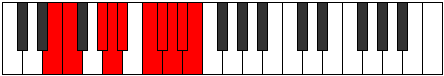

# Mode Galygic

## Links

- [Documentation](index.md)
- [Scales Index](Scales.md)
- [Modes Index](Modes.md)
- [Chords Index](Chords.md)

## Parent Scale

[Kalygic](ScaleKalygic.md)

## Number

[3955](https://ianring.com/musictheory/scales/3955)

## Perfection

- 7 Perfect notes
- 2 Perfect notes

## Perfection Profile

[false true true true true false true true true]

## Permutations

| Tonic | Notes | Signature | Illustration | Audio |
|-------|-------|-----------|--------------|-------|
| [C](ModeCNaturalGalygic.md) | **C**, C#, E, F, F#, **G#**, A, A#, B, **C** | C |  | [midi](ModeCNaturalGalygic.mid) [ogg](ModeCNaturalGalygic.ogg) |
| [C#](ModeCSharpGalygic.md) | **C#**, D, F, F#, G, **A**, A#, B, C, **C#** | C |  | [midi](ModeCSharpGalygic.mid) [ogg](ModeCSharpGalygic.ogg) |
| [Db](ModeDFlatGalygic.md) | **Db**, D, F, Gb, G, **A**, Bb, B, C, **Db** | C |  | [midi](ModeDFlatGalygic.mid) [ogg](ModeDFlatGalygic.ogg) |
| [D](ModeDNaturalGalygic.md) | **D**, D#, F#, G, G#, **A#**, B, C, C#, **D** | C |  | [midi](ModeDNaturalGalygic.mid) [ogg](ModeDNaturalGalygic.ogg) |
| [D#](ModeDSharpGalygic.md) | **D#**, E, G, G#, A, **B**, C, C#, D, **D#** | C |  | [midi](ModeDSharpGalygic.mid) [ogg](ModeDSharpGalygic.ogg) |
| [Eb](ModeEFlatGalygic.md) | **Eb**, E, G, Ab, A, **B**, C, Db, D, **Eb** | C |  | [midi](ModeEFlatGalygic.mid) [ogg](ModeEFlatGalygic.ogg) |
| [E](ModeENaturalGalygic.md) | **E**, F, G#, A, A#, **C**, C#, D, D#, **E** | C |  | [midi](ModeENaturalGalygic.mid) [ogg](ModeENaturalGalygic.ogg) |
| [F](ModeFNaturalGalygic.md) | **F**, F#, A, A#, B, **C#**, D, D#, E, **F** | C |  | [midi](ModeFNaturalGalygic.mid) [ogg](ModeFNaturalGalygic.ogg) |
| [F#](ModeFSharpGalygic.md) | **F#**, G, A#, B, C, **D**, D#, E, F, **F#** | C |  | [midi](ModeFSharpGalygic.mid) [ogg](ModeFSharpGalygic.ogg) |
| [Gb](ModeGFlatGalygic.md) | **Gb**, G, Bb, B, C, **D**, Eb, E, F, **Gb** | C |  | [midi](ModeGFlatGalygic.mid) [ogg](ModeGFlatGalygic.ogg) |
| [G](ModeGNaturalGalygic.md) | **G**, G#, B, C, C#, **D#**, E, F, F#, **G** | C |  | [midi](ModeGNaturalGalygic.mid) [ogg](ModeGNaturalGalygic.ogg) |
| [G#](ModeGSharpGalygic.md) | **G#**, A, C, C#, D, **E**, F, F#, G, **G#** | C |  | [midi](ModeGSharpGalygic.mid) [ogg](ModeGSharpGalygic.ogg) |
| [Ab](ModeAFlatGalygic.md) | **Ab**, A, C, Db, D, **E**, F, Gb, G, **Ab** | C |  | [midi](ModeAFlatGalygic.mid) [ogg](ModeAFlatGalygic.ogg) |
| [A](ModeANaturalGalygic.md) | **A**, A#, C#, D, D#, **F**, F#, G, G#, **A** | C |  | [midi](ModeANaturalGalygic.mid) [ogg](ModeANaturalGalygic.ogg) |
| [A#](ModeASharpGalygic.md) | **A#**, B, D, D#, E, **F#**, G, G#, A, **A#** | C |  | [midi](ModeASharpGalygic.mid) [ogg](ModeASharpGalygic.ogg) |
| [Bb](ModeBFlatGalygic.md) | **Bb**, B, D, Eb, E, **Gb**, G, Ab, A, **Bb** | C |  | [midi](ModeBFlatGalygic.mid) [ogg](ModeBFlatGalygic.ogg) |
| [B](ModeBNaturalGalygic.md) | **B**, C, D#, E, F, **G**, G#, A, A#, **B** | C |  | [midi](ModeBNaturalGalygic.mid) [ogg](ModeBNaturalGalygic.ogg) |
