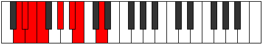

# Mode Ganian

## Links

- [Documentation](index.md)
- [Scales Index](Scales.md)
- [Modes Index](Modes.md)
- [Chords Index](Chords.md)

## Parent Scale

[Katocrian](ScaleKatocrian.md)

## Number

[847](https://ianring.com/musictheory/scales/847)

## Perfection

- 4 Perfect notes
- 3 Perfect notes

## Perfection Profile

[false true true false true true false]

## Permutations

| Tonic | Notes | Signature | Illustration | Audio |
|-------|-------|-----------|--------------|-------|
| [C](ModeCNaturalGanian.md) | **C**, Db, Ebb, **Fbb**, Gb, Ab, **Bbb**, **C** | C |  | [midi](ModeCNaturalGanian.mid) [ogg](ModeCNaturalGanian.ogg) |
| [C#](ModeCSharpGanian.md) | **C#**, D, Eb, **Fb**, G, A, **Bb**, **C#** | C |  | [midi](ModeCSharpGanian.mid) [ogg](ModeCSharpGanian.ogg) |
| [Db](ModeDFlatGanian.md) | **Db**, Ebb, Fbb, **Gbbb**, Abb, Bbb, **Cbb**, **Db** | C |  | [midi](ModeDFlatGanian.mid) [ogg](ModeDFlatGanian.ogg) |
| [D](ModeDNaturalGanian.md) | **D**, Eb, Fb, **Gbb**, Ab, Bb, **Cb**, **D** | C |  | [midi](ModeDNaturalGanian.mid) [ogg](ModeDNaturalGanian.ogg) |
| [D#](ModeDSharpGanian.md) | **D#**, E, F, **Gb**, A, B, **C**, **D#** | C |  | [midi](ModeDSharpGanian.mid) [ogg](ModeDSharpGanian.ogg) |
| [Eb](ModeEFlatGanian.md) | **Eb**, Fb, Gbb, **Abbb**, Bbb, Cb, **Dbb**, **Eb** | C |  | [midi](ModeEFlatGanian.mid) [ogg](ModeEFlatGanian.ogg) |
| [E](ModeENaturalGanian.md) | **E**, F, Gb, **Abb**, Bb, C, **Db**, **E** | C |  | [midi](ModeENaturalGanian.mid) [ogg](ModeENaturalGanian.ogg) |
| [F](ModeFNaturalGanian.md) | **F**, Gb, Abb, **Bbbb**, Cb, Db, **Ebb**, **F** | C |  | [midi](ModeFNaturalGanian.mid) [ogg](ModeFNaturalGanian.ogg) |
| [F#](ModeFSharpGanian.md) | **F#**, G, Ab, **Bbb**, C, D, **Eb**, **F#** | C |  | [midi](ModeFSharpGanian.mid) [ogg](ModeFSharpGanian.ogg) |
| [Gb](ModeGFlatGanian.md) | **Gb**, Abb, Bbbb, **Cbbb**, Dbb, Ebb, **Fbb**, **Gb** | C |  | [midi](ModeGFlatGanian.mid) [ogg](ModeGFlatGanian.ogg) |
| [G](ModeGNaturalGanian.md) | **G**, Ab, Bbb, **Cbb**, Db, Eb, **Fb**, **G** | C |  | [midi](ModeGNaturalGanian.mid) [ogg](ModeGNaturalGanian.ogg) |
| [G#](ModeGSharpGanian.md) | **G#**, A, Bb, **Cb**, D, E, **F**, **G#** | C |  | [midi](ModeGSharpGanian.mid) [ogg](ModeGSharpGanian.ogg) |
| [Ab](ModeAFlatGanian.md) | **Ab**, Bbb, Cbb, **Dbbb**, Ebb, Fb, **Gbb**, **Ab** | C |  | [midi](ModeAFlatGanian.mid) [ogg](ModeAFlatGanian.ogg) |
| [A](ModeANaturalGanian.md) | **A**, Bb, Cb, **Dbb**, Eb, F, **Gb**, **A** | C |  | [midi](ModeANaturalGanian.mid) [ogg](ModeANaturalGanian.ogg) |
| [A#](ModeASharpGanian.md) | **A#**, B, C, **Db**, E, F#, **G**, **A#** | C |  | [midi](ModeASharpGanian.mid) [ogg](ModeASharpGanian.ogg) |
| [Bb](ModeBFlatGanian.md) | **Bb**, Cb, Dbb, **Ebbb**, Fb, Gb, **Abb**, **Bb** | C |  | [midi](ModeBFlatGanian.mid) [ogg](ModeBFlatGanian.ogg) |
| [B](ModeBNaturalGanian.md) | **B**, C, Db, **Ebb**, F, G, **Ab**, **B** | C |  | [midi](ModeBNaturalGanian.mid) [ogg](ModeBNaturalGanian.ogg) |
