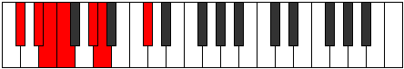

# Mode Ganimic

## Links

- [Documentation](README.md)
- [Scales Index](Scales.md)
- [Modes Index](Modes.md)
- [Chords Index](Chords.md)

## Parent Scale

[Aerycrimic](ScaleAerycrimic.md)

## Number

[413](https://ianring.com/musictheory/scales/413)

## Luminosity

-1

## Transposition

2, 1, 1, 3, 1, 4

## Chord Pattern

i, ii⁰b3

## Perfection

- 3 Perfect notes
- 3 Perfect notes

## Perfection Profile

true, false, false, false, true, true

## Permutations

| Tonic | Notes | Signature | Illustration | Audio |
|-------|-------|-----------|--------------|-------|
| [C](ModeCNaturalGanimic.md) | C, **D**, **Eb**, **Fb**, G, Ab, C | C |  | [midi](https://github.com/edipermadi/music/blob/main/docs/ModeCNaturalGanimic.mid?raw=true) |
| [C#](ModeCSharpGanimic.md) | C#, **D#**, **E**, **F**, G#, A, C# | C |  | [midi](https://github.com/edipermadi/music/blob/main/docs/ModeCSharpGanimic.mid?raw=true) |
| [Db](ModeDFlatGanimic.md) | Db, **Eb**, **Fb**, **Gbb**, Ab, Bbb, Db | C |  | [midi](https://github.com/edipermadi/music/blob/main/docs/ModeDFlatGanimic.mid?raw=true) |
| [D](ModeDNaturalGanimic.md) | D, **E**, **F**, **Gb**, A, Bb, D | C |  | [midi](https://github.com/edipermadi/music/blob/main/docs/ModeDNaturalGanimic.mid?raw=true) |
| [D#](ModeDSharpGanimic.md) | D#, **E#**, **F#**, **G**, A#, B, D# | C |  | [midi](https://github.com/edipermadi/music/blob/main/docs/ModeDSharpGanimic.mid?raw=true) |
| [Eb](ModeEFlatGanimic.md) | Eb, **F**, **Gb**, **Abb**, Bb, Cb, Eb | C |  | [midi](https://github.com/edipermadi/music/blob/main/docs/ModeEFlatGanimic.mid?raw=true) |
| [E](ModeENaturalGanimic.md) | E, **F#**, **G**, **Ab**, B, C, E | C |  | [midi](https://github.com/edipermadi/music/blob/main/docs/ModeENaturalGanimic.mid?raw=true) |
| [F](ModeFNaturalGanimic.md) | F, **G**, **Ab**, **Bbb**, C, Db, F | C |  | [midi](https://github.com/edipermadi/music/blob/main/docs/ModeFNaturalGanimic.mid?raw=true) |
| [F#](ModeFSharpGanimic.md) | F#, **G#**, **A**, **Bb**, C#, D, F# | C |  | [midi](https://github.com/edipermadi/music/blob/main/docs/ModeFSharpGanimic.mid?raw=true) |
| [Gb](ModeGFlatGanimic.md) | Gb, **Ab**, **Bbb**, **Cbb**, Db, Ebb, Gb | C |  | [midi](https://github.com/edipermadi/music/blob/main/docs/ModeGFlatGanimic.mid?raw=true) |
| [G](ModeGNaturalGanimic.md) | G, **A**, **Bb**, **Cb**, D, Eb, G | C |  | [midi](https://github.com/edipermadi/music/blob/main/docs/ModeGNaturalGanimic.mid?raw=true) |
| [G#](ModeGSharpGanimic.md) | G#, **A#**, **B**, **C**, D#, E, G# | C |  | [midi](https://github.com/edipermadi/music/blob/main/docs/ModeGSharpGanimic.mid?raw=true) |
| [Ab](ModeAFlatGanimic.md) | Ab, **Bb**, **Cb**, **Dbb**, Eb, Fb, Ab | C |  | [midi](https://github.com/edipermadi/music/blob/main/docs/ModeAFlatGanimic.mid?raw=true) |
| [A](ModeANaturalGanimic.md) | A, **B**, **C**, **Db**, E, F, A | C |  | [midi](https://github.com/edipermadi/music/blob/main/docs/ModeANaturalGanimic.mid?raw=true) |
| [A#](ModeASharpGanimic.md) | A#, **B#**, **C#**, **D**, E#, F#, A# | C |  | [midi](https://github.com/edipermadi/music/blob/main/docs/ModeASharpGanimic.mid?raw=true) |
| [Bb](ModeBFlatGanimic.md) | Bb, **C**, **Db**, **Ebb**, F, Gb, Bb | C |  | [midi](https://github.com/edipermadi/music/blob/main/docs/ModeBFlatGanimic.mid?raw=true) |
| [B](ModeBNaturalGanimic.md) | B, **C#**, **D**, **Eb**, F#, G, B | C |  | [midi](https://github.com/edipermadi/music/blob/main/docs/ModeBNaturalGanimic.mid?raw=true) |
