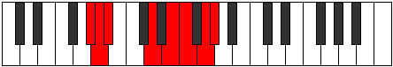

# Mode Gaptian

## Links

- [Documentation](index.md)
- [Scales Index](Scales.md)
- [Modes Index](Modes.md)
- [Chords Index](Chords.md)

## Parent Scale

[Aeopian](ScaleAeopian.md)

## Number

[2887](https://ianring.com/musictheory/scales/2887)

## Perfection

- 4 Perfect notes
- 3 Perfect notes

## Perfection Profile

[false true true true false false true]

## Permutations

| Tonic | Notes | Signature | Illustration | Audio |
|-------|-------|-----------|--------------|-------|
| [C](ModeCNaturalGaptian.md) | **C**, Db, Ebb, F#, **G#**, **A**, B, **C** | C |  | [midi](ModeCNaturalGaptian.mid) [ogg](ModeCNaturalGaptian.ogg) |
| [C#](ModeCSharpGaptian.md) | **C#**, D, Eb, F##, **G##**, **A#**, B#, **C#** | C |  | [midi](ModeCSharpGaptian.mid) [ogg](ModeCSharpGaptian.ogg) |
| [Db](ModeDFlatGaptian.md) | **Db**, Ebb, Fbb, G, **A**, **Bb**, C, **Db** | C |  | [midi](ModeDFlatGaptian.mid) [ogg](ModeDFlatGaptian.ogg) |
| [D](ModeDNaturalGaptian.md) | **D**, Eb, Fb, G#, **A#**, **B**, C#, **D** | C |  | [midi](ModeDNaturalGaptian.mid) [ogg](ModeDNaturalGaptian.ogg) |
| [D#](ModeDSharpGaptian.md) | **D#**, E, F, G##, **A##**, **B#**, C##, **D#** | C |  | [midi](ModeDSharpGaptian.mid) [ogg](ModeDSharpGaptian.ogg) |
| [Eb](ModeEFlatGaptian.md) | **Eb**, Fb, Gbb, A, **B**, **C**, D, **Eb** | C |  | [midi](ModeEFlatGaptian.mid) [ogg](ModeEFlatGaptian.ogg) |
| [E](ModeENaturalGaptian.md) | **E**, F, Gb, A#, **B#**, **C#**, D#, **E** | C |  | [midi](ModeENaturalGaptian.mid) [ogg](ModeENaturalGaptian.ogg) |
| [F](ModeFNaturalGaptian.md) | **F**, Gb, Abb, B, **C#**, **D**, E, **F** | C |  | [midi](ModeFNaturalGaptian.mid) [ogg](ModeFNaturalGaptian.ogg) |
| [F#](ModeFSharpGaptian.md) | **F#**, G, Ab, B#, **C##**, **D#**, E#, **F#** | C |  | [midi](ModeFSharpGaptian.mid) [ogg](ModeFSharpGaptian.ogg) |
| [Gb](ModeGFlatGaptian.md) | **Gb**, Abb, Bbbb, C, **D**, **Eb**, F, **Gb** | C |  | [midi](ModeGFlatGaptian.mid) [ogg](ModeGFlatGaptian.ogg) |
| [G](ModeGNaturalGaptian.md) | **G**, Ab, Bbb, C#, **D#**, **E**, F#, **G** | C |  | [midi](ModeGNaturalGaptian.mid) [ogg](ModeGNaturalGaptian.ogg) |
| [G#](ModeGSharpGaptian.md) | **G#**, A, Bb, C##, **D##**, **E#**, F##, **G#** | C |  | [midi](ModeGSharpGaptian.mid) [ogg](ModeGSharpGaptian.ogg) |
| [Ab](ModeAFlatGaptian.md) | **Ab**, Bbb, Cbb, D, **E**, **F**, G, **Ab** | C |  | [midi](ModeAFlatGaptian.mid) [ogg](ModeAFlatGaptian.ogg) |
| [A](ModeANaturalGaptian.md) | **A**, Bb, Cb, D#, **E#**, **F#**, G#, **A** | C |  | [midi](ModeANaturalGaptian.mid) [ogg](ModeANaturalGaptian.ogg) |
| [A#](ModeASharpGaptian.md) | **A#**, B, C, D##, **E##**, **F##**, G##, **A#** | C |  | [midi](ModeASharpGaptian.mid) [ogg](ModeASharpGaptian.ogg) |
| [Bb](ModeBFlatGaptian.md) | **Bb**, Cb, Dbb, E, **F#**, **G**, A, **Bb** | C |  | [midi](ModeBFlatGaptian.mid) [ogg](ModeBFlatGaptian.ogg) |
| [B](ModeBNaturalGaptian.md) | **B**, C, Db, E#, **F##**, **G#**, A#, **B** | C |  | [midi](ModeBNaturalGaptian.mid) [ogg](ModeBNaturalGaptian.ogg) |
