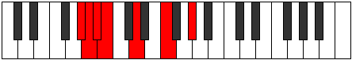
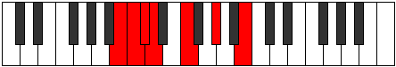

# Mode Gaptimic

## Links

- [Documentation](index.md)
- [Scales Index](Scales.md)
- [Modes Index](Modes.md)
- [Chords Index](Chords.md)

## Parent Scale

[Epynimic](ScaleEpynimic.md)

## Number

[591](https://ianring.com/musictheory/scales/591)

## Perfection

- 2 Perfect notes
- 4 Perfect notes

## Perfection Profile

[false false true false true false]

## Permutations

| Tonic | Notes | Signature | Illustration | Audio |
|-------|-------|-----------|--------------|-------|
| [C](ModeCNaturalGaptimic.md) | **C**, **Db**, Ebb, **Fbb**, Gb, **A**, **C** | C |  | [midi](ModeCNaturalGaptimic.mid) [ogg](ModeCNaturalGaptimic.ogg) |
| [C#](ModeCSharpGaptimic.md) | **C#**, **D**, Eb, **Fb**, G, **A#**, **C#** | C |  | [midi](ModeCSharpGaptimic.mid) [ogg](ModeCSharpGaptimic.ogg) |
| [Db](ModeDFlatGaptimic.md) | **Db**, **Ebb**, Fbb, **Gbbb**, Abb, **Bb**, **Db** | C |  | [midi](ModeDFlatGaptimic.mid) [ogg](ModeDFlatGaptimic.ogg) |
| [D](ModeDNaturalGaptimic.md) | **D**, **Eb**, Fb, **Gbb**, Ab, **B**, **D** | C |  | [midi](ModeDNaturalGaptimic.mid) [ogg](ModeDNaturalGaptimic.ogg) |
| [D#](ModeDSharpGaptimic.md) | **D#**, **E**, F, **Gb**, A, **B#**, **D#** | C |  | [midi](ModeDSharpGaptimic.mid) [ogg](ModeDSharpGaptimic.ogg) |
| [Eb](ModeEFlatGaptimic.md) | **Eb**, **Fb**, Gbb, **Abbb**, Bbb, **C**, **Eb** | C |  | [midi](ModeEFlatGaptimic.mid) [ogg](ModeEFlatGaptimic.ogg) |
| [E](ModeENaturalGaptimic.md) | **E**, **F**, Gb, **Abb**, Bb, **C#**, **E** | C |  | [midi](ModeENaturalGaptimic.mid) [ogg](ModeENaturalGaptimic.ogg) |
| [F](ModeFNaturalGaptimic.md) | **F**, **Gb**, Abb, **Bbbb**, Cb, **D**, **F** | C |  | [midi](ModeFNaturalGaptimic.mid) [ogg](ModeFNaturalGaptimic.ogg) |
| [F#](ModeFSharpGaptimic.md) | **F#**, **G**, Ab, **Bbb**, C, **D#**, **F#** | C |  | [midi](ModeFSharpGaptimic.mid) [ogg](ModeFSharpGaptimic.ogg) |
| [Gb](ModeGFlatGaptimic.md) | **Gb**, **Abb**, Bbbb, **Cbbb**, Dbb, **Eb**, **Gb** | C |  | [midi](ModeGFlatGaptimic.mid) [ogg](ModeGFlatGaptimic.ogg) |
| [G](ModeGNaturalGaptimic.md) | **G**, **Ab**, Bbb, **Cbb**, Db, **E**, **G** | C |  | [midi](ModeGNaturalGaptimic.mid) [ogg](ModeGNaturalGaptimic.ogg) |
| [G#](ModeGSharpGaptimic.md) | **G#**, **A**, Bb, **Cb**, D, **E#**, **G#** | C |  | [midi](ModeGSharpGaptimic.mid) [ogg](ModeGSharpGaptimic.ogg) |
| [Ab](ModeAFlatGaptimic.md) | **Ab**, **Bbb**, Cbb, **Dbbb**, Ebb, **F**, **Ab** | C |  | [midi](ModeAFlatGaptimic.mid) [ogg](ModeAFlatGaptimic.ogg) |
| [A](ModeANaturalGaptimic.md) | **A**, **Bb**, Cb, **Dbb**, Eb, **F#**, **A** | C |  | [midi](ModeANaturalGaptimic.mid) [ogg](ModeANaturalGaptimic.ogg) |
| [A#](ModeASharpGaptimic.md) | **A#**, **B**, C, **Db**, E, **F##**, **A#** | C |  | [midi](ModeASharpGaptimic.mid) [ogg](ModeASharpGaptimic.ogg) |
| [Bb](ModeBFlatGaptimic.md) | **Bb**, **Cb**, Dbb, **Ebbb**, Fb, **G**, **Bb** | C |  | [midi](ModeBFlatGaptimic.mid) [ogg](ModeBFlatGaptimic.ogg) |
| [B](ModeBNaturalGaptimic.md) | **B**, **C**, Db, **Ebb**, F, **G#**, **B** | C |  | [midi](ModeBNaturalGaptimic.mid) [ogg](ModeBNaturalGaptimic.ogg) |
