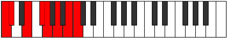

# Mode Garian

## Links

- [Documentation](README.md)
- [Scales Index](Scales.md)
- [Modes Index](Modes.md)
- [Chords Index](Chords.md)

## Parent Scale

[Thonian](ScaleThonian.md)

## Number

[2771](https://ianring.com/musictheory/scales/2771)

## Transposition

1, 3, 2, 1, 2, 2, 1

## Chord Pattern

I, iii, iv⁰, iv⁰, Vb5, vi

## Perfection

- 5 Perfect notes
- 2 Perfect notes

## Perfection Profile

[true false true true false true true]

## Permutations

| Tonic | Notes | Signature | Illustration | Audio |
|-------|-------|-----------|--------------|-------|
| [C](ModeCNaturalGarian.md) | C, **Db**, E, F#, **G**, A, B, C | C |  | [midi](https://github.com/edipermadi/music/blob/main/docs/ModeCNaturalGarian.mid?raw=true) |
| [C#](ModeCSharpGarian.md) | C#, **D**, E#, F##, **G#**, A#, B#, C# | C |  | [midi](https://github.com/edipermadi/music/blob/main/docs/ModeCSharpGarian.mid?raw=true) |
| [Db](ModeDFlatGarian.md) | Db, **Ebb**, F, G, **Ab**, Bb, C, Db | C |  | [midi](https://github.com/edipermadi/music/blob/main/docs/ModeDFlatGarian.mid?raw=true) |
| [D](ModeDNaturalGarian.md) | D, **Eb**, F#, G#, **A**, B, C#, D | C |  | [midi](https://github.com/edipermadi/music/blob/main/docs/ModeDNaturalGarian.mid?raw=true) |
| [D#](ModeDSharpGarian.md) | D#, **E**, F##, G##, **A#**, B#, C##, D# | C |  | [midi](https://github.com/edipermadi/music/blob/main/docs/ModeDSharpGarian.mid?raw=true) |
| [Eb](ModeEFlatGarian.md) | Eb, **Fb**, G, A, **Bb**, C, D, Eb | C |  | [midi](https://github.com/edipermadi/music/blob/main/docs/ModeEFlatGarian.mid?raw=true) |
| [E](ModeENaturalGarian.md) | E, **F**, G#, A#, **B**, C#, D#, E | C |  | [midi](https://github.com/edipermadi/music/blob/main/docs/ModeENaturalGarian.mid?raw=true) |
| [F](ModeFNaturalGarian.md) | F, **Gb**, A, B, **C**, D, E, F | C |  | [midi](https://github.com/edipermadi/music/blob/main/docs/ModeFNaturalGarian.mid?raw=true) |
| [F#](ModeFSharpGarian.md) | F#, **G**, A#, B#, **C#**, D#, E#, F# | C |  | [midi](https://github.com/edipermadi/music/blob/main/docs/ModeFSharpGarian.mid?raw=true) |
| [Gb](ModeGFlatGarian.md) | Gb, **Abb**, Bb, C, **Db**, Eb, F, Gb | C |  | [midi](https://github.com/edipermadi/music/blob/main/docs/ModeGFlatGarian.mid?raw=true) |
| [G](ModeGNaturalGarian.md) | G, **Ab**, B, C#, **D**, E, F#, G | C |  | [midi](https://github.com/edipermadi/music/blob/main/docs/ModeGNaturalGarian.mid?raw=true) |
| [G#](ModeGSharpGarian.md) | G#, **A**, B#, C##, **D#**, E#, F##, G# | C |  | [midi](https://github.com/edipermadi/music/blob/main/docs/ModeGSharpGarian.mid?raw=true) |
| [Ab](ModeAFlatGarian.md) | Ab, **Bbb**, C, D, **Eb**, F, G, Ab | C |  | [midi](https://github.com/edipermadi/music/blob/main/docs/ModeAFlatGarian.mid?raw=true) |
| [A](ModeANaturalGarian.md) | A, **Bb**, C#, D#, **E**, F#, G#, A | C |  | [midi](https://github.com/edipermadi/music/blob/main/docs/ModeANaturalGarian.mid?raw=true) |
| [A#](ModeASharpGarian.md) | A#, **B**, C##, D##, **E#**, F##, G##, A# | C |  | [midi](https://github.com/edipermadi/music/blob/main/docs/ModeASharpGarian.mid?raw=true) |
| [Bb](ModeBFlatGarian.md) | Bb, **Cb**, D, E, **F**, G, A, Bb | C |  | [midi](https://github.com/edipermadi/music/blob/main/docs/ModeBFlatGarian.mid?raw=true) |
| [B](ModeBNaturalGarian.md) | B, **C**, D#, E#, **F#**, G#, A#, B | C |  | [midi](https://github.com/edipermadi/music/blob/main/docs/ModeBNaturalGarian.mid?raw=true) |
