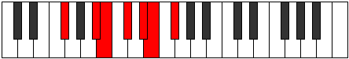

# Mode Garimic

## Links

- [Documentation](README.md)
- [Scales Index](Scales.md)
- [Modes Index](Modes.md)
- [Chords Index](Chords.md)

## Parent Scale

[Garimic](ScaleGarimic.md)

## Number

[1713](https://ianring.com/musictheory/scales/1713)

## Luminosity

-1

## Transposition

4, 1, 2, 2, 1, 2

## Chord Pattern

ii⁰, III

## Perfection

- 4 Perfect notes
- 2 Perfect notes

## Perfection Profile

true, false, true, false, true, true

## Permutations

| Tonic | Notes | Signature | Illustration | Audio |
|-------|-------|-----------|--------------|-------|
| [C](ModeCNaturalGarimic.md) | C, **D##**, E#, **F##**, G##, A#, C | C |  | [midi](https://github.com/edipermadi/music/blob/main/docs/ModeCNaturalGarimic.mid?raw=true) |
| [C#](ModeCSharpGarimic.md) | C#, **D###**, E##, **F###**, G###, A##, C# | C |  | [midi](https://github.com/edipermadi/music/blob/main/docs/ModeCSharpGarimic.mid?raw=true) |
| [Db](ModeDFlatGarimic.md) | Db, **E#**, F#, **G#**, A#, B, Db | C |  | [midi](https://github.com/edipermadi/music/blob/main/docs/ModeDFlatGarimic.mid?raw=true) |
| [D](ModeDNaturalGarimic.md) | D, **E##**, F##, **G##**, A##, B#, D | C |  | [midi](https://github.com/edipermadi/music/blob/main/docs/ModeDNaturalGarimic.mid?raw=true) |
| [D#](ModeDSharpGarimic.md) | D#, **E###**, F###, **G###**, A###, B##, D# | C |  | [midi](https://github.com/edipermadi/music/blob/main/docs/ModeDSharpGarimic.mid?raw=true) |
| [Eb](ModeEFlatGarimic.md) | Eb, **F##**, G#, **A#**, B#, C#, Eb | C |  | [midi](https://github.com/edipermadi/music/blob/main/docs/ModeEFlatGarimic.mid?raw=true) |
| [E](ModeENaturalGarimic.md) | E, **F###**, G##, **A##**, B##, C##, E | C |  | [midi](https://github.com/edipermadi/music/blob/main/docs/ModeENaturalGarimic.mid?raw=true) |
| [F](ModeFNaturalGarimic.md) | F, **G##**, A#, **B#**, C##, D#, F | C |  | [midi](https://github.com/edipermadi/music/blob/main/docs/ModeFNaturalGarimic.mid?raw=true) |
| [F#](ModeFSharpGarimic.md) | F#, **G###**, A##, **B##**, C###, D##, F# | C |  | [midi](https://github.com/edipermadi/music/blob/main/docs/ModeFSharpGarimic.mid?raw=true) |
| [Gb](ModeGFlatGarimic.md) | Gb, **A#**, B, **C#**, D#, E, Gb | C |  | [midi](https://github.com/edipermadi/music/blob/main/docs/ModeGFlatGarimic.mid?raw=true) |
| [G](ModeGNaturalGarimic.md) | G, **A##**, B#, **C##**, D##, E#, G | C |  | [midi](https://github.com/edipermadi/music/blob/main/docs/ModeGNaturalGarimic.mid?raw=true) |
| [G#](ModeGSharpGarimic.md) | G#, **A###**, B##, **C###**, D###, E##, G# | C |  | [midi](https://github.com/edipermadi/music/blob/main/docs/ModeGSharpGarimic.mid?raw=true) |
| [Ab](ModeAFlatGarimic.md) | Ab, **B#**, C#, **D#**, E#, F#, Ab | C |  | [midi](https://github.com/edipermadi/music/blob/main/docs/ModeAFlatGarimic.mid?raw=true) |
| [A](ModeANaturalGarimic.md) | A, **B##**, C##, **D##**, E##, F##, A | C |  | [midi](https://github.com/edipermadi/music/blob/main/docs/ModeANaturalGarimic.mid?raw=true) |
| [A#](ModeASharpGarimic.md) | A#, **B###**, C###, **D###**, E###, F###, A# | C |  | [midi](https://github.com/edipermadi/music/blob/main/docs/ModeASharpGarimic.mid?raw=true) |
| [Bb](ModeBFlatGarimic.md) | Bb, **C##**, D#, **E#**, F##, G#, Bb | C |  | [midi](https://github.com/edipermadi/music/blob/main/docs/ModeBFlatGarimic.mid?raw=true) |
| [B](ModeBNaturalGarimic.md) | B, **C###**, D##, **E##**, F###, G##, B | C |  | [midi](https://github.com/edipermadi/music/blob/main/docs/ModeBNaturalGarimic.mid?raw=true) |
