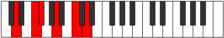
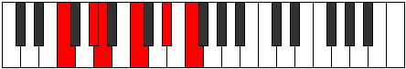
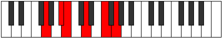
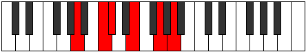

# Mode Garitonic

## Links

- [Documentation](README.md)
- [Scales Index](Scales.md)
- [Modes Index](Modes.md)
- [Chords Index](Chords.md)

## Parent Scale

[Thoditonic](ScaleThoditonic.md)

## Number

[1177](https://ianring.com/musictheory/scales/1177)

## Transposition

3, 1, 3, 3, 2

## Chord Pattern

## Perfection

- 2 Perfect notes
- 3 Perfect notes

## Perfection Profile

[true true false false false]

## Permutations

| Tonic | Notes | Signature | Illustration | Audio |
|-------|-------|-----------|--------------|-------|
| [C](ModeCNaturalGaritonic.md) | C, D#, **E**, **G**, **A#**, C | C |  | [midi](https://github.com/edipermadi/music/blob/main/docs/ModeCNaturalGaritonic.mid?raw=true) |
| [C#](ModeCSharpGaritonic.md) | C#, E, **F**, **G#**, **B**, C# | C |  | [midi](https://github.com/edipermadi/music/blob/main/docs/ModeCSharpGaritonic.mid?raw=true) |
| [Db](ModeDFlatGaritonic.md) | Db, E, **F**, **Ab**, **B**, Db | C |  | [midi](https://github.com/edipermadi/music/blob/main/docs/ModeDFlatGaritonic.mid?raw=true) |
| [D](ModeDNaturalGaritonic.md) | D, F, **F#**, **A**, **C**, D | C |  | [midi](https://github.com/edipermadi/music/blob/main/docs/ModeDNaturalGaritonic.mid?raw=true) |
| [D#](ModeDSharpGaritonic.md) | D#, F#, **G**, **A#**, **C#**, D# | C |  | [midi](https://github.com/edipermadi/music/blob/main/docs/ModeDSharpGaritonic.mid?raw=true) |
| [Eb](ModeEFlatGaritonic.md) | Eb, Gb, **G**, **Bb**, **Db**, Eb | C |  | [midi](https://github.com/edipermadi/music/blob/main/docs/ModeEFlatGaritonic.mid?raw=true) |
| [E](ModeENaturalGaritonic.md) | E, G, **G#**, **B**, **D**, E | C |  | [midi](https://github.com/edipermadi/music/blob/main/docs/ModeENaturalGaritonic.mid?raw=true) |
| [F](ModeFNaturalGaritonic.md) | F, G#, **A**, **C**, **D#**, F | C |  | [midi](https://github.com/edipermadi/music/blob/main/docs/ModeFNaturalGaritonic.mid?raw=true) |
| [F#](ModeFSharpGaritonic.md) | F#, A, **A#**, **C#**, **E**, F# | C |  | [midi](https://github.com/edipermadi/music/blob/main/docs/ModeFSharpGaritonic.mid?raw=true) |
| [Gb](ModeGFlatGaritonic.md) | Gb, A, **Bb**, **Db**, **E**, Gb | C |  | [midi](https://github.com/edipermadi/music/blob/main/docs/ModeGFlatGaritonic.mid?raw=true) |
| [G](ModeGNaturalGaritonic.md) | G, A#, **B**, **D**, **F**, G | C |  | [midi](https://github.com/edipermadi/music/blob/main/docs/ModeGNaturalGaritonic.mid?raw=true) |
| [G#](ModeGSharpGaritonic.md) | G#, B, **C**, **D#**, **F#**, G# | C |  | [midi](https://github.com/edipermadi/music/blob/main/docs/ModeGSharpGaritonic.mid?raw=true) |
| [Ab](ModeAFlatGaritonic.md) | Ab, B, **C**, **Eb**, **Gb**, Ab | C |  | [midi](https://github.com/edipermadi/music/blob/main/docs/ModeAFlatGaritonic.mid?raw=true) |
| [A](ModeANaturalGaritonic.md) | A, C, **C#**, **E**, **G**, A | C |  | [midi](https://github.com/edipermadi/music/blob/main/docs/ModeANaturalGaritonic.mid?raw=true) |
| [A#](ModeASharpGaritonic.md) | A#, C#, **D**, **F**, **G#**, A# | C |  | [midi](https://github.com/edipermadi/music/blob/main/docs/ModeASharpGaritonic.mid?raw=true) |
| [Bb](ModeBFlatGaritonic.md) | Bb, Db, **D**, **F**, **Ab**, Bb | C |  | [midi](https://github.com/edipermadi/music/blob/main/docs/ModeBFlatGaritonic.mid?raw=true) |
| [B](ModeBNaturalGaritonic.md) | B, D, **D#**, **F#**, **A**, B | C |  | [midi](https://github.com/edipermadi/music/blob/main/docs/ModeBNaturalGaritonic.mid?raw=true) |
