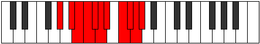

# Mode Garyllian

## Links

- [Documentation](README.md)
- [Scales Index](Scales.md)
- [Modes Index](Modes.md)
- [Chords Index](Chords.md)

## Parent Scale

[Aerycryllian](ScaleAerycryllian.md)

## Number

[3837](https://ianring.com/musictheory/scales/3837)

## Luminosity

7

## Transposition

2, 1, 1, 1, 1, 1, 2, 1, 1, 1

## Chord Pattern

## Perfection

- 9 Perfect notes
- 1 Perfect notes

## Perfection Profile

true, true, true, true, true, false, true, true, true, true

## Permutations

| Tonic | Notes | Signature | Illustration | Audio |
|-------|-------|-----------|--------------|-------|
| [C](ModeCNaturalGaryllian.md) | C, D, D#, E, F, **F#**, G, A, A#, B, C | C |  | [midi](https://github.com/edipermadi/music/blob/main/docs/ModeCNaturalGaryllian.mid?raw=true) |
| [C#](ModeCSharpGaryllian.md) | C#, D#, E, F, F#, **G**, G#, A#, B, C, C# | C |  | [midi](https://github.com/edipermadi/music/blob/main/docs/ModeCSharpGaryllian.mid?raw=true) |
| [Db](ModeDFlatGaryllian.md) | Db, Eb, E, F, Gb, **G**, Ab, Bb, B, C, Db | C |  | [midi](https://github.com/edipermadi/music/blob/main/docs/ModeDFlatGaryllian.mid?raw=true) |
| [D](ModeDNaturalGaryllian.md) | D, E, F, F#, G, **G#**, A, B, C, C#, D | C |  | [midi](https://github.com/edipermadi/music/blob/main/docs/ModeDNaturalGaryllian.mid?raw=true) |
| [D#](ModeDSharpGaryllian.md) | D#, F, F#, G, G#, **A**, A#, C, C#, D, D# | C |  | [midi](https://github.com/edipermadi/music/blob/main/docs/ModeDSharpGaryllian.mid?raw=true) |
| [Eb](ModeEFlatGaryllian.md) | Eb, F, Gb, G, Ab, **A**, Bb, C, Db, D, Eb | C |  | [midi](https://github.com/edipermadi/music/blob/main/docs/ModeEFlatGaryllian.mid?raw=true) |
| [E](ModeENaturalGaryllian.md) | E, F#, G, G#, A, **A#**, B, C#, D, D#, E | C |  | [midi](https://github.com/edipermadi/music/blob/main/docs/ModeENaturalGaryllian.mid?raw=true) |
| [F](ModeFNaturalGaryllian.md) | F, G, G#, A, A#, **B**, C, D, D#, E, F | C |  | [midi](https://github.com/edipermadi/music/blob/main/docs/ModeFNaturalGaryllian.mid?raw=true) |
| [F#](ModeFSharpGaryllian.md) | F#, G#, A, A#, B, **C**, C#, D#, E, F, F# | C |  | [midi](https://github.com/edipermadi/music/blob/main/docs/ModeFSharpGaryllian.mid?raw=true) |
| [Gb](ModeGFlatGaryllian.md) | Gb, Ab, A, Bb, B, **C**, Db, Eb, E, F, Gb | C |  | [midi](https://github.com/edipermadi/music/blob/main/docs/ModeGFlatGaryllian.mid?raw=true) |
| [G](ModeGNaturalGaryllian.md) | G, A, A#, B, C, **C#**, D, E, F, F#, G | C |  | [midi](https://github.com/edipermadi/music/blob/main/docs/ModeGNaturalGaryllian.mid?raw=true) |
| [G#](ModeGSharpGaryllian.md) | G#, A#, B, C, C#, **D**, D#, F, F#, G, G# | C |  | [midi](https://github.com/edipermadi/music/blob/main/docs/ModeGSharpGaryllian.mid?raw=true) |
| [Ab](ModeAFlatGaryllian.md) | Ab, Bb, B, C, Db, **D**, Eb, F, Gb, G, Ab | C |  | [midi](https://github.com/edipermadi/music/blob/main/docs/ModeAFlatGaryllian.mid?raw=true) |
| [A](ModeANaturalGaryllian.md) | A, B, C, C#, D, **D#**, E, F#, G, G#, A | C |  | [midi](https://github.com/edipermadi/music/blob/main/docs/ModeANaturalGaryllian.mid?raw=true) |
| [A#](ModeASharpGaryllian.md) | A#, C, C#, D, D#, **E**, F, G, G#, A, A# | C |  | [midi](https://github.com/edipermadi/music/blob/main/docs/ModeASharpGaryllian.mid?raw=true) |
| [Bb](ModeBFlatGaryllian.md) | Bb, C, Db, D, Eb, **E**, F, G, Ab, A, Bb | C |  | [midi](https://github.com/edipermadi/music/blob/main/docs/ModeBFlatGaryllian.mid?raw=true) |
| [B](ModeBNaturalGaryllian.md) | B, C#, D, D#, E, **F**, F#, G#, A, A#, B | C |  | [midi](https://github.com/edipermadi/music/blob/main/docs/ModeBNaturalGaryllian.mid?raw=true) |
