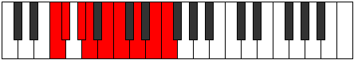
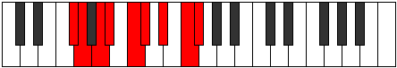

# Mode Garyllic

## Links

- [Documentation](README.md)
- [Scales Index](Scales.md)
- [Modes Index](Modes.md)
- [Chords Index](Chords.md)

## Parent Scale

[Dalyllic](ScaleDalyllic.md)

## Number

[2779](https://ianring.com/musictheory/scales/2779)

## Interval Pattern

1, 2, 1, 2, 1, 2, 2, 1

## Chord Pattern

i⁰, ii⁰, iii⁰, iv, v⁰, vii⁰

## Perfection

- 5 Perfect notes
- 3 Perfect notes

## Perfection Profile

[true false false true true false true true]

## Permutations

| Tonic | Notes | Signature | Illustration | Audio |
|-------|-------|-----------|--------------|-------|
| [C](ModeCNaturalGaryllic.md) | C, **C#**, **D#**, E, F#, **G**, A, B, C | C |  | [midi](https://github.com/edipermadi/music/blob/main/docs/ModeCNaturalGaryllic.mid?raw=true) |
| [C#](ModeCSharpGaryllic.md) | C#, **D**, **E**, F, G, **G#**, A#, C, C# | C |  | [midi](https://github.com/edipermadi/music/blob/main/docs/ModeCSharpGaryllic.mid?raw=true) |
| [Db](ModeDFlatGaryllic.md) | Db, **D**, **E**, F, G, **Ab**, Bb, C, Db | C |  | [midi](https://github.com/edipermadi/music/blob/main/docs/ModeDFlatGaryllic.mid?raw=true) |
| [D](ModeDNaturalGaryllic.md) | D, **D#**, **F**, F#, G#, **A**, B, C#, D | C |  | [midi](https://github.com/edipermadi/music/blob/main/docs/ModeDNaturalGaryllic.mid?raw=true) |
| [D#](ModeDSharpGaryllic.md) | D#, **E**, **F#**, G, A, **A#**, C, D, D# | C |  | [midi](https://github.com/edipermadi/music/blob/main/docs/ModeDSharpGaryllic.mid?raw=true) |
| [Eb](ModeEFlatGaryllic.md) | Eb, **E**, **Gb**, G, A, **Bb**, C, D, Eb | C |  | [midi](https://github.com/edipermadi/music/blob/main/docs/ModeEFlatGaryllic.mid?raw=true) |
| [E](ModeENaturalGaryllic.md) | E, **F**, **G**, G#, A#, **B**, C#, D#, E | C |  | [midi](https://github.com/edipermadi/music/blob/main/docs/ModeENaturalGaryllic.mid?raw=true) |
| [F](ModeFNaturalGaryllic.md) | F, **F#**, **G#**, A, B, **C**, D, E, F | C |  | [midi](https://github.com/edipermadi/music/blob/main/docs/ModeFNaturalGaryllic.mid?raw=true) |
| [F#](ModeFSharpGaryllic.md) | F#, **G**, **A**, A#, C, **C#**, D#, F, F# | C |  | [midi](https://github.com/edipermadi/music/blob/main/docs/ModeFSharpGaryllic.mid?raw=true) |
| [Gb](ModeGFlatGaryllic.md) | Gb, **G**, **A**, Bb, C, **Db**, Eb, F, Gb | C |  | [midi](https://github.com/edipermadi/music/blob/main/docs/ModeGFlatGaryllic.mid?raw=true) |
| [G](ModeGNaturalGaryllic.md) | G, **G#**, **A#**, B, C#, **D**, E, F#, G | C |  | [midi](https://github.com/edipermadi/music/blob/main/docs/ModeGNaturalGaryllic.mid?raw=true) |
| [G#](ModeGSharpGaryllic.md) | G#, **A**, **B**, C, D, **D#**, F, G, G# | C |  | [midi](https://github.com/edipermadi/music/blob/main/docs/ModeGSharpGaryllic.mid?raw=true) |
| [Ab](ModeAFlatGaryllic.md) | Ab, **A**, **B**, C, D, **Eb**, F, G, Ab | C |  | [midi](https://github.com/edipermadi/music/blob/main/docs/ModeAFlatGaryllic.mid?raw=true) |
| [A](ModeANaturalGaryllic.md) | A, **A#**, **C**, C#, D#, **E**, F#, G#, A | C |  | [midi](https://github.com/edipermadi/music/blob/main/docs/ModeANaturalGaryllic.mid?raw=true) |
| [A#](ModeASharpGaryllic.md) | A#, **B**, **C#**, D, E, **F**, G, A, A# | C |  | [midi](https://github.com/edipermadi/music/blob/main/docs/ModeASharpGaryllic.mid?raw=true) |
| [Bb](ModeBFlatGaryllic.md) | Bb, **B**, **Db**, D, E, **F**, G, A, Bb | C |  | [midi](https://github.com/edipermadi/music/blob/main/docs/ModeBFlatGaryllic.mid?raw=true) |
| [B](ModeBNaturalGaryllic.md) | B, **C**, **D**, D#, F, **F#**, G#, A#, B | C |  | [midi](https://github.com/edipermadi/music/blob/main/docs/ModeBNaturalGaryllic.mid?raw=true) |
