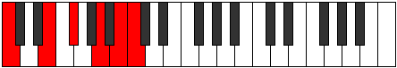

# Mode Gathitonic

## Links

- [Documentation](index.md)
- [Scales Index](Scales.md)
- [Modes Index](Modes.md)
- [Chords Index](Chords.md)

## Parent Scale

[Gathitonic](ScaleGathitonic.md)

## Number

[2641](https://ianring.com/musictheory/scales/2641)

## Perfection

- 3 Perfect notes
- 2 Perfect notes

## Perfection Profile

[false true false true true]

## Permutations

| Tonic | Notes | Signature | Illustration | Audio |
|-------|-------|-----------|--------------|-------|
| [C](ModeCNaturalGathitonic.md) | **C**, E, **F#**, A, B, **C** | C |  | [midi](ModeCNaturalGathitonic.mid) [ogg](ModeCNaturalGathitonic.ogg) |
| [C#](ModeCSharpGathitonic.md) | **C#**, F, **G**, A#, C, **C#** | C |  | [midi](ModeCSharpGathitonic.mid) [ogg](ModeCSharpGathitonic.ogg) |
| [Db](ModeDFlatGathitonic.md) | **Db**, F, **G**, Bb, C, **Db** | C |  | [midi](ModeDFlatGathitonic.mid) [ogg](ModeDFlatGathitonic.ogg) |
| [D](ModeDNaturalGathitonic.md) | **D**, F#, **G#**, B, C#, **D** | C |  | [midi](ModeDNaturalGathitonic.mid) [ogg](ModeDNaturalGathitonic.ogg) |
| [D#](ModeDSharpGathitonic.md) | **D#**, G, **A**, C, D, **D#** | C |  | [midi](ModeDSharpGathitonic.mid) [ogg](ModeDSharpGathitonic.ogg) |
| [Eb](ModeEFlatGathitonic.md) | **Eb**, G, **A**, C, D, **Eb** | C |  | [midi](ModeEFlatGathitonic.mid) [ogg](ModeEFlatGathitonic.ogg) |
| [E](ModeENaturalGathitonic.md) | **E**, G#, **A#**, C#, D#, **E** | C |  | [midi](ModeENaturalGathitonic.mid) [ogg](ModeENaturalGathitonic.ogg) |
| [F](ModeFNaturalGathitonic.md) | **F**, A, **B**, D, E, **F** | C |  | [midi](ModeFNaturalGathitonic.mid) [ogg](ModeFNaturalGathitonic.ogg) |
| [F#](ModeFSharpGathitonic.md) | **F#**, A#, **C**, D#, F, **F#** | C |  | [midi](ModeFSharpGathitonic.mid) [ogg](ModeFSharpGathitonic.ogg) |
| [Gb](ModeGFlatGathitonic.md) | **Gb**, Bb, **C**, Eb, F, **Gb** | C |  | [midi](ModeGFlatGathitonic.mid) [ogg](ModeGFlatGathitonic.ogg) |
| [G](ModeGNaturalGathitonic.md) | **G**, B, **C#**, E, F#, **G** | C |  | [midi](ModeGNaturalGathitonic.mid) [ogg](ModeGNaturalGathitonic.ogg) |
| [G#](ModeGSharpGathitonic.md) | **G#**, C, **D**, F, G, **G#** | C |  | [midi](ModeGSharpGathitonic.mid) [ogg](ModeGSharpGathitonic.ogg) |
| [Ab](ModeAFlatGathitonic.md) | **Ab**, C, **D**, F, G, **Ab** | C |  | [midi](ModeAFlatGathitonic.mid) [ogg](ModeAFlatGathitonic.ogg) |
| [A](ModeANaturalGathitonic.md) | **A**, C#, **D#**, F#, G#, **A** | C |  | [midi](ModeANaturalGathitonic.mid) [ogg](ModeANaturalGathitonic.ogg) |
| [A#](ModeASharpGathitonic.md) | **A#**, D, **E**, G, A, **A#** | C |  | [midi](ModeASharpGathitonic.mid) [ogg](ModeASharpGathitonic.ogg) |
| [Bb](ModeBFlatGathitonic.md) | **Bb**, D, **E**, G, A, **Bb** | C |  | [midi](ModeBFlatGathitonic.mid) [ogg](ModeBFlatGathitonic.ogg) |
| [B](ModeBNaturalGathitonic.md) | **B**, D#, **F**, G#, A#, **B** | C |  | [midi](ModeBNaturalGathitonic.mid) [ogg](ModeBNaturalGathitonic.ogg) |
