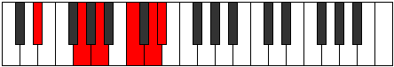

# Mode Gathitonic

## Links

- [Documentation](README.md)
- [Scales Index](Scales.md)
- [Modes Index](Modes.md)
- [Chords Index](Chords.md)

## Parent Scale

[Gathitonic](ScaleGathitonic.md)

## Number

[2641](https://ianring.com/musictheory/scales/2641)

## Transposition

4, 2, 3, 2, 1

## Chord Pattern

## Perfection

- 3 Perfect notes
- 2 Perfect notes

## Perfection Profile

false, true, false, true, true

## Permutations

| Tonic | Notes | Signature | Illustration | Audio |
|-------|-------|-----------|--------------|-------|
| [C](ModeCNaturalGathitonic.md) | **C**, E, **F#**, A, B, **C** | C |  | [midi](https://github.com/edipermadi/music/blob/main/docs/ModeCNaturalGathitonic.mid?raw=true) |
| [C#](ModeCSharpGathitonic.md) | **C#**, F, **G**, A#, C, **C#** | C |  | [midi](https://github.com/edipermadi/music/blob/main/docs/ModeCSharpGathitonic.mid?raw=true) |
| [Db](ModeDFlatGathitonic.md) | **Db**, F, **G**, Bb, C, **Db** | C |  | [midi](https://github.com/edipermadi/music/blob/main/docs/ModeDFlatGathitonic.mid?raw=true) |
| [D](ModeDNaturalGathitonic.md) | **D**, F#, **G#**, B, C#, **D** | C |  | [midi](https://github.com/edipermadi/music/blob/main/docs/ModeDNaturalGathitonic.mid?raw=true) |
| [D#](ModeDSharpGathitonic.md) | **D#**, G, **A**, C, D, **D#** | C |  | [midi](https://github.com/edipermadi/music/blob/main/docs/ModeDSharpGathitonic.mid?raw=true) |
| [Eb](ModeEFlatGathitonic.md) | **Eb**, G, **A**, C, D, **Eb** | C |  | [midi](https://github.com/edipermadi/music/blob/main/docs/ModeEFlatGathitonic.mid?raw=true) |
| [E](ModeENaturalGathitonic.md) | **E**, G#, **A#**, C#, D#, **E** | C |  | [midi](https://github.com/edipermadi/music/blob/main/docs/ModeENaturalGathitonic.mid?raw=true) |
| [F](ModeFNaturalGathitonic.md) | **F**, A, **B**, D, E, **F** | C |  | [midi](https://github.com/edipermadi/music/blob/main/docs/ModeFNaturalGathitonic.mid?raw=true) |
| [F#](ModeFSharpGathitonic.md) | **F#**, A#, **C**, D#, F, **F#** | C |  | [midi](https://github.com/edipermadi/music/blob/main/docs/ModeFSharpGathitonic.mid?raw=true) |
| [Gb](ModeGFlatGathitonic.md) | **Gb**, Bb, **C**, Eb, F, **Gb** | C |  | [midi](https://github.com/edipermadi/music/blob/main/docs/ModeGFlatGathitonic.mid?raw=true) |
| [G](ModeGNaturalGathitonic.md) | **G**, B, **C#**, E, F#, **G** | C |  | [midi](https://github.com/edipermadi/music/blob/main/docs/ModeGNaturalGathitonic.mid?raw=true) |
| [G#](ModeGSharpGathitonic.md) | **G#**, C, **D**, F, G, **G#** | C |  | [midi](https://github.com/edipermadi/music/blob/main/docs/ModeGSharpGathitonic.mid?raw=true) |
| [Ab](ModeAFlatGathitonic.md) | **Ab**, C, **D**, F, G, **Ab** | C |  | [midi](https://github.com/edipermadi/music/blob/main/docs/ModeAFlatGathitonic.mid?raw=true) |
| [A](ModeANaturalGathitonic.md) | **A**, C#, **D#**, F#, G#, **A** | C |  | [midi](https://github.com/edipermadi/music/blob/main/docs/ModeANaturalGathitonic.mid?raw=true) |
| [A#](ModeASharpGathitonic.md) | **A#**, D, **E**, G, A, **A#** | C |  | [midi](https://github.com/edipermadi/music/blob/main/docs/ModeASharpGathitonic.mid?raw=true) |
| [Bb](ModeBFlatGathitonic.md) | **Bb**, D, **E**, G, A, **Bb** | C |  | [midi](https://github.com/edipermadi/music/blob/main/docs/ModeBFlatGathitonic.mid?raw=true) |
| [B](ModeBNaturalGathitonic.md) | **B**, D#, **F**, G#, A#, **B** | C |  | [midi](https://github.com/edipermadi/music/blob/main/docs/ModeBNaturalGathitonic.mid?raw=true) |
