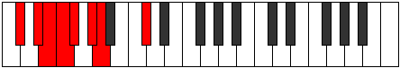

# Mode Gocrian

## Links

- [Documentation](index.md)
- [Scales Index](Scales.md)
- [Modes Index](Modes.md)
- [Chords Index](Chords.md)

## Parent Scale

[Epycrian](ScaleEpycrian.md)

## Number

[445](https://ianring.com/musictheory/scales/445)

## Interval Pattern

2, 1, 1, 1, 2, 1, 4

## Chord Pattern

## Perfection

- 4 Perfect notes
- 3 Perfect notes

## Perfection Profile

[true false false false true true true]

## Permutations

| Tonic | Notes | Signature | Illustration | Audio |
|-------|-------|-----------|--------------|-------|
| [C](ModeCNaturalGocrian.md) | C, **D**, **Eb**, **Fb**, Gbb, Abb, Bbbb, C | C |  | [midi](https://github.com/edipermadi/music/blob/main/docs/ModeCNaturalGocrian.mid?raw=true) |
| [C#](ModeCSharpGocrian.md) | C#, **D#**, **E**, **F**, Gb, Ab, Bbb, C# | C |  | [midi](https://github.com/edipermadi/music/blob/main/docs/ModeCSharpGocrian.mid?raw=true) |
| [Db](ModeDFlatGocrian.md) | Db, **Eb**, **Fb**, **Gbb**, Abbb, Bbbb, Cbbb, Db | C |  | [midi](https://github.com/edipermadi/music/blob/main/docs/ModeDFlatGocrian.mid?raw=true) |
| [D](ModeDNaturalGocrian.md) | D, **E**, **F**, **Gb**, Abb, Bbb, Cbb, D | C |  | [midi](https://github.com/edipermadi/music/blob/main/docs/ModeDNaturalGocrian.mid?raw=true) |
| [D#](ModeDSharpGocrian.md) | D#, **E#**, **F#**, **G**, Ab, Bb, Cb, D# | C |  | [midi](https://github.com/edipermadi/music/blob/main/docs/ModeDSharpGocrian.mid?raw=true) |
| [Eb](ModeEFlatGocrian.md) | Eb, **F**, **Gb**, **Abb**, Bbbb, Cbb, Dbbb, Eb | C |  | [midi](https://github.com/edipermadi/music/blob/main/docs/ModeEFlatGocrian.mid?raw=true) |
| [E](ModeENaturalGocrian.md) | E, **F#**, **G**, **Ab**, Bbb, Cb, Dbb, E | C |  | [midi](https://github.com/edipermadi/music/blob/main/docs/ModeENaturalGocrian.mid?raw=true) |
| [F](ModeFNaturalGocrian.md) | F, **G**, **Ab**, **Bbb**, Cbb, Dbb, Ebbb, F | C |  | [midi](https://github.com/edipermadi/music/blob/main/docs/ModeFNaturalGocrian.mid?raw=true) |
| [F#](ModeFSharpGocrian.md) | F#, **G#**, **A**, **Bb**, Cb, Db, Ebb, F# | C |  | [midi](https://github.com/edipermadi/music/blob/main/docs/ModeFSharpGocrian.mid?raw=true) |
| [Gb](ModeGFlatGocrian.md) | Gb, **Ab**, **Bbb**, **Cbb**, Dbbb, Ebbb, Fbbb, Gb | C |  | [midi](https://github.com/edipermadi/music/blob/main/docs/ModeGFlatGocrian.mid?raw=true) |
| [G](ModeGNaturalGocrian.md) | G, **A**, **Bb**, **Cb**, Dbb, Ebb, Fbb, G | C |  | [midi](https://github.com/edipermadi/music/blob/main/docs/ModeGNaturalGocrian.mid?raw=true) |
| [G#](ModeGSharpGocrian.md) | G#, **A#**, **B**, **C**, Db, Eb, Fb, G# | C |  | [midi](https://github.com/edipermadi/music/blob/main/docs/ModeGSharpGocrian.mid?raw=true) |
| [Ab](ModeAFlatGocrian.md) | Ab, **Bb**, **Cb**, **Dbb**, Ebbb, Fbb, Gbbb, Ab | C |  | [midi](https://github.com/edipermadi/music/blob/main/docs/ModeAFlatGocrian.mid?raw=true) |
| [A](ModeANaturalGocrian.md) | A, **B**, **C**, **Db**, Ebb, Fb, Gbb, A | C |  | [midi](https://github.com/edipermadi/music/blob/main/docs/ModeANaturalGocrian.mid?raw=true) |
| [A#](ModeASharpGocrian.md) | A#, **B#**, **C#**, **D**, Eb, F, Gb, A# | C |  | [midi](https://github.com/edipermadi/music/blob/main/docs/ModeASharpGocrian.mid?raw=true) |
| [Bb](ModeBFlatGocrian.md) | Bb, **C**, **Db**, **Ebb**, Fbb, Gbb, Abbb, Bb | C |  | [midi](https://github.com/edipermadi/music/blob/main/docs/ModeBFlatGocrian.mid?raw=true) |
| [B](ModeBNaturalGocrian.md) | B, **C#**, **D**, **Eb**, Fb, Gb, Abb, B | C |  | [midi](https://github.com/edipermadi/music/blob/main/docs/ModeBNaturalGocrian.mid?raw=true) |
